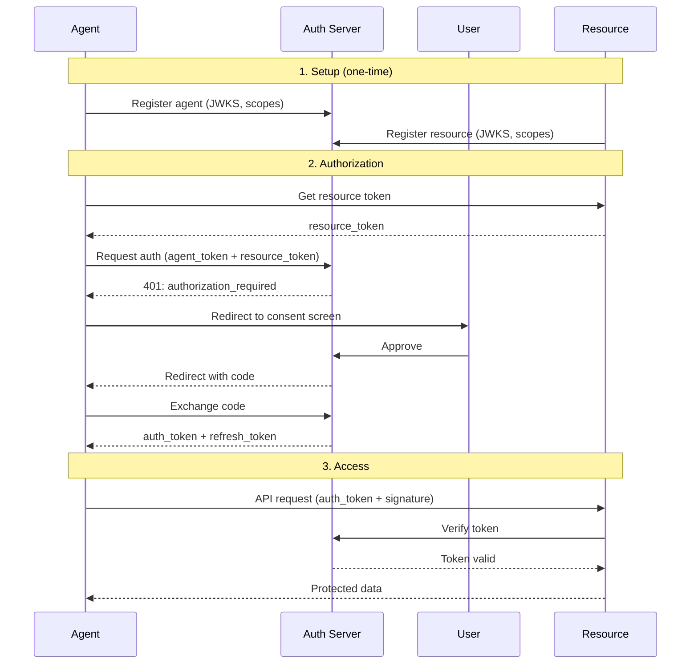

# Agent Auth (AAuth) - Quick Start Guide

Get your agent authenticated and authorized in 5 minutes. This guide walks you through 
    the essential steps to implement Agent Auth in your application.

:::note[Time to Complete]
This quickstart takes approximately 15-20 minutes to complete from start to finish.
:::


## Prerequisites

- Access to a LumoAuth tenant (e.g., `acme-corp`)
- Node.js 18+ or Python 3.9+ installed
- Basic understanding of OAuth 2.0 concepts

:::warning[Important Setup Requirements]
You'll need a LumoAuth tenant with AAuth enabled, and a server environment
capable of generating Ed25519 or RSA key pairs.
:::


## Step 1: Generate Key Pair (1 min)

Agent Auth requires cryptographic keys. Generate an Ed25519 key pair:

```javascript
// Node.js
const crypto = require('crypto');

const { publicKey, privateKey } = crypto.generateKeyPairSync('ed25519', {
  publicKeyEncoding: { type: 'spki', format: 'pem' },
  privateKeyEncoding: { type: 'pkcs8', format: 'pem' }
});

// Convert public key to raw bytes for JWK
const publicKeyBytes = Buffer.from(
  publicKey.replace(/-----BEGIN PUBLIC KEY-----|-----END PUBLIC KEY-----|\n/g, ''),
  'base64'
).slice(-32);

const jwks = {
  keys: [{
    kty: 'OKP',
    crv: 'Ed25519',
    x: publicKeyBytes.toString('base64url'),
    use: 'sig',
    kid: 'key-1'
  }]
};

console.log('JWKS:', JSON.stringify(jwks, null, 2));
console.log('\nPrivate Key (save securely):');
console.log(privateKey);
```

```python
# Python
from cryptography.hazmat.primitives.asymmetric import ed25519
from cryptography.hazmat.primitives import serialization
import base64
import json

# Generate key pair
private_key = ed25519.Ed25519PrivateKey.generate()
public_key = private_key.public_key()

# Export public key
public_bytes = public_key.public_bytes(
    encoding=serialization.Encoding.Raw,
    format=serialization.PublicFormat.Raw
)

jwks = {
    "keys": [{
        "kty": "OKP",
        "crv": "Ed25519",
        "x": base64.urlsafe_b64encode(public_bytes).decode().rstrip('='),
        "use": "sig",
        "kid": "key-1"
    }]
}

print('JWKS:', json.dumps(jwks, indent=2))
print('\nSave your private key securely!')
```

:::warning[Security Note]
Only call the introspection endpoint from your backend server. Never expose
your client credentials or call this endpoint from client-side code.
:::


## Step 2: Register Your Agent (2 min)

Navigate to your tenant's portal to register your agent:

:::tip[Registration URL]
Navigate to your tenant portal to register agents and resources, or use the
Admin API for programmatic registration.
:::


Fill in the registration form:

| Field | Example Value | Description |
| --- | --- | --- |
| **Name** | My First Agent | Human-readable agent name |
| **Agent Identifier** | `https://my-agent.example.com` | HTTPS URL uniquely identifying your agent |
| **Description** | Testing AAuth protocol | Optional description |
| **JWKS** | Paste your JWKS from Step 1 | Your agent's public keys |
| **Redirect URI** | `https://my-agent.example.com/oauth/callback` | Where to send authorization codes |
| **Allowed Scopes** | `read write` | Scopes this agent can request |

Enable features:

- ✅ **User Authorization Enabled**
- ✅ **Delegation Enabled**

Click **Create Agent** to complete registration.

## Step 3: Register a Resource (1 min)

Register the protected resource (API) your agent will access:

:::tip[Registration URL]
Navigate to your tenant portal to register agents and resources, or use the
Admin API for programmatic registration.
:::


| Field | Example Value |
| --- | --- |
| **Name** | My API |
| **Resource Identifier** | `https://api.example.com` |
| **JWKS URI** | `https://api.example.com/.well-known/jwks.json` |
| **Supported Scopes** | `read`, `write` |
| **Default Auth Level** | `authorized` |

## Step 4: Make Your First Request (1 min)

Now you're ready to authenticate your agent and access the resource. Here's a minimal example:

```javascript
const crypto = require('crypto');

// Configuration
const config = {
  tenantSlug: 'acme-corp',
  agentIdentifier: 'https://my-agent.example.com',
  resourceIdentifier: 'https://api.example.com',
  authServerUrl: 'https://app.lumoauth.dev',
  privateKey: process.env.AGENT_PRIVATE_KEY, // Load securely
  redirectUri: 'https://my-agent.example.com/oauth/callback'
};

// Helper: Sign HTTP request
function signRequest(method, url, headers = {}, body = null) {
  const components = [
    `"@method": ${method}`,
    `"@target-uri": ${url}`
  ];
  
  if (body) {
    const bodyStr = JSON.stringify(body);
    const digest = crypto.createHash('sha256').update(bodyStr).digest('base64');
    const contentDigest = `sha-256=:${digest}:`;
    components.push(`"content-type": application/json`);
    components.push(`"content-digest": ${contentDigest}`);
    headers['Content-Digest'] = contentDigest;
  }
  
  const signatureBase = components.join('\n');
  const signature = crypto.sign(null, Buffer.from(signatureBase), 
    crypto.createPrivateKey(config.privateKey));
  
  const covered = components.map(c => c.split('"')[1]).join(' ');
  const agentAuth = `sig1=:${signature.toString('base64')}:; ` +
    `label="sig1"; alg="ed25519"; ` +
    `keyid="${config.agentIdentifier}#key-1"; ` +
    `created=${Math.floor(Date.now() / 1000)}; ` +
    `covered="${covered}"`;
  
  return { agentAuth, headers };
}

// Step 1: Get agent token (delegation)
async function getAgentToken(sessionPublicKey) {
  // Your agent server issues agent tokens
  // For testing, you can skip delegation and use your agent directly
  return 'your_agent_token_here';
}

// Step 2: Get resource token
async function getResourceToken() {
  const body = {
    resource_identifier: config.resourceIdentifier,
    audience: `${config.authServerUrl}/t/${config.tenantSlug}/api/v1`,
    lifetime: 300
  };
  
  // Note: In production, the resource would create and sign this token itself
  // For testing, we'll use a simplified approach - check your LumoAuth setup
  // to see if your tenant has test mode enabled or if you need resource credentials
  
  const response = await fetch(
    `${config.authServerUrl}/t/${config.tenantSlug}/api/v1/aauth/resource/token`,
    {
      method: 'POST',
      headers: {
        'Content-Type': 'application/json',
        // Resources authenticate using their own credentials or signing
        'Authorization': `Bearer ${config.resourceIdentifier}`
      },
      body: JSON.stringify(body)
    }
  );
  
  if (!response.ok) {
    const errorText = await response.text();
    throw new Error(`Failed to get resource token: ${response.status} ${errorText}`);
  }
  
  const data = await response.json();
  return data.resource_token;
}

// Step 3: Request authorization
async function requestAuthorization(agentToken, resourceToken) {
  const requestBody = {
    request_type: 'auth',
    agent_token: agentToken,
    resource_token: resourceToken,
    scope: 'read write',
    redirect_uri: config.redirectUri
  };
  
  const url = `${config.authServerUrl}/t/${config.tenantSlug}/api/v1/aauth/agent/token`;
  const { agentAuth, headers } = signRequest('POST', url, {}, requestBody);
  
  headers['Content-Type'] = 'application/json';
  headers['Agent-Auth'] = agentAuth;
  
  const response = await fetch(url, {
    method: 'POST',
    headers,
    body: JSON.stringify(requestBody)
  });
  
  if (response.status === 401) {
    // User authorization required
    const data = await response.json();
    console.log('Redirect user to:', data.auth_url);
    // User will be redirected back with authorization code
    return null;
  }
  
  if (!response.ok) {
    const errorText = await response.text();
    throw new Error(`Authorization request failed: ${response.status} ${errorText}`);
  }
  
  return await response.json();
}

// Step 4: Exchange authorization code
async function exchangeCode(code, requestToken) {
  const requestBody = {
    request_type: 'code',
    code: code,
    request_token: requestToken
  };
  
  const url = `${config.authServerUrl}/t/${config.tenantSlug}/api/v1/aauth/agent/token`;
  const { agentAuth, headers } = signRequest('POST', url, {}, requestBody);
  
  headers['Content-Type'] = 'application/json';
  headers['Agent-Auth'] = agentAuth;
  
  const response = await fetch(url, {
    method: 'POST',
    headers,
    body: JSON.stringify(requestBody)
  });
  
  return await response.json();
}

// Step 5: Access protected resource
async function callResourceApi(authToken, endpoint) {
  const url = `${config.resourceIdentifier}${endpoint}`;
  const headers = {
    'Authorization': `Bearer ${authToken}`
  };
  
  const { agentAuth } = signRequest('GET', url, headers);
  headers['Agent-Auth'] = agentAuth;
  
  const response = await fetch(url, { headers });
  return await response.json();
}

// Main flow
async function main() {
  // 1. Get tokens
  const agentToken = await getAgentToken();
  const resourceToken = await getResourceToken();
  
  // 2. Request authorization
  const tokens = await requestAuthorization(agentToken, resourceToken);
  
  if (!tokens) {
    console.log('User authorization required - check console for URL');
    return;
  }
  
  // 3. Access resource
  const data = await callResourceApi(tokens.access_token, '/v1/data');
  console.log('Success! Got data:', data);
}

main().catch(console.error);
```

## Complete Flow Diagram

    


## Key Takeaways

    
    
        
            
            HTTP Signing
        
        
            Every request is signed using RFC 9421 to prevent tampering and replay attacks
        
    
    
    
        
            
            Token Binding
        
        
            Tokens are bound to keys via proof-of-possession, preventing token theft
        
    
    
    
        
            
            User Consent
        
        
            Users explicitly authorize agents to act on their behalf
        
    

## Troubleshooting Common Issues

### 401 Error: "Unauthorized" on Resource Token Request

**Problem:** Getting 401 when requesting a resource token.

**Solutions:**

- **Verify resource is registered:** Check that you've registered the resource in LumoAuth at the exact identifier URL
- **Check tenant slug:** Ensure you're using the correct tenant slug in the URL
- **Resource authentication:** Resources need proper credentials or signing. In development, check if your tenant has a test/development mode
- **HTTPS requirement:** All identifiers must use HTTPS (or localhost for local development)

### TypeError: response.headers.raw is not a function

**Problem:** The Fetch API doesn't have a `raw()` method.

**Solution:** Use `Object.fromEntries(response.headers)` to log headers:

```javascript
// For debugging
console.log('Headers:', Object.fromEntries(response.headers));
```

### 404 Error: Agent or Resource Not Found

**Problem:** The agent or resource identifier isn't recognized.

**Solutions:**

- **Check registration:** Verify the agent/resource is registered in the portal
- **Match identifiers exactly:** The identifier in your code must match exactly what's registered (including https://, trailing slashes, etc.)
- **Case sensitivity:** URLs are case-sensitive

### Signature Verification Failed

**Problem:** HTTP Message Signature verification fails.

**Solutions:**

- **Check key format:** Ensure your private key is in the correct PEM format
- **Verify JWKS:** The public key in your JWKS must match your private key
- **Algorithm match:** Use the same algorithm (ed25519) in both registration and signing
- **Covered components:** Ensure all required components are included in the signature

### Development/Testing Tips

```javascript
// Add error handling to all async functions
async function getResourceToken() {
  try {
    const response = await fetch(url, options);
    
    if (!response.ok) {
      const errorText = await response.text();
      console.error('Error response:', errorText);
      throw new Error(`HTTP ${response.status}: ${errorText}`);
    }
    
    return await response.json();
  } catch (error) {
    console.error('Request failed:', error);
    throw error;
  }
}

// For local development with self-signed certificates
// Add to your Node.js script (NOT for production!):
process.env.NODE_TLS_REJECT_UNAUTHORIZED = '0';
```

## Next Steps

- **Read the full protocol specification:** [Agent Auth Protocol](/agents/aauth)
- **Implement token refresh:** Use refresh tokens to avoid re-authorization
- **Add delegation:** Allow your agent to delegate to sub-agents
- **Explore token exchange:** Exchange tokens across trust boundaries
- **Review security best practices:** HSM storage, key rotation, rate limiting

:::tip[Need Help?]
Check the [AAuth Protocol specification](/agents/aauth) for detailed technical
documentation, or the [Agent Registry](/agents/registry) for managing agent registrations.
:::

