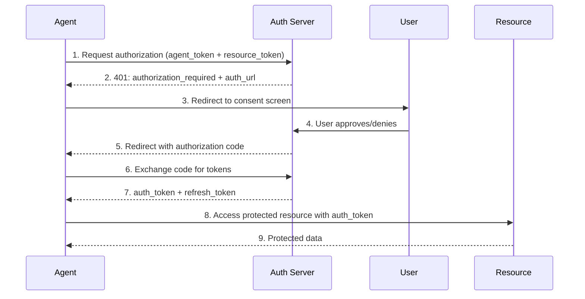

# Agent Auth (AAuth) Protocol

A modern authorization framework designed specifically for autonomous agents operating on behalf of 
    users and organizations, featuring cryptographic identity, proof-of-possession, and HTTP message signing.

:::note[Specification Status]
AAuth is an emerging protocol under active development. The implementation in LumoAuth
follows the current draft specification and may evolve as the standard matures.
:::


## Overview

Agent Auth (AAuth) is an authorization protocol that extends OAuth 2.1 to support autonomous agents with cryptographic identities. 
    Unlike traditional OAuth clients that require user interaction for each authorization, AAuth enables:

- **Autonomous Operation:** Agents can act independently once authorized
- **Cryptographic Identity:** All parties have provable identities using public key cryptography
- **Proof-of-Possession:** All tokens are bound to cryptographic keys, preventing token theft
- **HTTP Message Signing:** All requests are signed using RFC 9421, ensuring request integrity
- **Progressive Authentication:** Support for authentication levels from no user to fully authenticated user
- **Delegation:** Agents can delegate capabilities to sub-agents
- **Token Exchange:** Agents can exchange tokens across trust boundaries

## Key Concepts

### Parties in AAuth

| Party | Description | Identity |
| --- | --- | --- |
| **Agent** | An autonomous software entity | HTTPS URL with cryptographic identity |
| **Resource** | A protected service or API | URI with cryptographic identity |
| **Authorization Server** | Issues tokens after verifying identities | LumoAuth tenant endpoint |
| **User** | Human who authorizes agents | Optional, depending on auth level |

### Token Types

AAuth introduces three specialized JWT token types, all proof-of-possession bound:

    
    
        
            
            Resource Token (resource+jwt)
        
        
            **Purpose:** Proves resource's identity to authorization server

            **Issued to:** Resources

            **Lifetime:** 5 minutes (short-lived)

            **Bound to:** Resource's public key via `cnf.jkt`
        
    
    
    
        
            
            Auth Token (auth+jwt)
        
        
            **Purpose:** Authorizes agent access to a specific resource

            **Issued to:** Agent for specific agent+resource+user combination

            **Lifetime:** 1 hour (default)

            **Bound to:** Agent's public key via `cnf` claim
        
    

### Authentication Levels

AAuth supports four authentication levels for different use cases:

| Level | Description | User Interaction | Use Cases |
| --- | --- | --- | --- |
| `none` | No user identity | None | Public APIs, anonymous access |
| `authenticated` | User logged in once | Initial only | General agent tasks |
| `authorized` | User explicitly approved | Explicit consent | Sensitive operations |
| `user` | User actively present | Per-request | High-security operations |

## Protocol Flows

### Flow 1: Agent Registration

Before participating in AAuth, agents and resources must register with the authorization server.

:::tip[Portal UI]
You can register agents and resources through the LumoAuth Tenant Portal UI at
`/t/{tenantSlug}/portal/aauth/agents` or via the API.
:::


### Flow 2: Direct Authorization (No User)

For `none` or `authenticated` level access when no user interaction is needed:

```http
POST https://app.lumoauth.dev/t/{tenantSlug}/api/v1/aauth/agent/token
Content-Type: application/json
Agent-Auth: [HTTP Message Signature]

{
  "request_type": "auth",
  "agent_token": "eyJhbGc...",
  "resource_token": "eyJhbGc...",
  "scope": "read write"
}

Response 200:
{
  "access_token": "eyJhbGc...",
  "token_type": "Bearer",
  "expires_in": 3600,
  "scope": "read write",
  "refresh_token": "aauth_refresh_abc123def456"
}
```

### Flow 3: User Authorization Flow (Explicit Consent)

For `authorized` or `user` level access requiring user consent:

    


## Comprehensive Example: AI Email Agent

Let's walk through a complete example of an AI email agent that reads and sends emails on behalf of a user.

### Scenario Overview

| Component | Identifier | Description |
| --- | --- | --- |
| **Agent** | `https://email-agent.aiservices.com` | AI-powered email assistant |
| **Resource** | `https://api.mailservice.com` | Email API service |
| **Auth Server** | https://app.lumoauth.dev/t/acme-corp | LumoAuth tenant |
| **User** | `alice@acme-corp.com` | Alice wants to use the agent |

### Step 1: Register Agent (One-time Setup)

Administrator registers the email agent in LumoAuth portal. Navigate to 
    `/t/acme-corp/portal/aauth/agents/create` and configure:

- **Agent Name:** "AI Email Assistant"
- **Agent Identifier:** `https://email-agent.aiservices.com`
- **JWKS URI:** `https://email-agent.aiservices.com/.well-known/jwks.json`
- **Redirect URIs:** `https://email-agent.aiservices.com/oauth/callback`
- **Allowed Scopes:** `email:read email:send email:delete`
- **Signing Algorithms:** `ed25519`, `rsa-pss-sha512`
- **Features:** ✅ User Authorization, ✅ Delegation, ✅ Token Exchange

### Step 2: Register Resource (One-time Setup)

Administrator registers the email API. Navigate to 
    `/t/acme-corp/portal/aauth/resources/create` and configure:

- **Resource Name:** "Corporate Email API"
- **Resource Identifier:** `https://api.mailservice.com`
- **JWKS URI:** `https://api.mailservice.com/.well-known/jwks.json`
- **Supported Scopes:** `email:read`, `email:send`, `email:delete`
- **Default Auth Level:** `authorized` (requires explicit user consent)

### Step 3: Agent Generates Key Pair

Alice wants to use the AI email assistant. The agent generates a unique key pair for her session:

```javascript
// Email agent code (JavaScript/Node.js example)
const crypto = require('crypto');

// Generate Ed25519 key pair for this user session
const { publicKey, privateKey } = crypto.generateKeyPairSync('ed25519', {
  publicKeyEncoding: { type: 'spki', format: 'pem' },
  privateKeyEncoding: { type: 'pkcs8', format: 'pem' }
});

// Convert to JWK format
const publicKeyJwk = {
  kty: 'OKP',
  crv: 'Ed25519',
  x: publicKey.export({ type: 'spki', format: 'der' })
    .slice(-32).toString('base64url')
};

// Store private key securely for this session
session.agentPrivateKey = privateKey;
session.agentPublicKeyJwk = publicKeyJwk;
```

### Step 4: Obtain Agent Token

The main agent server issues an agent token to Alice's session delegate:

```javascript
const agentToken = await fetch('https://email-agent.aiservices.com/delegate/token', {
  method: 'POST',
  headers: { 'Content-Type': 'application/json' },
  body: JSON.stringify({
    delegate_sub: `https://email-agent.aiservices.com/session/${alice.sessionId}`,
    delegate_public_key: publicKeyJwk,
    audience: ['https://app.lumoauth.dev/t/acme-corp/api/v1'],
    lifetime: 3600
  })
}).then(r => r.json());

console.log('Agent Token:', agentToken.access_token);
```

The resulting agent token has the following claims:

```json
{
  "typ": "agent+jwt",
  "alg": "EdDSA",
  "kid": "agent-key-1"
}
{
  "iss": "https://email-agent.aiservices.com",
  "sub": "https://email-agent.aiservices.com/session/alice-123",
  "aud": ["https://app.lumoauth.dev/t/acme-corp/api/v1"],
  "exp": 1706817600,
  "iat": 1706814000,
  "jti": "agent_token_abc123",
  "cnf": {
    "jkt": "SHA256_thumbprint_of_delegate_public_key"
  }
}
```

### Step 5: Resource Creates Resource Token

The email API creates a short-lived resource token to prove its identity:

```javascript
const resourceToken = await fetch(
  'https://app.lumoauth.dev/t/acme-corp/api/v1/aauth/resource/token',
  {
    method: 'POST',
    headers: {
      'Content-Type': 'application/json',
      'Authorization': `Bearer https://api.mailservice.com`
    },
    body: JSON.stringify({
      resource_identifier: 'https://api.mailservice.com',
      audience: 'https://app.lumoauth.dev/t/acme-corp/api/v1',
      lifetime: 300
    })
  }
).then(r => r.json());

console.log('Resource Token:', resourceToken.resource_token);
```

### Step 6: Request Authorization with User Consent

The agent requests authorization with Alice's consent. This requires creating an HTTP Message Signature:

```javascript
const crypto = require('crypto');

// Build request body
const requestBody = {
  request_type: 'auth',
  agent_token: agentToken.access_token,
  resource_token: resourceToken.resource_token,
  scope: 'email:read email:send',
  redirect_uri: 'https://email-agent.aiservices.com/oauth/callback'
};

// Create HTTP Message Signature
const method = 'POST';
const targetUri = 'https://app.lumoauth.dev/t/acme-corp/api/v1/aauth/agent/token';
const contentType = 'application/json';
const bodyBytes = Buffer.from(JSON.stringify(requestBody));
const contentDigest = `sha-256=:${crypto.createHash('sha256').update(bodyBytes).digest('base64')}:`;

const signatureBase = [
  `"@method": ${method}`,
  `"@target-uri": ${targetUri}`,
  `"content-type": ${contentType}`,
  `"content-digest": ${contentDigest}`
].join('\n');

const signature = crypto.sign(null, Buffer.from(signatureBase), session.agentPrivateKey);
const signatureB64 = signature.toString('base64');

const agentAuthHeader = `sig1=:${signatureB64}:; label="sig1"; alg="ed25519"; ` +
  `keyid="https://email-agent.aiservices.com#key-1"; ` +
  `created=${Math.floor(Date.now() / 1000)}; ` +
  `covered="@method @target-uri content-type content-digest"`;

// Request authorization
const authResponse = await fetch(targetUri, {
  method: 'POST',
  headers: {
    'Content-Type': contentType,
    'Content-Digest': contentDigest,
    'Agent-Auth': agentAuthHeader
  },
  body: JSON.stringify(requestBody)
});

if (authResponse.status === 401) {
  const authData = await authResponse.json();
  console.log('User authorization required');
  console.log('Authorization URL:', authData.auth_url);
  
  // Redirect Alice to authorization URL
  redirectUser(authData.auth_url);
}
```

### Step 7: User Sees Consent Screen

Alice is redirected to the LumoAuth consent screen:

    
        
        AI Email Assistant wants to access your emails
    
    
        **Agent:** AI Email Assistant

        🔗 `https://email-agent.aiservices.com`

        **Will be accessing:** Corporate Email API

        🔗 `https://api.mailservice.com`

        **Requested permissions:**

        ☑️ `email:read` - Read your emails and metadata

        ☑️ `email:send` - Send emails on your behalf

        **Trust Indicators:**

        ✅ Verified agent identity

        ✅ Verified resource identity

        ✅ Cryptographically secured

        *This application will act on behalf of Alice (alice@acme-corp.com)*
    

### Step 8: Exchange Authorization Code for Tokens

After Alice approves, she's redirected back with an authorization code. The agent exchanges it for tokens:

```javascript
// Alice is redirected back with authorization code
// https://email-agent.aiservices.com/oauth/callback?code=authz_code_abc123def456

const codeExchangeBody = {
  request_type: 'code',
  code: 'authz_code_abc123def456',
  request_token: 'aauth_req_abc123'
};

// Sign and exchange code for tokens
const tokenResponse = await fetch(targetUri, {
  method: 'POST',
  headers: {
    'Content-Type': 'application/json',
    'Agent-Auth': signRequest(codeExchangeBody) // Using same signing logic
  },
  body: JSON.stringify(codeExchangeBody)
}).then(r => r.json());

console.log('Auth Token:', tokenResponse.access_token);
console.log('Refresh Token:', tokenResponse.refresh_token);
console.log('Expires in:', tokenResponse.expires_in, 'seconds');

// Store tokens securely
session.authToken = tokenResponse.access_token;
session.refreshToken = tokenResponse.refresh_token;
```

### Step 9: Access Email API

Now the agent can read and send emails on Alice's behalf:

```javascript
// Read emails
const signEmailRequest = (method, url, authToken) => {
  const signatureBase = [
    `"@method": ${method}`,
    `"@target-uri": ${url}`,
    `"authorization": Bearer ${authToken}`
  ].join('\n');
  
  const signature = crypto.sign(null, Buffer.from(signatureBase), session.agentPrivateKey);
  return `sig1=:${signature.toString('base64')}:; label="sig1"; alg="ed25519"; ` +
    `keyid="https://email-agent.aiservices.com#key-1"; ` +
    `created=${Math.floor(Date.now() / 1000)}; ` +
    `covered="@method @target-uri authorization"`;
};

const emails = await fetch('https://api.mailservice.com/v1/emails/inbox', {
  method: 'GET',
  headers: {
    'Authorization': `Bearer ${session.authToken}`,
    'Agent-Auth': signEmailRequest('GET', 
      'https://api.mailservice.com/v1/emails/inbox', 
      session.authToken)
  }
}).then(r => r.json());

console.log('Fetched', emails.length, 'emails');
```

```javascript
// Send email
const emailData = {
  to: 'bob@example.com',
  subject: 'Meeting Summary',
  body: 'Here is the summary of our meeting...',
  from: 'alice@acme-corp.com'
};

const emailBody = JSON.stringify(emailData);
const emailDigest = `sha-256=:${crypto.createHash('sha256')
  .update(Buffer.from(emailBody))
  .digest('base64')}:`;

const sendResult = await fetch('https://api.mailservice.com/v1/emails/send', {
  method: 'POST',
  headers: {
    'Authorization': `Bearer ${session.authToken}`,
    'Content-Type': 'application/json',
    'Content-Digest': emailDigest,
    'Agent-Auth': signEmailRequestWithBody('POST', 
      'https://api.mailservice.com/v1/emails/send', 
      session.authToken, emailDigest)
  },
  body: emailBody
}).then(r => r.json());

console.log('Email sent:', sendResult.message_id);
```

### Step 10: Token Refresh

When the auth token expires (after 1 hour), use the refresh token to obtain a new one:

```javascript
const refreshBody = {
  request_type: 'refresh',
  refresh_token: session.refreshToken,
  scope: 'email:read email:send'
};

const refreshResponse = await fetch(targetUri, {
  method: 'POST',
  headers: {
    'Content-Type': 'application/json',
    'Agent-Auth': signRequest(refreshBody) // Using same signing logic
  },
  body: JSON.stringify(refreshBody)
}).then(r => r.json());

// Update tokens
session.authToken = refreshResponse.access_token;
session.refreshToken = refreshResponse.refresh_token;

console.log('Tokens refreshed successfully');
```

## Security Features

### 1. Proof-of-Possession Binding

All tokens are bound to cryptographic keys. Token theft is mitigated because stolen tokens cannot be used 
    without the corresponding private key.

### 2. HTTP Message Signing (RFC 9421)

All requests are signed, preventing:

- Request tampering
- Replay attacks (with nonce validation)
- Man-in-the-middle attacks

### 3. Cryptographic Identity Verification

All parties have verifiable cryptographic identities with published JWKS endpoints.

### 4. Delegation Chain Tracking

The `act` (actor) claim tracks the complete delegation chain:

```json
{
  "sub": "user_12345",
  "client_id": "https://primary-agent.com",
  "act": {
    "sub": "https://delegate-agent.com",
    "act": {
      "sub": "https://sub-delegate.com"
    }
  }
}
```

## API Reference

### Agent Token Endpoint

    POST
    `/t/\{tenantSlug\}/api/v1/aauth/agent/token`

Main endpoint for token operations. Requires HTTP Message Signature via `Agent-Auth` header.

| request_type | Purpose | Required Fields |
| --- | --- | --- |
| `auth` | Request new auth token | `agent_token`, `resource_token`, `scope` |
| `code` | Exchange authorization code | `code`, `request_token` |
| `refresh` | Refresh auth token | `refresh_token` |
| `exchange` | Exchange token across boundaries | `subject_token`, `resource_token` |

### Discovery Endpoints

    GET
    `/.well-known/aauth-issuer`

Returns authorization server metadata including supported algorithms, token types, and endpoints.

    GET
    `/.well-known/aauth-agent`

Returns agent metadata including JWKS URI and supported capabilities (hosted by the agent).

    GET
    `/.well-known/aauth-resource`

Returns resource metadata including supported scopes and auth levels (hosted by the resource).

## Best Practices

### For Agents

- **Generate unique key pairs per user session** - Don't reuse keys across users
- **Store private keys securely** - Use HSM when possible, encrypt at rest
- **Request minimum necessary scopes** - Only request what you need
- **Handle token refresh gracefully** - Refresh proactively before expiration
- **Validate all responses** - Check signatures and claims

### For Resources

- **Always verify proof-of-possession** - Don't accept tokens without valid signatures
- **Validate token claims** - Check `aud`, `scope`, and `exp`
- **Implement proper error responses** - Return helpful error descriptions
- **Rate limit token verification** - Cache validated tokens
- **Log security events** - Track failed verifications and insufficient scopes

:::warning[Security Warning]
Never store private keys in source code or environment variables in production.
Use a Hardware Security Module (HSM) or secure key management service.
:::


## Related Resources

        
            Get started with Agent Auth in 5 minutes

    [Agent Registry
        
        
            Manage agent registrations in your tenant](/agents/registry)
    
    [Chain of Agency
        
        
            Token exchange and delegation patterns](/agents/delegation)
