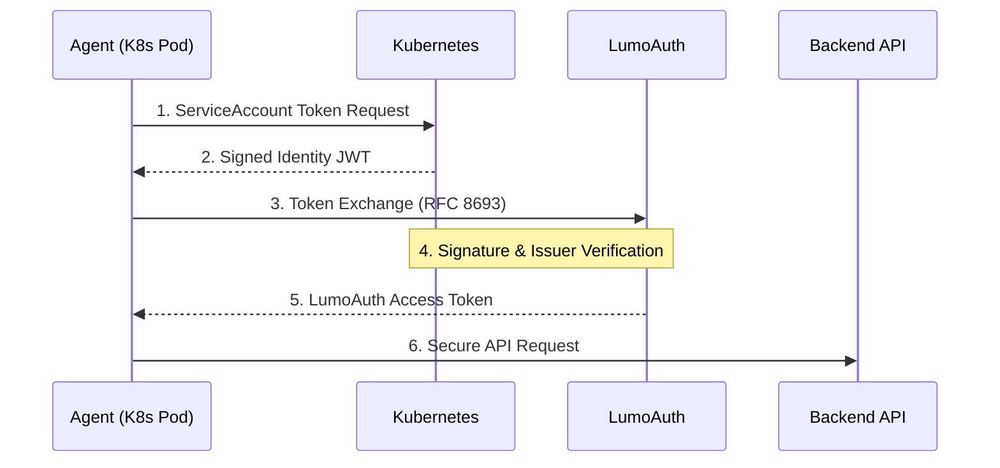

# AI Agent Security

LumoAuth treats AI agents as first-class citizens in your identity system. 
    Instead of sharing static API keys or user credentials, agents get their own secure identity 
    with scoped capabilities and audit trails.

:::note[Why This Matters]
Traditional OAuth was designed for human users clicking through consent screens.
AI agents are different - they operate autonomously, chain actions together, and need
fine-grained, verifiable authorization without human interaction for every request.
:::


## The Agent Identity Model

LumoAuth shifts from *"User X is always User X"* to a more nuanced model:

    
    
        
            
            LumoAuth: Agent Identity
        
        
            "Agent A is acting as User 123, within Context Z"

            Full visibility into the chain of actors
        
    

## Key Concepts

### 1. Agent Registration

Agents are registered in LumoAuth just like OAuth clients, but with additional metadata:

- **Capabilities:** What the agent is allowed to do (e.g., `read:data`, `tool:search`)
- **Budget Policy:** Usage limits (tokens per day, API calls per hour)
- **Allowed Tools:** Which external tools the agent can invoke
- **Delegation Rules:** Whether the agent can act on behalf of users

### 2. Workload Identity Federation

Agents running in cloud environments (Kubernetes, AWS, GCP) can authenticate using their 
    platform identity instead of static secrets:

    


This means **no secrets to manage** – the agent's identity is tied to its infrastructure.

### 3. Chain of Agency

When an agent acts on behalf of a user, LumoAuth uses **Token Exchange (RFC 8693)** 
    to create a delegation chain:

```json
{
  "sub": "user:alice",            // The user being represented
  "act": {
    "sub": "agent:research-bot",  // The agent acting on behalf of user
    "act": {
      "sub": "agent:search-tool"  // Nested: a tool the agent called
    }
  },
  "scope": "read:articles search:web",
  "exp": 1704067200
}
```

This creates a complete audit trail: "Search Tool, used by Research Bot, acting for Alice."

### 4. Capability-Based Access

Unlike traditional permissions that ask "can user X do Y?", agent capabilities are explicitly granted 
    and scoped:

| Capability | Meaning |
| --- | --- |
| `read:data` | Can read data from your APIs |
| `write:data` | Can create or modify data |
| `tool:search` | Can use web search tools |
| `tool:execute_code` | Can run code in sandboxes |
| `delegate:user` | Can act on behalf of users |

## Authentication Patterns

### Pattern 1: Client Credentials (Agent as Itself)

For agents that act independently, not on behalf of any user:

```bash
curl -X POST https://app.lumoauth.dev/t/acme-corp/api/v1/oauth/token \
  -d "grant_type=client_credentials" \
  -d "client_id=AGENT_CLIENT_ID" \
  -d "client_secret=AGENT_CLIENT_SECRET"
```

### Pattern 2: Workload Identity (Zero Secrets)

For agents running in trusted infrastructure:

```bash
curl -X POST https://app.lumoauth.dev/t/acme-corp/api/v1/oauth/token \
  -d "grant_type=urn:ietf:params:oauth:grant-type:token-exchange" \
  -d "subject_token=$(cat /var/run/secrets/kubernetes.io/serviceaccount/token)" \
  -d "subject_token_type=urn:ietf:params:oauth:token-type:jwt" \
  -d "subject_issuer=kubernetes"
```

### Pattern 3: User Delegation (Agent Acting for User)

When an agent needs to perform actions on behalf of a user:

```bash
curl -X POST https://app.lumoauth.dev/t/acme-corp/api/v1/oauth/token \
  -d "grant_type=urn:ietf:params:oauth:grant-type:token-exchange" \
  -d "subject_token=USER_ACCESS_TOKEN" \
  -d "subject_token_type=urn:ietf:params:oauth:token-type:access_token" \
  -d "actor_token=AGENT_ACCESS_TOKEN" \
  -d "actor_token_type=urn:ietf:params:oauth:token-type:access_token"
```

### Pattern 4: AAuth Protocol (Cryptographic Identity)

For agent-to-agent communication with cryptographic proof-of-possession:

```bash
curl -X POST https://app.lumoauth.dev/t/acme-corp/api/v1/aauth/agent/token \
  -H "Content-Type: application/json" \
  -H "Agent-Auth: [HTTP Message Signature]" \
  -d '{
    "request_type": "auth",
    "agent_token": "eyJhbGc...",
    "resource_token": "eyJhbGc...",
    "scope": "read write"
  }'
```

**Learn more:** See the [AAuth Protocol documentation](/agents/aauth) for complete details on cryptographic agent authentication.

## Available Endpoints

    [Agent Registry
        
            Register and manage AI agents in your tenant.](/agents/registry)
    
    [Workload Federation
        
            Authenticate agents using platform identity (K8s, AWS, GCP).](/agents/workload-federation)
    
    [Chain of Agency
        
            Token exchange for delegation and audit trails.](/agents/delegation)
    
    [AAuth Protocol
        
            Cryptographic agent identity with proof-of-possession tokens.](/agents/aauth)

## Security Best Practices

- **Least Privilege:** Give agents only the capabilities they need
- **Use Workload Identity:** Avoid static secrets when running in cloud infrastructure
- **Set Budget Limits:** Prevent runaway costs with token and API limits
- **Enable Audit Logging:** Track all agent actions for compliance
- **Use Short-Lived Tokens:** Access tokens for agents should have shorter lifetimes
- **Verify Before Delegating:** Confirm user consent before acting on their behalf
