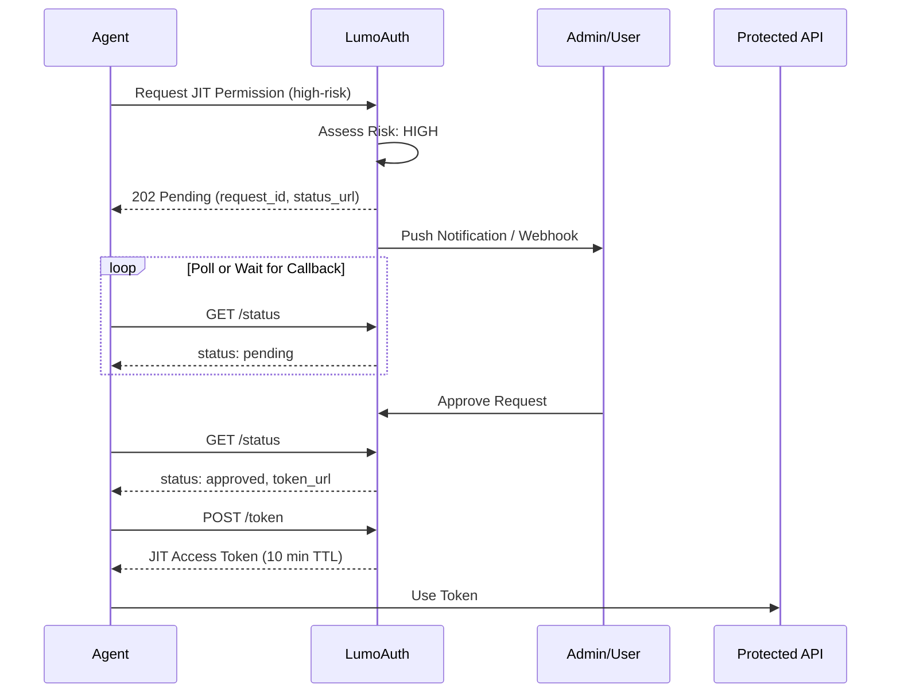

# Just-in-Time (JIT) Permissions

JIT permissions shift the security model from "Access by Default" to "Access by Request."
    Instead of granting broad capabilities upfront, agents request specific permissions at the 
    exact moment they need them, with short-lived tokens (5-15 minutes) that limit blast radius.

:::warning[Security First Design]
JIT permissions are granted with the minimum scope and duration needed.
All grants are logged for audit and can be revoked at any time.
:::


## Standards & Specifications

| Standard | Description | LumoAuth Implementation |
| --- | --- | --- |
| [RFC 9396](https://www.rfc-editor.org/rfc/rfc9396) | Rich Authorization Requests (RAR) | Full support for `authorization_details` JSON structure |
| [RFC 8693](https://www.rfc-editor.org/rfc/rfc8693) | Token Exchange | Downscoping tokens with specific RAR objects |
| RAR Error Signaling (Draft) | Insufficient authorization header | `Insufficient-Authorization-Details` header for agent self-correction |
| CAEP | Continuous Access Evaluation Profile | Real-time token revocation on suspicious behavior |

## Core Concepts

### 1. Ephemeral Personas (Task-Based Identity)

Every agent task gets a unique sub-identity via a `task_id`. This creates isolation 
    between different workflows, even for the same agent.

```json
{
  "sub": "agent:research-bot:task:task_abc123def456",
  "agent_id": "agt_research-bot",
  "task_id": "task_abc123def456",
  "parent_task_id": null,
  "jit": true,
  "exp": 1706644800,  // 10 minutes from now
  "authorization_details": [{
    "type": "file_access",
    "actions": ["read"],
    "identifier": "report_2024.pdf"
  }]
}
```

### 2. RFC 9396 Authorization Details

Instead of generic scopes like `files.read`, agents request specific authorization using 
    structured JSON objects:

```json
{
  "type": "file_access",
  "actions": ["read"],
  "identifier": "report_2024.pdf",
  "locations": ["https://storage.example.com/docs/"]
}
```

Common authorization types:

| Type | Actions | Description |
| --- | --- | --- |
| `file_access` | read, write, delete | Access to specific files or directories |
| `api_call` | GET, POST, PUT, DELETE | HTTP API operations |
| `database_query` | select, insert, update, delete | Database operations on specific tables |
| `tool_invocation` | execute | Invoking external tools or functions |
| `payment` | initiate, approve | Financial operations (high-risk, requires HITL) |
| `user_data` | read, export | Access to user PII (high-risk) |

### 3. Human-in-the-Loop (HITL)

High-risk operations pause for human approval before issuing tokens:

    


### 4. Token Downscoping (RFC 8693)

Agents start with minimal permissions and request specific capabilities as needed:

    
    
        
            
            JIT Token
        
        
            Specific action, short TTL

            `authorization_details: [{type: "file_access"...}]`
        
    

## API Reference

### Create Task (Ephemeral Persona)

    POST
    `/t/\{tenant\}/api/v1/jit/task`

Create a new ephemeral task context for the agent.

```bash
curl -X POST https://app.lumoauth.dev/t/acme-corp/api/v1/jit/task \
  -H "Authorization: Bearer $AGENT_TOKEN" \
  -H "Content-Type: application/json" \
  -d '{
    "name": "Research Task #123",
    "type": "research",
    "on_behalf_of": "alice@example.com"
  }'
```

```json
{
  "task_id": "task_a1b2c3d4e5f6g7h8",
  "caep_session_id": "caep_xyz789",
  "expires_at": "2026-01-30T15:00:00Z",
  "agent_id": "agt_research-bot",
  "on_behalf_of": "alice@example.com"
}
```

### Request JIT Permission

    POST
    `/t/\{tenant\}/api/v1/jit/request`

Request a specific permission using RFC 9396 authorization_details.

```bash
curl -X POST https://app.lumoauth.dev/t/acme-corp/api/v1/jit/request \
  -H "Authorization: Bearer $AGENT_TOKEN" \
  -H "Content-Type: application/json" \
  -d '{
    "task_id": "task_a1b2c3d4e5f6g7h8",
    "authorization_details": {
      "type": "file_access",
      "actions": ["read"],
      "identifier": "report_2024.pdf"
    },
    "justification": "Need to analyze Q4 financial data for user query",
    "requested_ttl": 300,
    "callback_url": "https://agent.example.com/webhook/jit"
  }'
```

```json
{
  "request_id": "jit_abc123xyz",
  "status": "approved",
  "risk_level": "low",
  "task_id": "task_a1b2c3d4e5f6g7h8",
  "token_url": "/t/acme-corp/api/v1/jit/request/jit_abc123xyz/token",
  "granted_ttl": 300
}
```

```json
{
  "request_id": "jit_def456uvw",
  "status": "pending",
  "risk_level": "high",
  "task_id": "task_a1b2c3d4e5f6g7h8",
  "status_url": "/t/acme-corp/api/v1/jit/request/jit_def456uvw/status",
  "expires_at": "2026-01-30T14:05:00Z",
  "message": "Request requires human approval. Poll status_url or wait for callback."
}
```

### Get Request Status

    GET
    `/t/\{tenant\}/api/v1/jit/request/\{request_id\}/status`

Poll for HITL approval status.

### Exchange for JIT Token

    POST
    `/t/\{tenant\}/api/v1/jit/request/\{request_id\}/token`

Exchange an approved request for a short-lived JIT token.

```json
{
  "access_token": "eyJhbGciOiJIUzI1NiIsInR5cCI6IkpXVCJ9...",
  "token_type": "Bearer",
  "expires_in": 300,
  "issued_token_type": "urn:ietf:params:oauth:token-type:access_token",
  "authorization_details": [{
    "type": "file_access",
    "actions": ["read"],
    "identifier": "report_2024.pdf"
  }],
  "task_id": "task_a1b2c3d4e5f6g7h8",
  "jit_request_id": "jit_abc123xyz"
}
```

### Complete Task

    POST
    `/t/\{tenant\}/api/v1/jit/task/\{task_id\}/complete`

Mark task complete and revoke all associated JIT tokens.

## Error Signaling (Agent Self-Correction)

When a resource server rejects a request due to insufficient permissions, it returns 
    a `403 Forbidden` with the `Insufficient-Authorization-Details` header:

```http
HTTP/1.1 403 Forbidden
WWW-Authenticate: Bearer error="insufficient_authorization_details"
Insufficient-Authorization-Details: eyJ0eXBlIjoiZmlsZV9hY2Nlc3MiLC...

{
  "error": "insufficient_authorization_details",
  "error_description": "Token lacks required permission",
  "authorization_details_hint": {
    "type": "file_access",
    "actions": ["write"],
    "identifier": "report_2024.pdf"
  }
}
```

The agent can automatically parse this response and request the specific permission:

```python
import base64
import json
import requests

def call_api_with_jit(agent_token, task_id, api_url, method="GET"):
    """Call API with automatic JIT permission escalation."""
    
    response = requests.request(method, api_url, headers={
        "Authorization": f"Bearer {agent_token}"
    })
    
    if response.status_code == 403:
        # Check for insufficient_authorization_details header
        header = response.headers.get("Insufficient-Authorization-Details")
        if header:
            # Decode the required authorization_details
            required_authz = json.loads(base64.b64decode(header))
            
            # Request JIT permission
            jit_response = requests.post(
                "https://app.lumoauth.dev/t/acme-corp/api/v1/jit/request",
                headers={"Authorization": f"Bearer {agent_token}"},
                json={
                    "task_id": task_id,
                    "authorization_details": required_authz,
                    "justification": "Required for user request"
                }
            )
            
            if jit_response.json()["status"] == "approved":
                # Get the JIT token
                token_url = jit_response.json()["token_url"]
                token_response = requests.post(
                    f"https://app.lumoauth.dev{token_url}",
                    headers={"Authorization": f"Bearer {agent_token}"}
                )
                jit_token = token_response.json()["access_token"]
                
                # Retry with JIT token
                return requests.request(method, api_url, headers={
                    "Authorization": f"Bearer {jit_token}"
                })
    
    return response
```

## Best Practices

| Practice | Description | Implementation |
| --- | --- | --- |
| **Ephemeral Personas** | Create a new sub-identity for every "Task" or "Thread" | Use `task_id` claim in JWT; call `/jit/task` at workflow start |
| **Token Downscoping** | Start with zero permissions; add only what's needed per tool-call | Request specific `authorization_details` per operation |
| **Human-in-the-Loop** | For high-risk JIT requests (delete, payment), pause token issuance | Configure webhook for approval notifications |
| **Short TTLs** | JIT tokens should rarely last longer than 5-15 minutes | Use `requested_ttl` parameter (max 900 seconds) |
| **Continuous Validation** | Don't just check at issuance; check during use | CAEP evaluates risk continuously and revokes suspicious tokens |
| **Self-Correction** | Agents should automatically request missing permissions | Parse `Insufficient-Authorization-Details` header on 403 |

## Risk Levels & HITL

JIT requests are automatically assessed for risk based on multiple factors:

| Risk Level | Triggers | Behavior |
| --- | --- | --- |
| Low | Read-only operations, non-sensitive resources | Auto-approved instantly |
| Medium | Write operations, elevated task risk score | Auto-approved with audit logging |
| High | Delete, admin, execute actions; sensitive resource types | Requires human approval (HITL) |
| Critical | Payment, user_data, credentials; CAEP flags; multiple denials | Requires human approval + extra review |

## CAEP Continuous Validation

LumoAuth continuously evaluates agent behavior during task execution:

- **Risk Score Accumulation:** Each permission request adds to task risk score
- **Denial Tracking:** Multiple denials trigger automatic task suspension
- **Anomaly Detection:** High-frequency requests or unusual patterns trigger flags
- **Real-time Revocation:** Suspicious tasks have all JIT tokens revoked immediately

```json
{
  "task_id": "task_a1b2c3d4e5f6g7h8",
  "active": false,
  "events": [
    {
      "type": "risk_threshold_exceeded",
      "details": {
        "risk_score": 65.0,
        "denial_count": 3
      },
      "timestamp": "2026-01-30T14:25:00Z"
    }
  ],
  "action": "suspended"
}
```

## Complete Integration Example

This self-contained example demonstrates the full JIT permission workflow, including:

- **Agent authentication** using client credentials
- **User consent** via OAuth delegation (on-behalf-of flow)
- **Ephemeral task creation** for isolated personas
- **JIT permission requests** with HITL support
- **Token exchange** for scoped, short-lived access

```python
"""
LumoAuth JIT Permissions - Complete Self-Contained Example

This example demonstrates the full lifecycle of Just-in-Time permissions
for AI agents, including the on-behalf-of delegation flow.

Prerequisites:
  1. Register an agent in LumoAuth (get client_id and client_secret)
  2. Configure the agent with 'delegate:on_behalf' capability
  3. User has authorized the agent to act on their behalf

Environment Variables:
  - LUMOAUTH_URL: Your LumoAuth instance URL (e.g., https://app.lumoauth.dev)
  - LUMOAUTH_TENANT: Your tenant slug (e.g., acme-corp)
  - AGENT_CLIENT_ID: Agent's OAuth client ID (from agent registration)
  - AGENT_CLIENT_SECRET: Agent's OAuth client secret
"""

import os
import time
import requests
from typing import Optional, Dict, Any

class LumoAuthJIT:
    """
    Complete JIT Permission client for AI agents.
    
    This class handles:
    1. Agent authentication (client credentials flow)
    2. User delegation (token exchange for on-behalf-of)
    3. Ephemeral task creation (isolated sub-identities)
    4. JIT permission requests with HITL polling
    5. Token exchange for short-lived access
    """
    
    def __init__(
        self,
        base_url: str = None,
        tenant: str = None,
        client_id: str = None,
        client_secret: str = None
    ):
        """
        Initialize the JIT client.
        
        Args:
            base_url: LumoAuth server URL (defaults to LUMOAUTH_URL env var)
            tenant: Tenant slug (defaults to LUMOAUTH_TENANT env var)
            client_id: Agent's client ID (defaults to AGENT_CLIENT_ID env var)
            client_secret: Agent's client secret (defaults to AGENT_CLIENT_SECRET env var)
        """
        # Configuration from environment variables or parameters
        self.base_url = base_url or os.environ.get('LUMOAUTH_URL', 'https://app.lumoauth.dev')
        self.tenant = tenant or os.environ.get('LUMOAUTH_TENANT', 'acme-corp')
        self.client_id = client_id or os.environ.get('AGENT_CLIENT_ID')
        self.client_secret = client_secret or os.environ.get('AGENT_CLIENT_SECRET')
        
        # Token state
        self.agent_token: Optional[str] = None      # Agent's own access token
        self.delegated_token: Optional[str] = None  # Token for acting on behalf of user
        self.task_id: Optional[str] = None          # Current ephemeral task ID
        self.caep_session_id: Optional[str] = None  # CAEP monitoring session
    
    # =========================================================================
    # STEP 1: AGENT AUTHENTICATION (Client Credentials Flow)
    # =========================================================================
    
    def authenticate_agent(self) -> bool:
        """
        Authenticate the agent using OAuth 2.0 client credentials flow.
        
        This is the first step - the agent obtains its own access token
        using its registered client_id and client_secret.
        
        Returns:
            True if authentication succeeded, False otherwise
        
        API Endpoint:
            POST /t/{tenant}/api/v1/oauth/token
            Content-Type: application/x-www-form-urlencoded
        """
        print(f"🔐 Authenticating agent with client_id: {self.client_id[:8]}...")
        
        response = requests.post(
            f"{self.base_url}/t/{self.tenant}/api/v1/oauth/token",
            data={
                'grant_type': 'client_credentials',
                'client_id': self.client_id,
                'client_secret': self.client_secret,
                # Request minimal scopes - we'll use JIT for specific permissions
                'scope': 'agent:basic jit:request'
            }
        )
        
        if response.status_code == 200:
            token_data = response.json()
            self.agent_token = token_data['access_token']
            print(f"✅ Agent authenticated. Token expires in {token_data.get('expires_in', 3600)}s")
            return True
        else:
            print(f"❌ Authentication failed: {response.status_code} - {response.text}")
            return False
    
    # =========================================================================
    # STEP 2: ON-BEHALF-OF DELEGATION (RFC 8693 Token Exchange)
    # =========================================================================
    
    def get_user_consent_url(self, redirect_uri: str, state: str = None) -> str:
        """
        Generate the URL where users authorize the agent to act on their behalf.
        
        The user must visit this URL and grant consent before the agent can
        perform actions on their behalf. This creates an auditable record
        of user authorization.
        
        Args:
            redirect_uri: Where to redirect after consent
            state: Optional state parameter for CSRF protection
        
        Returns:
            Authorization URL for user to visit
        """
        # Build the authorization URL for user consent
        params = {
            'client_id': self.client_id,
            'response_type': 'code',
            'redirect_uri': redirect_uri,
            'scope': 'openid profile delegation:on_behalf',
            'state': state or 'random_state_value'
        }
        
        query = '&'.join(f"{k}={v}" for k, v in params.items())
        consent_url = f"{self.base_url}/t/{self.tenant}/api/v1/oauth/authorize?{query}"
        
        print(f"📋 User consent URL: {consent_url}")
        return consent_url
    
    def exchange_for_delegated_token(self, user_token: str) -> bool:
        """
        Exchange agent token + user token for a delegated token (RFC 8693).
        
        This implements the "on-behalf-of" flow where the agent gets a token
        that represents "agent acting as user". All actions with this token
        are audited with the full delegation chain.
        
        Args:
            user_token: The user's access token (obtained via OAuth flow)
        
        Returns:
            True if exchange succeeded, False otherwise
        
        API Endpoint:
            POST /t/{tenant}/api/v1/oauth/token
            grant_type=urn:ietf:params:oauth:grant-type:token-exchange
        
        JWT Result:
            The delegated token contains an 'act' (actor) claim:
            {
                "sub": "user:alice",
                "act": { "sub": "agent:research-bot" }
            }
            This means: "research-bot is acting as alice"
        """
        if not self.agent_token:
            print("❌ Agent must be authenticated first. Call authenticate_agent()")
            return False
        
        print("🔄 Exchanging tokens for delegated access (on-behalf-of flow)...")
        
        response = requests.post(
            f"{self.base_url}/t/{self.tenant}/api/v1/oauth/token",
            data={
                # RFC 8693 Token Exchange
                'grant_type': 'urn:ietf:params:oauth:grant-type:token-exchange',
                
                # Subject token = who we're acting for (the user)
                'subject_token': user_token,
                'subject_token_type': 'urn:ietf:params:oauth:token-type:access_token',
                
                # Actor token = who is doing the acting (the agent)
                'actor_token': self.agent_token,
                'actor_token_type': 'urn:ietf:params:oauth:token-type:access_token',
            }
        )
        
        if response.status_code == 200:
            token_data = response.json()
            self.delegated_token = token_data['access_token']
            print(f"✅ Delegated token obtained. Agent can now act on behalf of user.")
            print(f"   Token type: {token_data.get('issued_token_type', 'access_token')}")
            return True
        else:
            print(f"❌ Token exchange failed: {response.status_code} - {response.text}")
            return False
    
    # =========================================================================
    # STEP 3: CREATE EPHEMERAL TASK (Isolated Sub-Identity)
    # =========================================================================
    
    def start_task(
        self,
        name: str = None,
        task_type: str = None,
        on_behalf_of_email: str = None
    ) -> str:
        """
        Create an ephemeral task with isolated permissions.
        
        Each task gets its own sub-identity (task_id) which:
        - Limits blast radius of any compromise
        - Provides granular audit trails per operation
        - Allows independent permission management
        
        Args:
            name: Human-readable task name (e.g., "Analyze Q4 Report")
            task_type: Task category (e.g., "research", "analysis")
            on_behalf_of_email: User email if acting on their behalf
        
        Returns:
            task_id: Unique identifier for this ephemeral persona
        
        API Endpoint:
            POST /t/{tenant}/api/v1/jit/task
        """
        # Use delegated token if available, otherwise agent token
        token = self.delegated_token or self.agent_token
        if not token:
            raise RuntimeError("No authentication token. Call authenticate_agent() first.")
        
        print(f"📝 Creating ephemeral task: {name or 'Unnamed task'}")
        
        response = requests.post(
            f"{self.base_url}/t/{self.tenant}/api/v1/jit/task",
            headers={"Authorization": f"Bearer {token}"},
            json={
                "name": name,
                "type": task_type,
                "on_behalf_of": on_behalf_of_email
            }
        )
        
        response.raise_for_status()
        data = response.json()
        
        self.task_id = data["task_id"]
        self.caep_session_id = data.get("caep_session_id")
        
        print(f"✅ Task created: {self.task_id}")
        print(f"   CAEP Session: {self.caep_session_id}")
        print(f"   Expires: {data.get('expires_at', 'unknown')}")
        
        return self.task_id
    
    # =========================================================================
    # STEP 4: REQUEST JIT PERMISSION (RFC 9396 Authorization Details)
    # =========================================================================
    
    def request_permission(
        self,
        authorization_details: Dict[str, Any],
        justification: str = None,
        requested_ttl: int = 300,
        wait_for_approval: bool = True,
        timeout_seconds: int = 300
    ) -> Dict[str, Any]:
        """
        Request a specific JIT permission using RFC 9396 authorization_details.
        
        Instead of broad scopes like "files.read", we request exactly what's needed:
        {"type": "file_access", "actions": ["read"], "identifier": "report.pdf"}
        
        High-risk requests may require human approval (HITL). If wait_for_approval
        is True, this method will poll until approved/denied or timeout.
        
        Args:
            authorization_details: RFC 9396 structured authorization object
            justification: Human-readable reason for the request
            requested_ttl: Desired token lifetime in seconds (max 900)
            wait_for_approval: Whether to wait for HITL approval
            timeout_seconds: How long to wait for approval
        
        Returns:
            Permission request result including status and token URL
        
        API Endpoint:
            POST /t/{tenant}/api/v1/jit/request
        """
        if not self.task_id:
            raise RuntimeError("No active task. Call start_task() first.")
        
        token = self.delegated_token or self.agent_token
        
        print(f"🔒 Requesting JIT permission...")
        print(f"   Type: {authorization_details.get('type')}")
        print(f"   Actions: {authorization_details.get('actions')}")
        print(f"   Resource: {authorization_details.get('identifier', 'N/A')}")
        
        response = requests.post(
            f"{self.base_url}/t/{self.tenant}/api/v1/jit/request",
            headers={"Authorization": f"Bearer {token}"},
            json={
                "task_id": self.task_id,
                "authorization_details": authorization_details,
                "justification": justification,
                "requested_ttl": min(requested_ttl, 900)  # Max 15 minutes
            }
        )
        
        response.raise_for_status()
        result = response.json()
        
        print(f"   Status: {result['status']}")
        print(f"   Risk Level: {result.get('risk_level', 'unknown')}")
        
        # Handle Human-in-the-Loop (HITL) approval
        if result["status"] == "pending" and wait_for_approval:
            print(f"⏳ Request requires human approval. Waiting...")
            result = self._poll_for_approval(result, timeout_seconds)
        
        return result
    
    def _poll_for_approval(
        self,
        initial_result: Dict[str, Any],
        timeout_seconds: int
    ) -> Dict[str, Any]:
        """
        Poll for HITL approval status.
        
        In production, you might use webhooks instead of polling.
        Configure callback_url in the permission request for async notification.
        """
        status_url = initial_result["status_url"]
        token = self.delegated_token or self.agent_token
        
        start_time = time.time()
        poll_interval = 5  # seconds
        
        while time.time() - start_time  str:
        """
        Exchange an approved permission request for a short-lived JIT token.
        
        The JIT token contains:
        - The specific authorization_details granted
        - A short TTL (typically 5-15 minutes)
        - Task context for audit and revocation
        
        Args:
            request_id: The approved permission request ID
        
        Returns:
            JIT access token (short-lived, narrowly scoped)
        
        API Endpoint:
            POST /t/{tenant}/api/v1/jit/request/{request_id}/token
        """
        token = self.delegated_token or self.agent_token
        
        print(f"🎫 Exchanging approval for JIT token...")
        
        response = requests.post(
            f"{self.base_url}/t/{self.tenant}/api/v1/jit/request/{request_id}/token",
            headers={"Authorization": f"Bearer {token}"}
        )
        
        response.raise_for_status()
        data = response.json()
        
        print(f"✅ JIT token issued!")
        print(f"   Expires in: {data.get('expires_in', 300)} seconds")
        print(f"   Task ID: {data.get('task_id')}")
        
        return data["access_token"]
    
    # =========================================================================
    # STEP 6: USE JIT TOKEN FOR PROTECTED OPERATION
    # =========================================================================
    
    def call_protected_api(
        self,
        api_url: str,
        jit_token: str,
        method: str = "GET",
        data: Dict = None
    ) -> requests.Response:
        """
        Call a protected API using the JIT token.
        
        The JIT token authorizes only the specific operation requested.
        The resource server validates the authorization_details in the token.
        
        Args:
            api_url: The protected API endpoint
            jit_token: The JIT access token
            method: HTTP method
            data: Request body for POST/PUT
        
        Returns:
            API response
        """
        print(f"📡 Calling protected API: {method} {api_url}")
        
        response = requests.request(
            method,
            api_url,
            headers={"Authorization": f"Bearer {jit_token}"},
            json=data if data else None
        )
        
        print(f"   Response: {response.status_code}")
        return response
    
    # =========================================================================
    # STEP 7: COMPLETE TASK (Cleanup)
    # =========================================================================
    
    def complete_task(self) -> bool:
        """
        Complete the task and revoke all associated JIT tokens.
        
        This should ALWAYS be called when the task is done, even on errors.
        It ensures all short-lived tokens are invalidated immediately.
        
        Returns:
            True if task was completed successfully
        
        API Endpoint:
            POST /t/{tenant}/api/v1/jit/task/{task_id}/complete
        """
        if not self.task_id:
            return True  # No task to complete
        
        token = self.delegated_token or self.agent_token
        
        print(f"🏁 Completing task: {self.task_id}")
        
        try:
            response = requests.post(
                f"{self.base_url}/t/{self.tenant}/api/v1/jit/task/{self.task_id}/complete",
                headers={"Authorization": f"Bearer {token}"}
            )
            
            if response.status_code == 200:
                print(f"✅ Task completed. All JIT tokens revoked.")
                return True
            else:
                print(f"⚠️ Task completion returned: {response.status_code}")
                return False
        finally:
            self.task_id = None
            self.caep_session_id = None

# =============================================================================
# COMPLETE USAGE EXAMPLE
# =============================================================================

def main():
    """
    Complete example: Agent reads a file on behalf of a user.
    
    This demonstrates the full flow:
    1. Agent authenticates itself
    2. Agent gets delegated token to act for user (requires user's access token)
    3. Agent creates an ephemeral task
    4. Agent requests specific file read permission
    5. Agent exchanges approval for JIT token
    6. Agent reads the file with JIT token
    7. Agent completes the task (cleanup)
    
    Usage:
        # First run - get consent URL (no user token available yet):
        python jit_example.py
        
        # After user logs in and you have their token:
        python jit_example.py --user-token "eyJhbGciOiJSUzI1NiIsInR5cCI6IkpXVCJ9..."
    
    The user_token is obtained when:
    - A user logs into your application via OAuth
    - Your app receives their access_token from the OAuth callback
    - You pass that token to the agent for delegation
    """
    import argparse
    
    parser = argparse.ArgumentParser(
        description="LumoAuth JIT Agent Example - Demonstrates delegation and JIT permissions"
    )
    parser.add_argument(
        "--user-token",
        help="User's access token obtained after OAuth login. Required for delegation flow."
    )
    parser.add_argument(
        "--base-url",
        default=os.environ.get('LUMOAUTH_URL', 'https://app.lumoauth.dev'),
        help="LumoAuth server URL"
    )
    parser.add_argument(
        "--tenant",
        default=os.environ.get('LUMOAUTH_TENANT', 'acme-corp'),
        help="Tenant slug"
    )
    parser.add_argument(
        "--client-id",
        default=os.environ.get('AGENT_CLIENT_ID'),
        help="Agent client ID"
    )
    parser.add_argument(
        "--client-secret",
        default=os.environ.get('AGENT_CLIENT_SECRET'),
        help="Agent client secret"
    )
    args = parser.parse_args()
    
    # Validate required credentials
    if not args.client_id or not args.client_secret:
        print("❌ Agent credentials required!")
        print("   Set AGENT_CLIENT_ID and AGENT_CLIENT_SECRET environment variables,")
        print("   or use --client-id and --client-secret arguments.")
        return
    
    # Initialize the JIT client
    jit = LumoAuthJIT(
        base_url=args.base_url,
        tenant=args.tenant,
        client_id=args.client_id,
        client_secret=args.client_secret
    )
    
    # ----- STEP 1: Agent Authentication -----
    if not jit.authenticate_agent():
        print("Failed to authenticate agent. Exiting.")
        return
    
    # ----- STEP 2: Get Delegated Token (On-Behalf-Of) -----
    # The user_token is REQUIRED for delegation. It proves that a real user
    # has logged in and granted consent for the agent to act on their behalf.
    #
    # How to obtain the user_token:
    # 1. User visits your app and clicks "Login"
    # 2. User is redirected to LumoAuth OAuth authorization endpoint
    # 3. User authenticates and grants consent
    # 4. LumoAuth redirects back to your app with an authorization code
    # 5. Your app exchanges the code for tokens (access_token, refresh_token)
    # 6. The access_token is the user_token needed here
    
    if not args.user_token:
        print("\n" + "="*70)
        print("⚠️  USER TOKEN REQUIRED FOR DELEGATION")
        print("="*70)
        print("\nTo act on behalf of a user, you need their access token.")
        print("This token is obtained when the user logs into your application.")
        print("\n📋 STEP 1: Have the user visit this consent URL:")
        consent_url = jit.get_user_consent_url(
            redirect_uri="https://agent.example.com/callback"
        )
        print(f"\n   {consent_url}")
        print("\n📋 STEP 2: After user login, your callback receives an auth code.")
        print("   Exchange the code for tokens using the OAuth token endpoint.")
        print("\n📋 STEP 3: Run this script again with the user's access token:")
        print(f"\n   python {os.path.basename(__file__)} --user-token \"USER_ACCESS_TOKEN\"")
        print("\n" + "="*70)
        return
    
    # We have a user token - proceed with delegation
    if not jit.exchange_for_delegated_token(args.user_token):
        print("\n❌ Token exchange failed. Possible causes:")
        print("   - User token is expired or invalid")
        print("   - User has not granted consent for delegation")
        print("   - Agent is not configured with 'Allow Acting on Behalf of Users'")
        # Show user consent URL as fallback
        consent_url = jit.get_user_consent_url(
            redirect_uri="https://agent.example.com/callback"
        )
        print(f"Have user visit: {consent_url}")
        return
    
    # ----- STEP 3+: JIT Permission Flow -----
    try:
        # Create ephemeral task
        jit.start_task(
            name="Analyze Q4 Financial Report",
            task_type="analysis",
            on_behalf_of_email="alice@acme-corp.com"
        )
        
        # Request specific permission for file access
        result = jit.request_permission(
            authorization_details={
                "type": "file_access",
                "actions": ["read"],
                "identifier": "quarterly_report_q4_2024.pdf",
                "locations": ["https://storage.acme-corp.com/finance/"]
            },
            justification="User asked: 'What were our Q4 revenues?'"
        )
        
        if result["status"] == "approved":
            # Get the short-lived JIT token
            jit_token = jit.get_jit_token(result["request_id"])
            
            # Use the JIT token to access the file
            response = jit.call_protected_api(
                "https://storage.acme-corp.com/finance/quarterly_report_q4_2024.pdf",
                jit_token
            )
            
            if response.status_code == 200:
                # Process the file content
                file_content = response.content
                print(f"📄 Successfully read file ({len(file_content)} bytes)")
                # ... analyze the content ...
            else:
                print(f"❌ Failed to read file: {response.status_code}")
        
        elif result["status"] == "denied":
            print(f"Permission denied: {result.get('deny_reason')}")
        
        else:
            print(f"Permission request failed: {result['status']}")
    
    finally:
        # ALWAYS complete the task to cleanup and revoke tokens
        jit.complete_task()

if __name__ == "__main__":
    main()
```

:::note[Pro Tip]
Always check the `error` field in responses to determine if the request was successful.
Use the `details` object for machine-readable error information to help with debugging.
:::


## Integrating with LangGraph (JIT)

You can seamlessly integrate LumoAuth's JIT provisioning into your LangGraph agents. 
    By leveraging LangGraph's self-correcting capabilities (often through a tool-calling fallback loop), 
    your agent can dynamically request JIT access to protected resources when it encounters 
    an `Insufficient-Authorization-Details` error.

```python
import os
import requests
import json
import base64
from typing import Dict, Any, Annotated, List
from typing_extensions import TypedDict
from langchain_openai import ChatOpenAI
from langchain_core.tools import tool
from langchain_core.messages import BaseMessage, ToolMessage, AIMessage
from langgraph.graph import StateGraph, START, END
from langgraph.graph.message import add_messages
# Assuming LumoAuthJIT is imported from the previous example
# from lumoauth_jit import LumoAuthJIT

# Initialize the JIT client
jit_client = LumoAuthJIT(
    base_url=os.environ.get('LUMOAUTH_URL', 'https://app.lumoauth.dev'),
    tenant=os.environ.get('LUMOAUTH_TENANT', 'acme-corp'),
    client_id=os.environ.get('AGENT_CLIENT_ID'),
    client_secret=os.environ.get('AGENT_CLIENT_SECRET')
)
jit_client.authenticate_agent()

# Note: In a real app, you would pass the user's token 
# and call jit_client.start_task() here to setup the context.
# We assume the task has already been started.

# State definition
class AgentState(TypedDict):
    messages: Annotated[list, add_messages]
    # Keep track of any acquired JIT tokens that we can use across retries
    jit_tokens: Dict[str, str]

@tool
def fetch_protected_document(document_id: str, jit_token: str = None) -> str:
    """
    Fetch a highly sensitive document. 
    If you don't have a token, you will get an error telling you the permissions needed.
    """
    url = f"https://api.acme-corp.com/v1/documents/{document_id}"
    
    # Try with JIT token if we have one, otherwise fallback to base agent token
    headers = {}
    if jit_token:
        headers["Authorization"] = f"Bearer {jit_token}"
    elif jit_client.delegated_token:
        headers["Authorization"] = f"Bearer {jit_client.delegated_token}"
        
    response = requests.get(url, headers=headers)
    
    if response.status_code == 403:
        # Expected failure path: Resource requires specific JIT authorization
        auth_header = response.headers.get("Insufficient-Authorization-Details")
        if auth_header:
            required_authz = json.loads(base64.b64decode(auth_header))
            # Return the required authorization as JSON string so the LLM knows what to request
            return json.dumps({
                "error": "Insufficient JIT permissions",
                "required_authorization_details": required_authz
            })
            
    if response.status_code == 200:
        return response.text
        
    return f"Error: HTTP {response.status_code}"

@tool
def request_jit_access(required_authorization_details_json: str, justification: str) -> str:
    """
    Use this tool to request Just-In-Time (JIT) access when another tool fails due to insufficient permissions.
    Pass the exact 'required_authorization_details' JSON object that the failing tool returned.
    """
    try:
        authz_details = json.loads(required_authorization_details_json)
    except json.JSONDecodeError:
        return "Error: Invalid JSON format for authorization details."
        
    result = jit_client.request_permission(
        authorization_details=authz_details,
        justification=justification,
        wait_for_approval=True
    )
    
    if result.get("status") == "approved":
        # Get the actual token and return it to the LLM
        token = jit_client.get_jit_token(result["request_id"])
        return json.dumps({"status": "success", "jit_token": token})
    else:
        return f"Access request failed/denied: {result.get('status')}"

tools = [fetch_protected_document, request_jit_access]
llm = ChatOpenAI(model="gpt-4", temperature=0).bind_tools(tools)

# Define LangGraph Nodes
def agent_node(state: AgentState):
    """The main reasoning node."""
    response = llm.invoke(state["messages"])

def execute_tools(state: AgentState):
    """Execute tools and track acquired JIT tokens."""
    messages = state["messages"]
    last_message = messages[-1]
    
    tool_responses = []
    # Dictionary to keep track of tokens acquired in this step
    new_tokens = {}
    
    for tool_call in last_message.tool_calls:
        tool_name = tool_call["name"]
        tool_args = tool_call["args"]
        
        # If the LLM is trying to call a protected tool, inject the JIT token if we have it
        if tool_name == "fetch_protected_document":
            # Just blindly use the most recently acquired token for simplicity
            # In production, match tokens to their specific authorization_details
            if state.get("jit_tokens") and "latest" in state["jit_tokens"]:
                tool_args["jit_token"] = state["jit_tokens"]["latest"]
                
        # Find and invoke the tool
        matched_tool = next((t for t in tools if t.name == tool_name), None)
        if matched_tool:
            result = matched_tool.invoke(tool_args)
            
            # If the tool was request_jit_access, extract the token from the response
            if tool_name == "request_jit_access":
                try:
                    result_json = json.loads(result)
                    if result_json.get("status") == "success":
                        new_tokens["latest"] = result_json["jit_token"]
                        # We return a masked string to the LLM so it doesn't try to reason about the raw JWT
                        result = "Access granted. Please retry the previous tool call."
                except json.JSONDecodeError:
                    pass
                    
            tool_responses.append(ToolMessage(content=str(result), tool_call_id=tool_call["id"]))

def should_continue(state: AgentState):
    """Route based on whether the agent needs to call a tool."""
    messages = state["messages"]
    last_message = messages[-1]
    if last_message.tool_calls:
        return "tools"
    return END

# Build Graph
graph_builder = StateGraph(AgentState)
graph_builder.add_node("agent", agent_node)
graph_builder.add_node("tools", execute_tools)

graph_builder.add_edge(START, "agent")
graph_builder.add_conditional_edges("agent", should_continue, ["tools", END])
graph_builder.add_edge("tools", "agent")

compiled_graph = graph_builder.compile()

# Example usage:
# The agent will try to fetch the document, fail with 403, 
# parse the required capabilities, request JIT access, and finally retry.
if __name__ == "__main__":
    initial_state = {
        "messages": [("user", "Can you summarize the confidential report doc_9982?")],
        "jit_tokens": {}
    }
    
    for event in compiled_graph.stream(initial_state, stream_mode="values"):
        event["messages"][-1].pretty_print()
```
