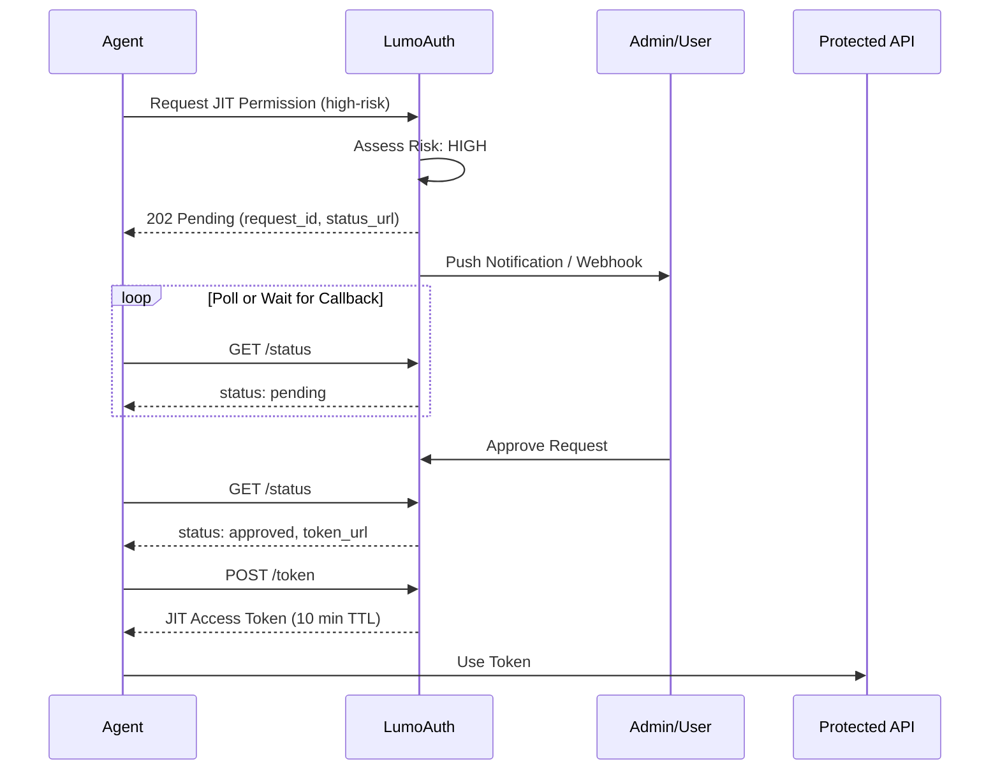

# Just-in-Time (JIT) Permissions

JIT permissions shift the security model from "Access by Default" to "Access by Request."
    Instead of granting broad capabilities upfront, agents request specific permissions at the 
    exact moment they need them, with short-lived tokens (5-15 minutes) that limit blast radius.

:::warning[Security First Design]
JIT permissions are granted with the minimum scope and duration needed.
All grants are logged for audit and can be revoked at any time.
:::


## Standards & Specifications

| Standard | Description | LumoAuth Implementation |
| --- | --- | --- |
| [RFC 9396](https://www.rfc-editor.org/rfc/rfc9396) | Rich Authorization Requests (RAR) | Full support for `authorization_details` JSON structure |
| [RFC 8693](https://www.rfc-editor.org/rfc/rfc8693) | Token Exchange | Downscoping tokens with specific RAR objects |
| RAR Error Signaling (Draft) | Insufficient authorization header | `Insufficient-Authorization-Details` header for agent self-correction |
| CAEP | Continuous Access Evaluation Profile | Real-time token revocation on suspicious behavior |

## Core Concepts

### 1. Ephemeral Personas (Task-Based Identity)

Every agent task gets a unique sub-identity via a `task_id`. This creates isolation 
    between different workflows, even for the same agent.

```json
{
  "sub": "agent:research-bot:task:task_abc123def456",
  "agent_id": "agt_research-bot",
  "task_id": "task_abc123def456",
  "parent_task_id": null,
  "jit": true,
  "exp": 1706644800,  // 10 minutes from now
  "authorization_details": [{
    "type": "file_access",
    "actions": ["read"],
    "identifier": "report_2024.pdf"
  }]
}
```

### 2. RFC 9396 Authorization Details

Instead of generic scopes like `files.read`, agents request specific authorization using 
    structured JSON objects:

```json
{
  "type": "file_access",
  "actions": ["read"],
  "identifier": "report_2024.pdf",
  "locations": ["https://storage.example.com/docs/"]
}
```

Common authorization types:

| Type | Actions | Description |
| --- | --- | --- |
| `file_access` | read, write, delete | Access to specific files or directories |
| `api_call` | GET, POST, PUT, DELETE | HTTP API operations |
| `database_query` | select, insert, update, delete | Database operations on specific tables |
| `tool_invocation` | execute | Invoking external tools or functions |
| `payment` | initiate, approve | Financial operations (high-risk, requires HITL) |
| `user_data` | read, export | Access to user PII (high-risk) |

### 3. Human-in-the-Loop (HITL)

High-risk operations pause for human approval before issuing tokens:

    


### 4. Token Downscoping (RFC 8693)

Agents start with minimal permissions and request specific capabilities as needed:

    
    
        
            
            JIT Token
        
        
            Specific action, short TTL

            `authorization_details: [{type: "file_access"...}]`
        
    

## API Reference

### Create Task (Ephemeral Persona)

    POST
    `/t/\{tenant\}/api/v1/jit/task`

Create a new ephemeral task context for the agent.

```bash
curl -X POST https://app.lumoauth.dev/t/acme-corp/api/v1/jit/task \
  -H "Authorization: Bearer $AGENT_TOKEN" \
  -H "Content-Type: application/json" \
  -d '{
    "name": "Research Task #123",
    "type": "research",
    "on_behalf_of": "alice@example.com"
  }'
```

```json
{
  "task_id": "task_a1b2c3d4e5f6g7h8",
  "caep_session_id": "caep_xyz789",
  "expires_at": "2026-01-30T15:00:00Z",
  "agent_id": "agt_research-bot",
  "on_behalf_of": "alice@example.com"
}
```

### Request JIT Permission

    POST
    `/t/\{tenant\}/api/v1/jit/request`

Request a specific permission using RFC 9396 authorization_details.

```bash
curl -X POST https://app.lumoauth.dev/t/acme-corp/api/v1/jit/request \
  -H "Authorization: Bearer $AGENT_TOKEN" \
  -H "Content-Type: application/json" \
  -d '{
    "task_id": "task_a1b2c3d4e5f6g7h8",
    "authorization_details": {
      "type": "file_access",
      "actions": ["read"],
      "identifier": "report_2024.pdf"
    },
    "justification": "Need to analyze Q4 financial data for user query",
    "requested_ttl": 300,
    "callback_url": "https://agent.example.com/webhook/jit"
  }'
```

```json
{
  "request_id": "jit_abc123xyz",
  "status": "approved",
  "risk_level": "low",
  "task_id": "task_a1b2c3d4e5f6g7h8",
  "token_url": "/t/acme-corp/api/v1/jit/request/jit_abc123xyz/token",
  "granted_ttl": 300
}
```

```json
{
  "request_id": "jit_def456uvw",
  "status": "pending",
  "risk_level": "high",
  "task_id": "task_a1b2c3d4e5f6g7h8",
  "status_url": "/t/acme-corp/api/v1/jit/request/jit_def456uvw/status",
  "expires_at": "2026-01-30T14:05:00Z",
  "message": "Request requires human approval. Poll status_url or wait for callback."
}
```

### Get Request Status

    GET
    `/t/\{tenant\}/api/v1/jit/request/\{request_id\}/status`

Poll for HITL approval status.

### Exchange for JIT Token

    POST
    `/t/\{tenant\}/api/v1/jit/request/\{request_id\}/token`

Exchange an approved request for a short-lived JIT token.

```json
{
  "access_token": "eyJhbGciOiJIUzI1NiIsInR5cCI6IkpXVCJ9...",
  "token_type": "Bearer",
  "expires_in": 300,
  "issued_token_type": "urn:ietf:params:oauth:token-type:access_token",
  "authorization_details": [{
    "type": "file_access",
    "actions": ["read"],
    "identifier": "report_2024.pdf"
  }],
  "task_id": "task_a1b2c3d4e5f6g7h8",
  "jit_request_id": "jit_abc123xyz"
}
```

### Complete Task

    POST
    `/t/\{tenant\}/api/v1/jit/task/\{task_id\}/complete`

Mark task complete and revoke all associated JIT tokens.

## Error Signaling (Agent Self-Correction)

When a resource server rejects a request due to insufficient permissions, it returns 
    a `403 Forbidden` with the `Insufficient-Authorization-Details` header:

```http
HTTP/1.1 403 Forbidden
WWW-Authenticate: Bearer error="insufficient_authorization_details"
Insufficient-Authorization-Details: eyJ0eXBlIjoiZmlsZV9hY2Nlc3MiLC...

{
  "error": "insufficient_authorization_details",
  "error_description": "Token lacks required permission",
  "authorization_details_hint": {
    "type": "file_access",
    "actions": ["write"],
    "identifier": "report_2024.pdf"
  }
}
```

The agent can automatically parse this response and request the specific permission:

```python
import base64
import json
import requests

def call_api_with_jit(agent_token, task_id, api_url, method="GET"):
    """Call API with automatic JIT permission escalation."""
    
    response = requests.request(method, api_url, headers={
        "Authorization": f"Bearer {agent_token}"
    })
    
    if response.status_code == 403:
        # Check for insufficient_authorization_details header
        header = response.headers.get("Insufficient-Authorization-Details")
        if header:
            # Decode the required authorization_details
            required_authz = json.loads(base64.b64decode(header))
            
            # Request JIT permission
            jit_response = requests.post(
                "https://app.lumoauth.dev/t/acme-corp/api/v1/jit/request",
                headers={"Authorization": f"Bearer {agent_token}"},
                json={
                    "task_id": task_id,
                    "authorization_details": required_authz,
                    "justification": "Required for user request"
                }
            )
            
            if jit_response.json()["status"] == "approved":
                # Get the JIT token
                token_url = jit_response.json()["token_url"]
                token_response = requests.post(
                    f"https://app.lumoauth.dev{token_url}",
                    headers={"Authorization": f"Bearer {agent_token}"}
                )
                jit_token = token_response.json()["access_token"]
                
                # Retry with JIT token
                return requests.request(method, api_url, headers={
                    "Authorization": f"Bearer {jit_token}"
                })
    
    return response
```

## Best Practices

| Practice | Description | Implementation |
| --- | --- | --- |
| **Ephemeral Personas** | Create a new sub-identity for every "Task" or "Thread" | Use `task_id` claim in JWT; call `/jit/task` at workflow start |
| **Token Downscoping** | Start with zero permissions; add only what's needed per tool-call | Request specific `authorization_details` per operation |
| **Human-in-the-Loop** | For high-risk JIT requests (delete, payment), pause token issuance | Configure webhook for approval notifications |
| **Short TTLs** | JIT tokens should rarely last longer than 5-15 minutes | Use `requested_ttl` parameter (max 900 seconds) |
| **Continuous Validation** | Don't just check at issuance; check during use | CAEP evaluates risk continuously and revokes suspicious tokens |
| **Self-Correction** | Agents should automatically request missing permissions | Parse `Insufficient-Authorization-Details` header on 403 |

## Risk Levels & HITL

JIT requests are automatically assessed for risk based on multiple factors:

| Risk Level | Triggers | Behavior |
| --- | --- | --- |
| Low | Read-only operations, non-sensitive resources | Auto-approved instantly |
| Medium | Write operations, elevated task risk score | Auto-approved with audit logging |
| High | Delete, admin, execute actions; sensitive resource types | Requires human approval (HITL) |
| Critical | Payment, user_data, credentials; CAEP flags; multiple denials | Requires human approval + extra review |

## CAEP Continuous Validation

LumoAuth continuously evaluates agent behavior during task execution:

- **Risk Score Accumulation:** Each permission request adds to task risk score
- **Denial Tracking:** Multiple denials trigger automatic task suspension
- **Anomaly Detection:** High-frequency requests or unusual patterns trigger flags
- **Real-time Revocation:** Suspicious tasks have all JIT tokens revoked immediately

```json
{
  "task_id": "task_a1b2c3d4e5f6g7h8",
  "active": false,
  "events": [
    {
      "type": "risk_threshold_exceeded",
      "details": {
        "risk_score": 65.0,
        "denial_count": 3
      },
      "timestamp": "2026-01-30T14:25:00Z"
    }
  ],
  "action": "suspended"
}
```

## Complete Integration Example

This example demonstrates the full JIT permission workflow using the
`lumoauth` Python SDK, including:

- **Agent authentication** using client credentials
- **User consent** via OAuth delegation (on-behalf-of flow)
- **Ephemeral task creation** for isolated personas
- **JIT permission requests** with HITL support
- **Token exchange** for scoped, short-lived access

### Install

```bash
pip install lumoauth
```

Set the required environment variables:

```bash
export LUMOAUTH_URL=https://app.lumoauth.dev
export LUMOAUTH_TENANT=acme-corp
export AGENT_CLIENT_ID=agt_...
export AGENT_CLIENT_SECRET=secret_...
```

### Full Example

```python
from lumoauth import LumoAuthAgent
from lumoauth.jit import JITContext

# 1. Authenticate the agent (client credentials)
agent = LumoAuthAgent()
agent.authenticate()

# 2. Create a JIT context (context-manager revokes tokens on exit)
with JITContext(agent) as jit:
    # 3. (Optional) Delegate on behalf of a user
    #    user_token is obtained when the user logs in via OAuth
    #    jit.delegate_on_behalf_of(user_token)

    # 4. Create an ephemeral task
    jit.create_task(
        name="Analyse Q4 Financial Report",
        task_type="analysis",
        on_behalf_of="alice@acme-corp.com",
    )

    # 5. Request a specific permission (RFC 9396)
    result = jit.request_permission(
        {
            "type": "file_access",
            "actions": ["read"],
            "identifier": "quarterly_report_q4_2024.pdf",
            "locations": ["https://storage.acme-corp.com/finance/"],
        },
        justification="User asked: 'What were our Q4 revenues?'",
    )

    if result["status"] == "approved":
        # 6. Exchange approval for a short-lived JIT token
        jit_token = jit.get_token(result["request_id"])

        # 7. Use the token to access the protected resource
        resp = jit.call(
            jit_token,
            "GET",
            "https://storage.acme-corp.com/finance/quarterly_report_q4_2024.pdf",
        )
        print(f"Read {len(resp.content)} bytes")

    elif result["status"] == "denied":
        print(f"Permission denied: {result.get('deny_reason')}")
```

### Auto-Escalation

`call_with_escalation` automatically handles the 403 → JIT request → retry
flow when a resource returns an `Insufficient-Authorization-Details` header:

```python
with JITContext(agent) as jit:
    jit.create_task(name="Ad-hoc data access")

    resp = jit.call_with_escalation(
        "GET",
        "https://api.acme-corp.com/v1/documents/doc_9982",
        justification="User asked for summary of doc_9982",
    )
    print(resp.json())
```


:::note[Pro Tip]
Always check the `error` field in responses to determine if the request was successful.
Use the `details` object for machine-readable error information to help with debugging.
:::


## Framework Examples

The patterns above work with any HTTP-capable language or framework. Select
your framework below for a complete, copy-paste integration guide.

| Framework | Guide |
|-----------|-------|
| LangChain / LangGraph | [View example →](./jit-langgraph) |
| CrewAI | [View example →](./jit-crewai) |
| OpenAI Agents SDK | [View example →](./jit-openai-agents) |
| Agno | [View example →](./jit-agno) |
| Google ADK | [View example →](./jit-google-adk) |


