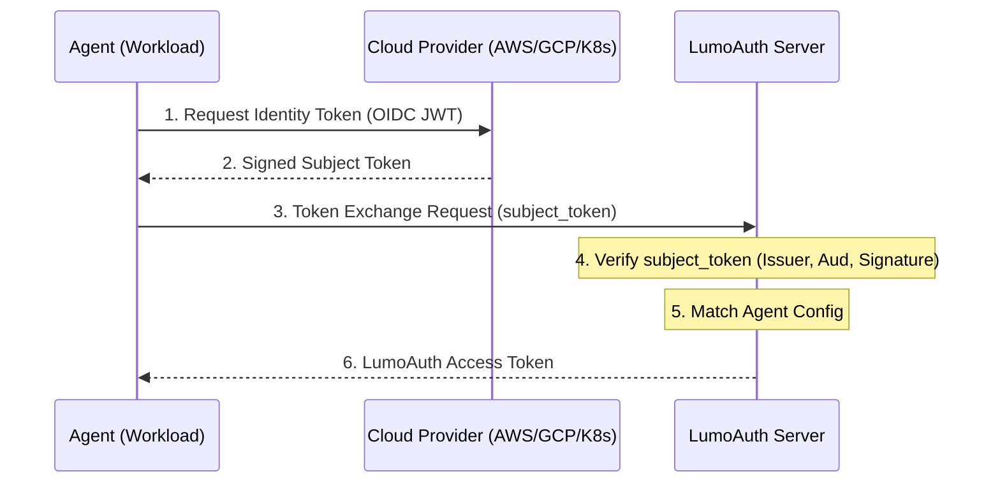

# Workload Identity Federation

Authenticate agents using their native platform identity (AWS, GCP, Azure, Kubernetes) instead of static secrets.
Exchange tokens from your infrastructure provider for LumoAuth access tokens using `urn:ietf:params:oauth:grant-type:token-exchange`.

## Overview

## Token Exchange Flow



The flow is simple: your agent retrieves a signed JWT from its environment (the **Subject Token**) and sends it to LumoAuth. LumoAuth verifies the signature against the provider's public keys (JWKS) and, if valid, issues a LumoAuth Access Token.

## Configuration

To enable Workload Identity for an agent:

1. **Navigate to AI Agents** — Go to the **AI Agents** section within your Tenant Portal dashboard.
2. **Initiate Agent Setup** — Click the **Create Agent** button to start a new agent, or select an existing agent and click "Edit".
3. **Select Identity Method** — In the Authentication Method section, choose **Workload Identity**.
4. **Choose Provider** — Select your hosting platform (Kubernetes, AWS, GCP, Azure) from the **Cloud Provider** dropdown.
5. **Configure Trust** — Fill in the provider-specific details (referenced below) to establish the trust relationship.

## Provider Guides

### Kubernetes

Authenticate a Pod running in a Kubernetes cluster.

| Field | Description |
| --- | --- |
| **Cluster Issuer URL** | Primary OIDC issuer (e.g., EKS OIDC URL) |
| **Namespace** | K8s namespace where agent runs |
| **Service Account** | Name of the ServiceAccount |

### AWS

Authenticate EC2, Lambda, or ECS via IAM Role.

| Field | Description |
| --- | --- |
| **Role ARN** | `arn:aws:iam::123:role/name` |
| **Region** | (Optional) Specific AWS region |

### Google Cloud

Authenticate via GCP Service Account.

| Field | Description |
| --- | --- |
| **Service Account Email** | `agent@project.iam.gserviceaccount.com` |
| **Project ID** | GCP Project Identifier |

### Azure

Authenticate via Managed Identity.

| Field | Description |
| --- | --- |
| **Client ID** | Application (Client) ID |
| **Tenant ID** | Directory (Tenant) ID |

### Custom OIDC Provider

Use any standard OpenID Connect provider (Auth0, Okta, Keycloak).

| Field | Description |
| --- | --- |
| **Issuer URL** | The `iss` claim value |
| **Subject** | Expected `sub` claim |
| **Audience** | Expected `aud` claim |

## API Usage (Token Exchange)

Once configured, your agent can exchange its platform token for a LumoAuth token.

```http
POST /t/{tenant_slug}/api/v1/oauth/token HTTP/1.1
Host: your-lumoauth-domain.com
Content-Type: application/x-www-form-urlencoded

grant_type=urn:ietf:params:oauth:grant-type:token-exchange
&subject_token=<PLATFORM_TOKEN>
&subject_token_type=urn:ietf:params:oauth:token-type:jwt
&subject_issuer=<PROVIDER>
```

### Parameter Details

| Parameter | Required | Description |
| --- | --- | --- |
| `subject_token` | Yes | The Identity Token (JWT) obtained from your cloud provider. **Kubernetes:** Content of `/var/run/secrets/.../token`. **AWS:** Result of `sts.get_caller_identity()` (signed). **GCP:** Metadata server identity response. **Azure:** Managed Identity token. |
| `subject_issuer` | Yes | The provider identifier: `kubernetes`, `aws`, `gcp`, `azure`, or `oidc`. |
| `subject_token_type` | Yes | Must be `urn:ietf:params:oauth:token-type:jwt` |
| `grant_type` | Yes | Must be `urn:ietf:params:oauth:grant-type:token-exchange` |

### Example: Python Code

```python
import requests

def get_access_token(tenant_slug, subject_token):
    url = f"https://app.lumoauth.dev/t/{tenant_slug}/api/v1/oauth/token"
    payload = {
        "grant_type": "urn:ietf:params:oauth:grant-type:token-exchange",
        "subject_token": subject_token,
        "subject_token_type": "urn:ietf:params:oauth:token-type:jwt"
    }

    response = requests.post(url, data=payload)
    response.raise_for_status()
    return response.json()["access_token"]

# 1. Get K8s Token
with open('/var/run/secrets/kubernetes.io/serviceaccount/token') as f:
    k8s_token = f.read().strip()

# 2. Exchange for LumoAuth Token
token = get_access_token("acme-corp", k8s_token)
print(f"Got Access Token: {token}")
```

:::note[Audience Validation]
LumoAuth validates the `aud` claim in the subject token matches the expected audience configured for the agent.
:::

