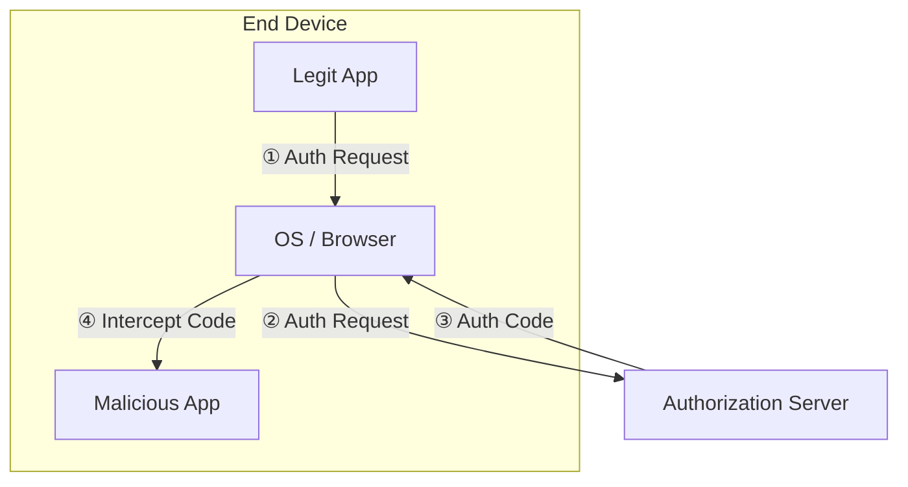
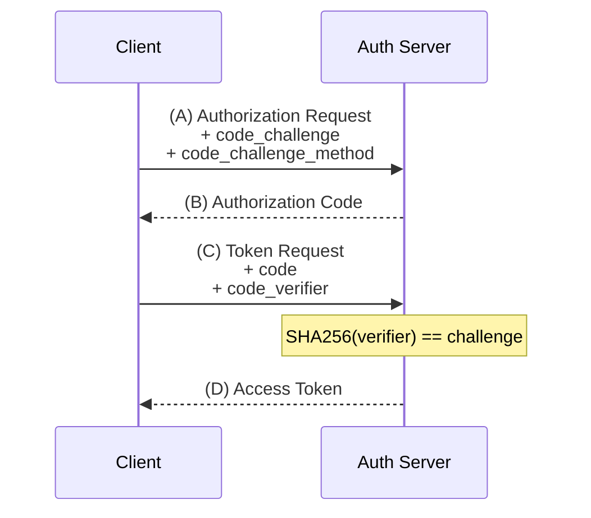

# PKCE (Proof Key for Code Exchange)

                
RFC 7636 implementation for secure OAuth 2.0 authorization code flows.

            
        

        
PKCE (pronounced "pixy") is a security extension to OAuth 2.0 that protects authorization codes from
            interception attacks. It's **mandatory in OAuth 2.1** and required by LumoAuth for all
            public clients and recommended for confidential clients.

        > [!NOTE]
> **RFC 7636 Compliant**

    
        
            Quick Reference
            
                
                    summary
                    
                
                
```
# PKCE Flow Overview

1. Generate code_verifier (43-128 chars)
2. Create   code_challenge = BASE64URL(SHA256(verifier))
3. Send     code_challenge to /oauth/authorize
4. Send     code_verifier  to /oauth/token

# Supported Methods
S256  - SHA-256 hash (recommended, MTI)
plain - No transformation (legacy only)
```

            
        
    

    
    

    
        ## Why PKCE?

        
PKCE protects against the **authorization code interception attack**, where a malicious 
            application on the same device intercepts the authorization code from the redirect URI.

        
        ### Attack Scenario

        
Without PKCE:

        
1. User authorizes your app and gets an authorization code
2. Malicious app intercepts the redirect containing the code
3. Attacker exchanges the code for tokens using your client credentials
4. Attacker gains access to user's resources

        
        ### With PKCE

        
The attacker cannot exchange the code because they don't possess the secret `code_verifier` that was never transmitted over the network.

        
        > [!WARNING]
> **Required for Public Clients**

    
        
            Attack Diagram
            
                
                    diagram
                    
                
                


> **PKCE Solution:** Only the app with the secret `code_verifier` can exchange the code.

            
        
    

    
    

    
        ## Protocol Flow

        
PKCE adds two parameters to the standard authorization code flow:

        
        ### Step 1: Create Code Verifier

        
Generate a high-entropy cryptographic random string:

        
            
                
                    code_verifier
                    string
                
                
                    
- **Length:** 43-128 characters
- **Characters:** `[A-Z] [a-z] [0-9] - . _ ~` (unreserved URI characters)
- **Entropy:** Minimum 256 bits recommended

                
            
        
        
        ### Step 2: Create Code Challenge

        
Transform the verifier using S256 (recommended) or plain:

        
            
                
                    S256
                    recommended
                
                `BASE64URL(SHA256(ASCII(code_verifier)))`
            
            
                
                    plain
                    legacy
                
                `code_challenge = code_verifier`
            
        
    
    
        
            PKCE Flow Diagram
            
                
                    diagram
                    
                
                


            
        
    

    
    

    
        ## Implementation

        
        ### Authorization Request

        
Include these parameters when redirecting to the authorization endpoint:

        
        
            
                
                    code_challenge
                    string
                    required
                
                
                    The transformed code verifier. For S256: base64url-encoded SHA256 hash of the verifier.
                    
- Length: 43-128 characters
- Characters: `[A-Z] [a-z] [0-9] - . _ ~`

                
            
            
                
                    code_challenge_method
                    string
                    optional
                
                
                    Transformation method used. Defaults to `plain` if not specified.
                    
- `S256` - SHA-256 (recommended, mandatory to implement)
- `plain` - No transformation (only for constrained environments)

                
            
        
        
        ### Token Request

        
Include the original verifier when exchanging the code:

        
        
            
                
                    code_verifier
                    string
                    required
                
                
                    The original code verifier created in step 1. The server will hash this and compare it to the stored challenge.
                
            
        
    
    
        
            JavaScript Implementation
            
                
                    javascript
                    
                
                
```
// Generate code_verifier (43-128 unreserved chars)
function generateCodeVerifier() {
  const array = new Uint8Array(32);
  crypto.getRandomValues(array);
  return base64UrlEncode(array);
}

// Create S256 code_challenge
async function createCodeChallenge(verifier) {
  const encoder = new TextEncoder();
  const data = encoder.encode(verifier);
  const hash = await crypto.subtle
    .digest('SHA-256', data);
  return base64UrlEncode(
    new Uint8Array(hash)
  );
}

// Base64URL encoding (no padding)
function base64UrlEncode(buffer) {
  return btoa(String.fromCharCode(...buffer))
    .replace(/\+/g, '-')
    .replace(/\//g, '_')
    .replace(/=+$/, '');
}
```

            
        
    

    
    

    
        ## Complete Example

        
Here's a complete PKCE flow implementation:

        
        ### Step-by-Step

        
1. **Generate verifier:** `dBjftJeZ4CVP-mB92K27uhbUJU1p1r_wW1gFWFOEjXk`
2. **Compute SHA256:** Hash the ASCII bytes of the verifier
3. **Base64URL encode:** `E9Melhoa2OwvFrEMTJguCHaoeK1t8URWbuGJSstw-cM`
4. **Send challenge** in authorization request
5. **Store verifier** securely (session, secure storage)
6. **Send verifier** when exchanging code for tokens

        
        
            Security Note
            
Never transmit the `code_verifier` until the token exchange. Store it securely on the client.

        
    
    
        
            RFC 7636 Example Values
            
                
                    text
                    
                
                
```
# code_verifier (from 32 random octets)
dBjftJeZ4CVP-mB92K27uhbUJU1p1r_wW1gFWFOEjXk

# SHA256 of verifier (hex)
13d31e96 1a1ad8ec 2f16b10c 4c982e08
76a878ad 6df14456 6ee18949 4cb70f9c3

# code_challenge (base64url of hash)
E9Melhoa2OwvFrEMTJguCHaoeK1t8URWbuGJSstw-cM
```

            
        
        
            Authorization Request
            
                
                    url
                    
                
                
```
https://app.lumoauth.dev/t/acme-corp/api/v1/oauth/authorize?
  response_type=code&
  client_id=your_client_id&
  redirect_uri=https://app.example.com/callback&
  scope=openid profile&
  state=abc123&
  code_challenge=E9Melhoa2OwvFrEMTJguCHaoeK1t8URWbuGJSstw-cM&
  code_challenge_method=S256
```

            
        
        
            Token Request
            
                
                    bash
                    
                
                
```
curl -X POST \
  https://app.lumoauth.dev/t/acme-corp/api/v1/oauth/token \
  -H "Content-Type: application/x-www-form-urlencoded" \
  -d "grant_type=authorization_code" \
  -d "code=SplxlOBeZQQYbYS6WxSbIA" \
  -d "redirect_uri=https://app.example.com/callback" \
  -d "client_id=your_client_id" \
  -d "code_verifier=dBjftJeZ4CVP-mB92K27uhbUJU1p1r_wW1gFWFOEjXk"
```

            
        
    

    
    

    
        ## Language Examples

        
PKCE implementations in popular languages:

    
    
        
            Python
            
                
                    python
                    
                
                
```
import secrets
import hashlib
import base64

def generate_pkce():
    # Generate 32 random bytes -> 43 char verifier
    verifier = secrets.token_urlsafe(32)
    
    # SHA256 hash and base64url encode
    digest = hashlib.sha256(
        verifier.encode('ascii')
    ).digest()
    
    challenge = base64.urlsafe_b64encode(digest) \
        .decode('ascii') \
        .rstrip('=')
    
    return verifier, challenge

verifier, challenge = generate_pkce()
print(f"Verifier: {verifier}")
print(f"Challenge: {challenge}")
```

            
        
        
            PHP
            
                
                    php
                    
                
                
```
function generatePkce(): array
{
    // Generate 32 random bytes
    $bytes = random_bytes(32);
    
    // Base64URL encode for verifier
    $verifier = rtrim(strtr(
        base64_encode($bytes), 
        '+/', '-_'
    ), '=');
    
    // SHA256 hash and base64URL encode
    $hash = hash('sha256', $verifier, true);
    $challenge = rtrim(strtr(
        base64_encode($hash), 
        '+/', '-_'
    ), '=');
    
    return [$verifier, $challenge];
}

[$verifier, $challenge] = generatePkce();
echo "Verifier: $verifier\n";
echo "Challenge: $challenge\n";
```

            
        
        
            Swift (iOS)
            
                
                    swift
                    
                
                
```
import CryptoKit
import Foundation

func generatePKCE() -> (
    verifier: String, 
    challenge: String
) {
    // Generate 32 random bytes
    var bytes = [UInt8](repeating: 0, count: 32)
    _ = SecRandomCopyBytes(
        kSecRandomDefault, 32, &bytes
    )
    
    // Base64URL encode for verifier
    let verifier = Data(bytes)
        .base64EncodedString()
        .replacingOccurrences(of: "+", with: "-")
        .replacingOccurrences(of: "/", with: "_")
        .replacingOccurrences(of: "=", with: "")
    
    // SHA256 and base64URL encode
    let hash = SHA256.hash(
        data: Data(verifier.utf8)
    )
    let challenge = Data(hash)
        .base64EncodedString()
        .replacingOccurrences(of: "+", with: "-")
        .replacingOccurrences(of: "/", with: "_")
        .replacingOccurrences(of: "=", with: "")
    
    return (verifier, challenge)
}
```

            
        
    

    
    

    
        ## Error Handling

        
PKCE-related errors follow OAuth 2.0 error response format:

        
        
| Error Code | When | Description |
| --- | --- | --- |
| `invalid_request` | Authorization | `code_challenge` missing when required, or invalid format (not 43-128 unreserved chars) |
| `invalid_request` | Authorization | `code_challenge_method` not `plain` or `S256` |
| `invalid_grant` | Token | `code_verifier` missing when `code_challenge` was provided |
| `invalid_grant` | Token | `code_verifier` format invalid (not 43-128 unreserved chars) |
| `invalid_grant` | Token | `code_verifier` doesn't match stored `code_challenge` |

    
    
        
            Error Response Example
            
                
                    json
                    
                
                
```
// Missing code_verifier at token endpoint
{
  "error": "invalid_grant",
  "error_description": "code_verifier is required"
}

// Invalid code_verifier format
{
  "error": "invalid_grant",
  "error_description": "code_verifier must be at least 43 characters (got 20)"
}

// Verification failed
{
  "error": "invalid_grant",
  "error_description": "code_verifier verification failed"
}
```

            
        
    

    
    

    
        ## Security Considerations

        
        ### Use S256, Not plain

        
The `plain` method only protects against attackers who can observe responses but not requests.
            `S256` protects even when attackers can observe both. Always use `S256` unless you
            have a technical constraint that prevents it.

        
        ### Entropy Requirements

        
The code verifier must have at least 256 bits of entropy to prevent brute-force attacks.
            Generate it from a cryptographically secure random number generator (CSPRNG).

        
        ### Secure Storage

        
Store the `code_verifier` securely until the token exchange. On mobile platforms, use
            secure enclave or keychain. On web, use `sessionStorage` or secure server-side sessions.

        
        ### No Downgrade

        
Clients must not downgrade from `S256` to `plain` after receiving an error.
            LumoAuth supports both methods, so an error with `S256` indicates a server issue or attack.

        
        > [!NOTE]
> **FAPI 2.0 Requirements**

    
        
            Secure Verifier Storage (Web)
            
                
                    javascript
                    
                
                
```
// Store verifier before redirect
const verifier = generateCodeVerifier();
sessionStorage.setItem(
  'pkce_verifier', 
  verifier
);

// Retrieve after redirect
const storedVerifier = sessionStorage
  .getItem('pkce_verifier');
sessionStorage.removeItem('pkce_verifier');

// Use in token exchange
const response = await fetch(tokenUrl, {
  method: 'POST',
  body: new URLSearchParams({
    grant_type: 'authorization_code',
    code: authorizationCode,
    redirect_uri: redirectUri,
    client_id: clientId,
    code_verifier: storedVerifier
  })
});
```

            
        
    

    
    

    
        ## Specifications

        
LumoAuth's PKCE implementation conforms to:

        
        
| Specification | Status |
| --- | --- |
| [RFC 7636](https://www.rfc-editor.org/rfc/rfc7636) - PKCE | ✅ Fully Compliant |
| [OAuth 2.1](https://datatracker.ietf.org/doc/html/draft-ietf-oauth-v2-1-10) - Mandatory PKCE | ✅ Enforced for Public Clients |
| [FAPI 2.0](https://openid.net/specs/fapi-2_0-security-profile.html) - S256 Required | ✅ Enforced for FAPI Clients |

        
        ### Implementation Details

        
- Supported methods: `S256` (MTI), `plain`
- Verifier length: 43-128 characters
- Challenge length: 43-128 characters
- Character set: `[A-Za-z0-9\-._~]` (RFC 3986 unreserved)
- Hash algorithm: SHA-256
- Encoding: Base64URL without padding

    
    
        
            ABNF Definitions (RFC 7636)
            
                
                    abnf
                    
                
                
```
; code_verifier = 43*128unreserved
code-verifier = 43*128unreserved

; code_challenge = 43*128unreserved
code-challenge = 43*128unreserved

; unreserved = ALPHA / DIGIT / "-" / "." / "_" / "~"
unreserved = ALPHA / DIGIT / "-" / "." / "_" / "~"

; ALPHA = A-Z / a-z
ALPHA = %x41-5A / %x61-7A

; DIGIT = 0-9
DIGIT = %x30-39
```
