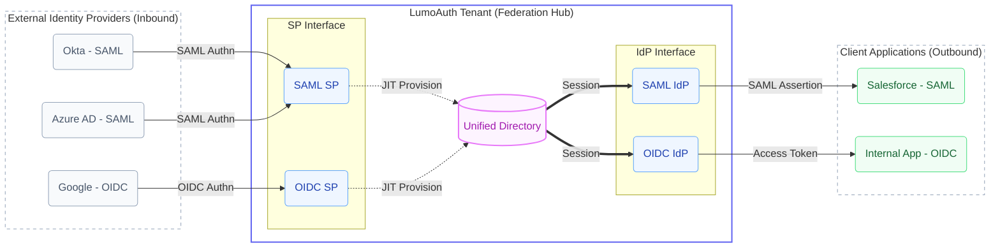
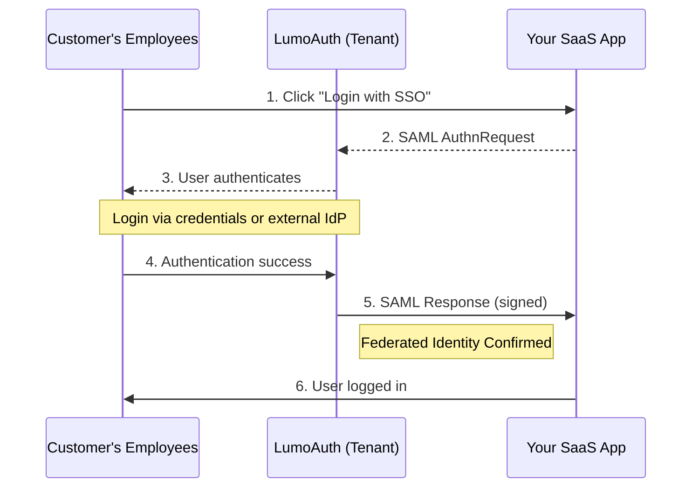
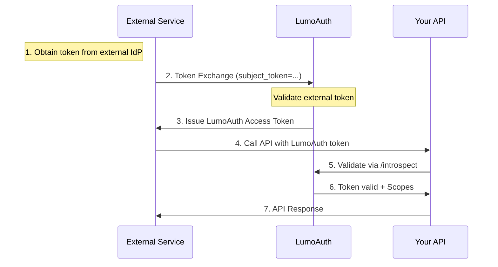

# Identity Federation

LumoAuth provides comprehensive identity federation capabilities, enabling each tenant to act as 
    both an OAuth 2.0/OIDC and SAML 2.0 Identity Provider. External applications, services, 
    and other identity providers can federate with LumoAuth for seamless single sign-on and 
    secure identity exchange.

:::note[What is Identity Federation?]
Identity Federation allows users to authenticate with one system and gain access to
resources in another system without needing separate credentials. LumoAuth supports both
inbound federation (accepting external IdP logins) and outbound federation (acting as an IdP).
:::


## Federation Architecture

Each LumoAuth tenant functions as an independent identity authority with full federation capabilities:



## OAuth 2.0 / OIDC Identity Provider

Each tenant exposes standard OAuth 2.0 and OpenID Connect endpoints, enabling relying party 
    applications to authenticate users and obtain tokens.

### Discovery Endpoint

    
        **GET** 
        `/t/\{tenantSlug\}/api/v1/.well-known/openid-configuration`
    

External applications can discover all OAuth/OIDC endpoints automatically by fetching this metadata document:

```bash
curl https://app.lumoauth.dev/t/acme-corp/api/v1/.well-known/openid-configuration
```

### Discovery Response

```json
{
  "issuer": "https://app.lumoauth.dev/t/acme-corp/api/v1",
  "authorization_endpoint": "https://app.lumoauth.dev/t/acme-corp/api/v1/oauth/authorize",
  "token_endpoint": "https://app.lumoauth.dev/t/acme-corp/api/v1/oauth/token",
  "userinfo_endpoint": "https://app.lumoauth.dev/t/acme-corp/api/v1/oauth/userinfo",
  "jwks_uri": "https://app.lumoauth.dev/t/acme-corp/api/v1/.well-known/jwks.json",
  "registration_endpoint": "https://app.lumoauth.dev/t/acme-corp/api/v1/oauth/register",
  "introspection_endpoint": "https://app.lumoauth.dev/t/acme-corp/api/v1/oauth/introspect",
  "revocation_endpoint": "https://app.lumoauth.dev/t/acme-corp/api/v1/oauth/revoke",
  "end_session_endpoint": "https://app.lumoauth.dev/t/acme-corp/api/v1/oauth/logout",
  "pushed_authorization_request_endpoint": "https://app.lumoauth.dev/t/acme-corp/api/v1/oauth/par",
  "backchannel_authentication_endpoint": "https://app.lumoauth.dev/t/acme-corp/api/v1/oauth/bc-authorize",
  "scopes_supported": ["openid", "profile", "email", "phone", "address", "offline_access"],
  "response_types_supported": ["code"],
  "grant_types_supported": [
    "authorization_code",
    "refresh_token",
    "client_credentials",
    "urn:ietf:params:oauth:grant-type:token-exchange",
    "urn:openid:params:grant-type:ciba"
  ],
  "token_endpoint_auth_methods_supported": [
    "client_secret_basic",
    "client_secret_post",
    "private_key_jwt",
    "tls_client_auth"
  ],
  "code_challenge_methods_supported": ["S256"],
  "dpop_signing_alg_values_supported": ["ES256", "PS256", "RS256"]
}
```

### Supported Features

| Feature | Specification | Description |
| --- | --- | --- |
| **Authorization Code + PKCE** | RFC 7636 | Secure flow for web apps, SPAs, and mobile apps |
| **Client Credentials** | RFC 6749 | Machine-to-machine authentication |
| **Token Exchange** | RFC 8693 | Exchange tokens for federation and delegation |
| **CIBA** | OpenID CIBA 1.0 | Client-initiated backchannel authentication |
| **PAR** | RFC 9126 | Pushed Authorization Requests for enhanced security |
| **DPoP** | RFC 9449 | Sender-constrained proof-of-possession tokens |
| **FAPI 2.0** | OpenID FAPI 2.0 | Financial-grade API security profile |
| **Introspection** | RFC 7662 | Token validation for resource servers |
| **Revocation** | RFC 7009 | Revoke access and refresh tokens |
| **Dynamic Registration** | RFC 7591 | Programmatic OAuth client creation |

## SAML 2.0 Identity Provider

Each tenant also acts as a SAML 2.0 Identity Provider, issuing signed SAML assertions to 
    configured Service Provider applications.

### IdP Metadata

    
        **GET** 
        `/t/\{tenantSlug\}/saml/idp/metadata`
    

Provide this metadata URL to SP applications to configure SAML SSO:

```bash
curl https://app.lumoauth.dev/t/acme-corp/saml/idp/metadata
```

### SAML IdP Endpoints

| Endpoint | Method | Description |
| --- | --- | --- |
| `/t/\{tenant\}/saml/idp/metadata` | GET | IdP metadata XML document |
| `/t/\{tenant\}/saml/idp/sso` | GET/POST | Single Sign-On service (receives AuthnRequest) |
| `/t/\{tenant\}/saml/idp/slo` | GET/POST | Single Logout service |

### SAML Security Features

| Feature | Default | Configurable |
| --- | --- | --- |
| **Response Signing** | ✓ Enabled | Per SP |
| **Assertion Signing** | ✓ Enabled | Per SP |
| **Assertion Encryption** | Optional | Per SP |
| **Signed Request Validation** | Optional | Per SP |
| **NameID Formats** | Email | Email, Persistent, Transient |

## Configuring External Applications

:::tip[Integration Steps]
Most applications can be configured using the OIDC Discovery URL or SAML metadata URL.
Check your application's documentation for specific integration steps.
:::


### For OAuth 2.0 / OIDC Applications

Configure your OAuth application with:

| Configuration | Value |
| --- | --- |
| **Issuer** | https://app.lumoauth.dev/t/\{tenant\} |
| **Discovery URL** | `https://app.lumoauth.dev/t/\{tenant\}/api/v1/.well-known/openid-configuration` |
| **Authorization URL** | `https://app.lumoauth.dev/t/\{tenant\}/api/v1/oauth/authorize` |
| **Token URL** | `https://app.lumoauth.dev/t/\{tenant\}/api/v1/oauth/token` |
| **UserInfo URL** | `https://app.lumoauth.dev/t/\{tenant\}/api/v1/oauth/userinfo` |
| **JWKS URL** | `https://app.lumoauth.dev/t/\{tenant\}/api/v1/.well-known/jwks.json` |

### For SAML Applications

Configure your SAML SP application with:

| Configuration | Value |
| --- | --- |
| **IdP Entity ID** | `https://app.lumoauth.dev/t/\{tenant\}/saml/idp/metadata` |
| **IdP Metadata URL** | `https://app.lumoauth.dev/t/\{tenant\}/saml/idp/metadata` |
| **SSO URL** | `https://app.lumoauth.dev/t/\{tenant\}/saml/idp/sso` |
| **SLO URL** | `https://app.lumoauth.dev/t/\{tenant\}/saml/idp/slo` |
| **Certificate** | Download from metadata or tenant portal |

## Token Exchange Federation (RFC 8693)

Token Exchange enables advanced federation scenarios where tokens from one security domain 
    can be exchanged for tokens in another domain. This is essential for:

- **Cross-domain SSO:** Exchange external IdP tokens for LumoAuth tokens
- **Service-to-service calls:** Backend services acting on behalf of users
- **Identity delegation:** AI agents or workloads operating with user context
- **Impersonation:** Administrative access with audit trails

### Token Exchange Request

    
        **POST** 
        `/t/\{tenantSlug\}/api/v1/oauth/token`
    

```bash
curl -X POST https://app.lumoauth.dev/t/acme-corp/api/v1/oauth/token \
  -u "CLIENT_ID:CLIENT_SECRET" \
  -d "grant_type=urn:ietf:params:oauth:grant-type:token-exchange" \
  -d "subject_token=eyJhbGciOiJSUzI1NiI..." \
  -d "subject_token_type=urn:ietf:params:oauth:token-type:access_token" \
  -d "scope=openid profile email"
```

### Token Exchange Parameters

| Parameter | Required | Description |
| --- | --- | --- |
| `grant_type` | Yes | `urn:ietf:params:oauth:grant-type:token-exchange` |
| `subject_token` | Yes | The security token being exchanged |
| `subject_token_type` | Yes | URN identifying the token type |
| `actor_token` | No | Token representing the acting party (for delegation) |
| `actor_token_type` | No | URN identifying the actor token type |
| `subject_issuer` | No | Expected issuer of the subject token (for external tokens) |
| `requested_token_type` | No | Desired output token type |
| `scope` | No | Requested scopes for the new token |

### Supported Token Types

| Token Type URN | Description |
| --- | --- |
| `urn:ietf:params:oauth:token-type:access_token` | OAuth 2.0 access token (JWT or opaque) |
| `urn:ietf:params:oauth:token-type:refresh_token` | OAuth 2.0 refresh token |
| `urn:ietf:params:oauth:token-type:id_token` | OpenID Connect ID token |
| `urn:ietf:params:oauth:token-type:jwt` | Any JWT token |
| `urn:ietf:params:saml:token-type:saml2` | SAML 2.0 assertion |

### Token Exchange Response

```json
{
  "access_token": "eyJhbGciOiJSUzI1NiIsInR5cCI6IkpXVCJ9...",
  "issued_token_type": "urn:ietf:params:oauth:token-type:access_token",
  "token_type": "Bearer",
  "expires_in": 3600,
  "scope": "openid profile email"
}
```

## Inbound Federation (External IdP Login)

LumoAuth also supports inbound federation, allowing users to authenticate via external 
    Identity Providers. This enables B2B scenarios where enterprise customers use their 
    corporate IdP for SSO.

### Supported External IdP Types

| Protocol | Examples | Configuration |
| --- | --- | --- |
| **SAML 2.0** | Okta, Azure AD, ADFS, OneLogin, PingIdentity | Tenant Portal → SAML IdPs |
| **OAuth 2.0 / OIDC** | Google, Microsoft, GitHub, Custom OpenID providers | Tenant Portal → Social Login / IdP Connections |

### SAML SP Endpoints (for External IdP)

When accepting logins from external SAML IdPs, LumoAuth exposes SP endpoints:

| Endpoint | Description |
| --- | --- |
| `/t/\{tenant\}/saml/sp/metadata` | SP metadata for external IdP configuration |
| `/t/\{tenant\}/saml/sp/login` | Initiate SSO login via external IdP |
| `/t/\{tenant\}/saml/sp/acs` | Assertion Consumer Service (receives SAML Response) |
| `/t/\{tenant\}/saml/sp/slo` | Single Logout service |

### Just-in-Time (JIT) Provisioning

When users authenticate via external IdPs, LumoAuth can automatically create user accounts:

- **Automatic user creation:** New users provisioned on first login
- **Attribute mapping:** Map SAML/OIDC claims to user profile fields
- **Role assignment:** Assign default roles based on IdP or group membership
- **Attribute sync:** Update user attributes on each login

## Federation Use Cases

### 1. Enterprise SSO for SaaS Applications

    


### 2. API Federation with Token Exchange

    


### 3. Multi-Protocol Bridge

LumoAuth can bridge between SAML and OAuth/OIDC protocols:

- Users authenticate via corporate SAML IdP
- LumoAuth creates local session
- OAuth/OIDC applications receive JWT tokens
- Single unified identity across all protocols

## Security Considerations

:::warning[Federation Security Best Practices]
Always validate token signatures, check audience restrictions, and verify time constraints.
Use short-lived tokens and implement proper error handling for federation failures.
:::


| Security Feature | OAuth/OIDC | SAML |
| --- | --- | --- |
| **Signature Validation** | JWT RS256/ES256/PS256 | XML DSIG with X.509 |
| **Encryption** | TLS, JWE optional | XML Encryption optional |
| **Audience Restriction** | `aud` claim | AudienceRestriction element |
| **Time Validation** | `exp`, `iat`, `nbf` | NotBefore, NotOnOrAfter |
| **Replay Prevention** | `jti` claim | InResponseTo, ID attributes |

## Keep Reading

        
            Complete OAuth/OIDC endpoint reference for your applications.

    [SAML 2.0 Overview
        
        
            Enterprise single sign-on using the SAML 2.0 standard.](/saml)
    [SAML IdP Mode
        
        
            Detailed guide for configuring LumoAuth as an Identity Provider.](/saml/idp)
    [SAML SP Mode
        
        
            Accept identities from external enterprise Identity Providers.](/saml/sp)
    [Token Endpoint
        
        
            Master the token exchange and other OAuth 2.0 grant types.](/oauth/token)
    [Agent Workload Federation
        
        
            Configure secure identity for AI agents and autonomous workloads.](/agents/workload-federation)
