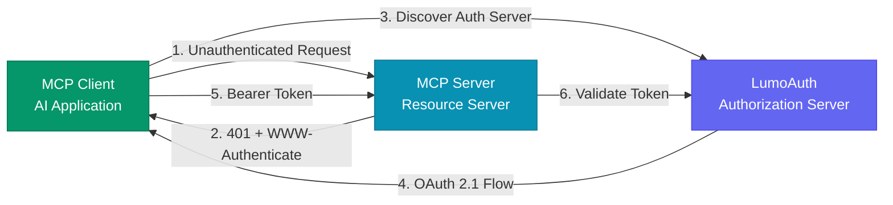

# MCP Server Authorization

LumoAuth provides first-class support for securing Model Context Protocol (MCP) servers
    with OAuth 2.0 authorization. Register MCP servers as protected resources, configure scopes,
    and let LumoAuth handle the authorization server discovery and token issuance for AI tools and agents.

    MCP Authorization Specification
    
This implementation follows the [MCP Authorization specification (draft)](https://modelcontextprotocol.io/specification/draft/basic/authorization.md) and implements the required standards: OAuth 2.1, RFC 9728 (Protected Resource Metadata), RFC 8707 (Resource Indicators), and RFC 8414 (Authorization Server Metadata).

## What is MCP?

The **Model Context Protocol (MCP)** enables AI applications (MCP clients) to connect to external
    tools and data sources (MCP servers). When an MCP server exposes sensitive resources, it needs
    authorization to ensure only permitted clients and users can access it.

In the MCP authorization model, LumoAuth acts as the **OAuth 2.0 Authorization Server**,
    your MCP server acts as the **Resource Server**, and AI applications act as **OAuth Clients**.

## Architecture

    

## Key Concepts

### Roles

    
| Role | Description | In LumoAuth |
| --- | --- | --- |
| **Authorization Server** | Issues access tokens and handles user authentication | LumoAuth serves this role |
| **Resource Server (MCP Server)** | Hosts tools, resources, and prompts; validates Bearer tokens | Your registered MCP server |
| **Client (MCP Client)** | AI application that connects to MCP servers on behalf of users | Registered as an OAuth client in LumoAuth |

### Standards Implemented

    
| Standard | Purpose |
| --- | --- |
| [OAuth 2.1](https://datatracker.ietf.org/doc/html/draft-ietf-oauth-v2-1-13) | Core authorization framework with security best practices |
| [RFC 9728](https://datatracker.ietf.org/doc/html/rfc9728) | OAuth 2.0 Protected Resource Metadata - how MCP clients discover the authorization server |
| [RFC 8707](https://www.rfc-editor.org/rfc/rfc8707.html) | Resource Indicators - binding tokens to specific MCP server audiences |
| [RFC 8414](https://datatracker.ietf.org/doc/html/rfc8414) | Authorization Server Metadata - discovering LumoAuth endpoints |
| [RFC 7591](https://datatracker.ietf.org/doc/html/rfc7591) | Dynamic Client Registration - MCP clients can self-register |

## Quick Start

    To secure an MCP server with LumoAuth:

1. **Register your MCP server** in the LumoAuth Tenant Portal under *Developer &gt; MCP Servers*
2. **Configure your MCP server** to return `401 Unauthorized` with a `WWW-Authenticate` header pointing to LumoAuth's Protected Resource Metadata
3. **Validate tokens** using LumoAuth's [token introspection endpoint](/oauth/introspect) and verify the audience matches your server's Resource URI

## API Endpoints

    
        **GET** 
        `/t/\{tenantSlug\}/api/v1/.well-known/oauth-protected-resource/mcp/\{serverId\}`
    
    
Returns the OAuth 2.0 Protected Resource Metadata (RFC 9728) for a specific MCP server.
        [View details &rarr;](/mcp/resource-metadata)

    
        **GET** 
        `/t/\{tenantSlug\}/api/v1/.well-known/oauth-protected-resource`
    
    
Root-level Protected Resource Metadata endpoint. Returns metadata for the tenant's MCP servers.
        [View details &rarr;](/mcp/resource-metadata)

    
        **GET** 
        `/t/\{tenantSlug\}/api/v1/mcp/servers`
    
    
List all active MCP servers for a tenant (requires Bearer token).
        [View details &rarr;](/mcp/registration)

    
        **GET** 
        `/t/\{tenantSlug\}/api/v1/mcp/servers/\{serverId\}`
    
    
Get details of a specific MCP server including discovery URLs.
        [View details &rarr;](/mcp/registration)

    
        **GET** 
        **POST** 
        `/t/\{tenantSlug\}/api/v1/mcp/\{serverId\}/challenge`
    
    
Test the 401 challenge flow for an MCP server. Returns `WWW-Authenticate` header for unauthenticated requests.
        [View details &rarr;](/mcp/authorization-flow)
