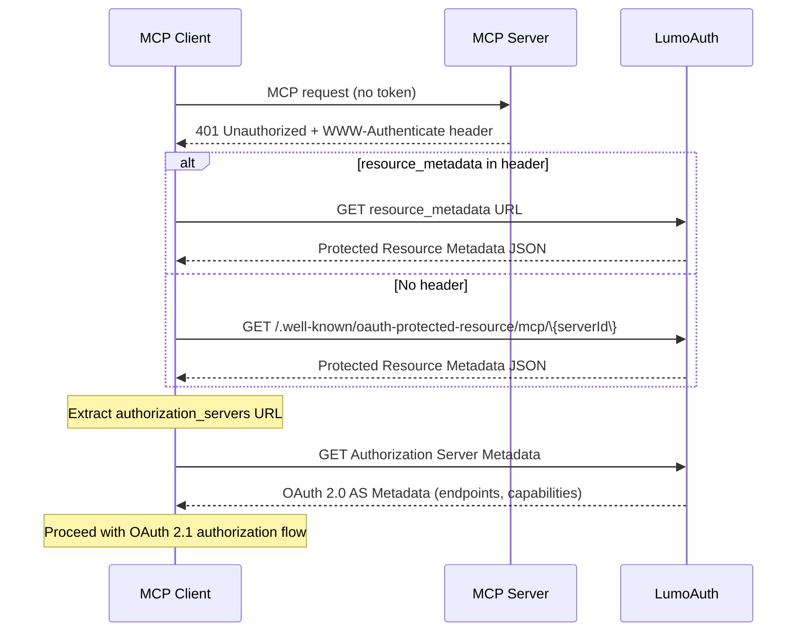

# Protected Resource Metadata (RFC 9728)

LumoAuth implements OAuth 2.0 Protected Resource Metadata
    ([RFC 9728](https://datatracker.ietf.org/doc/html/rfc9728))
    to enable MCP clients to discover the authorization server associated with each MCP server.
    This is the primary discovery mechanism required by the MCP Authorization specification.

## Discovery Mechanisms

Per the MCP spec, MCP servers MUST implement at least one of the following discovery mechanisms.
    LumoAuth supports both:

### 1. Well-Known URI (Recommended)

LumoAuth serves Protected Resource Metadata at well-known URIs for each registered MCP server:

    
        **GET** 
        `/t/\{tenantSlug\}/api/v1/.well-known/oauth-protected-resource/mcp/\{serverId\}`
    
    
Path-specific metadata for a specific MCP server.

    
        **GET** 
        `/t/\{tenantSlug\}/api/v1/.well-known/oauth-protected-resource`
    
    
Root-level metadata endpoint. Returns metadata for single-server tenants, or a list of servers for multi-server tenants.

### 2. WWW-Authenticate Header

When your MCP server returns a `401 Unauthorized` response, it should include a
    `WWW-Authenticate` header with the `resource_metadata` URL:

```bash
HTTP/1.1 401 Unauthorized
WWW-Authenticate: Bearer resource_metadata="https://app.lumoauth.dev/t/acme-corp/api/v1/.well-known/oauth-protected-resource/mcp/mcp_abc123",
                        scope="mcp:read mcp:write"
```

MCP clients MUST parse this header and use the `resource_metadata` URL to discover the authorization server. If the `scope` parameter is present, clients SHOULD use those scopes in the initial authorization request.

## Metadata Document Structure

The Protected Resource Metadata document follows the schema defined in
    [RFC 9728](https://datatracker.ietf.org/doc/html/rfc9728):

```json
{
  "resource": "https://mcp.example.com",
  "authorization_servers": [
    "https://app.lumoauth.dev/t/acme-corp/api/v1/.well-known/oauth-authorization-server"
  ],
  "bearer_methods_supported": ["header"],
  "scopes_supported": ["mcp:read", "mcp:write", "mcp:admin"]
}
```

### Fields

    
| Field | Required | Description |
| --- | --- | --- |
| `resource` | Yes | The canonical URI of the MCP server (Resource URI per RFC 8707) |
| `authorization_servers` | Yes | Array containing the URL(s) of the authorization server(s) that can issue tokens for this resource. Points to LumoAuth's OAuth Authorization Server Metadata endpoint. |
| `bearer_methods_supported` | No | Methods supported for Bearer token transmission. Per MCP spec, only `header` (Authorization request header) is MUST-supported. |
| `scopes_supported` | No | OAuth scopes supported by this resource. Represents the minimal set for basic functionality. |

## Client Discovery Flow

MCP clients MUST support both discovery mechanisms and follow this priority order:

1. **Check WWW-Authenticate header**: If the 401 response includes `resource_metadata`, use that URL directly
2. **Try path-specific well-known URI**: `/.well-known/oauth-protected-resource/\{path\}`
3. **Try root well-known URI**: `/.well-known/oauth-protected-resource`

    


## Testing Discovery

    You can test the discovery flow using the challenge endpoint:

```bash
# 1. Send unauthenticated request to trigger 401 challenge
curl -v https://app.lumoauth.dev/t/acme-corp/api/v1/mcp/mcp_abc123/challenge

# Look for: WWW-Authenticate: Bearer resource_metadata="...", scope="..."

# 2. Fetch the Protected Resource Metadata
curl https://app.lumoauth.dev/t/acme-corp/api/v1/.well-known/oauth-protected-resource/mcp/mcp_abc123

# 3. Fetch the Authorization Server Metadata
curl https://app.lumoauth.dev/t/acme-corp/api/v1/.well-known/oauth-authorization-server
```

## Scope Handling

### Scope Selection Strategy

Per the MCP spec, clients SHOULD follow this priority order for scope selection:

1. **Use `scope` from WWW-Authenticate header** if provided in the 401 response
2. **Use `scopes_supported` from Protected Resource Metadata** if the header scope is absent
3. **Omit scope parameter** if `scopes_supported` is also undefined

    Scope Minimization
    
The `scopes_supported` field should represent the **minimal set of scopes** necessary for basic MCP server functionality. Additional scopes can be requested incrementally through step-up authorization when the server returns a `403 Forbidden` with `error="insufficient_scope"`.

### Step-Up Authorization (Insufficient Scope)

When a client's token lacks required scopes for a specific operation, the MCP server SHOULD respond with:

```bash
HTTP/1.1 403 Forbidden
WWW-Authenticate: Bearer error="insufficient_scope",
                        scope="mcp:read mcp:write mcp:admin",
                        resource_metadata="https://app.lumoauth.dev/.well-known/oauth-protected-resource/mcp/mcp_abc123",
                        error_description="Admin permission required for this operation"
```

MCP clients SHOULD respond by initiating a step-up authorization flow with the expanded scope set.
