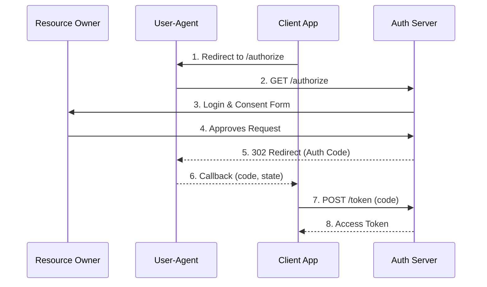

# Authorization Endpoint

The authorization endpoint is where users authenticate and grant permission to your application. 
    This is the starting point for the OAuth 2.0 Authorization Code flow.

    
        **GET** 
        `/t/\{tenantSlug\}/api/v1/oauth/authorize`
    

## How It Works

When a user clicks "Sign in with LumoAuth" in your application, you redirect them to this endpoint. 
    LumoAuth handles the entire authentication experience:

1. User is shown a login form (or social login options)
2. If MFA is enabled, they complete the second factor
3. User reviews and approves the permissions your app is requesting
4. LumoAuth redirects back to your app with an authorization code

    


:::tip[Why Use This Flow?]
The Authorization Code flow is the most secure OAuth flow for web applications.
User credentials are never exposed to your application - they're handled entirely by LumoAuth.
:::


## Request Parameters

| Parameter | Required | Description |
| --- | --- | --- |
| `client_id` | Yes | Your application's public identifier |
| `redirect_uri` | Yes | URL where LumoAuth will send the authorization code. Must exactly match a registered URI. |
| `response_type` | Yes | Must be `code` for the Authorization Code flow |
| `scope` | No | Space-separated list of permissions (e.g., `openid profile email`) |
| `state` | Recommended | Random string to prevent CSRF attacks. **Always verify this in your callback!** |
| `code_challenge` | Recommended | PKCE code challenge (SHA-256 hash of code_verifier, base64url encoded) |
| `code_challenge_method` | If PKCE | Must be `S256` (recommended) or `plain` |
| `nonce` | If OIDC | Random string to prevent replay attacks. Returned in the ID token. |
| `prompt` | No | `login` forces re-authentication, `create` shows registration |

## Example Request

```bash
GET /t/acme-corp/api/v1/oauth/authorize?
  response_type=code&
  client_id=abc123def456&
  redirect_uri=https://myapp.com/callback&
  scope=openid%20profile%20email&
  state=xyzSecureRandom123&
  code_challenge=E9Melhoa2OwvFrEMTJguCHaoeK1t8URWbuGJSstw-cM&
  code_challenge_method=S256
HTTP/1.1
Host: app.lumoauth.dev
```

## Successful Response

After the user authenticates and approves, LumoAuth redirects to your `redirect_uri` 
    with the authorization code and state:

```bash
HTTP/1.1 302 Found
Location: https://myapp.com/callback?
  code=SplxlOBeZQQYbYS6WxSbIA&
  state=xyzSecureRandom123
```

:::warning[Important: Verify the State]
Always compare the `state` parameter in the callback with the one you sent.
If they don't match, the request may be a CSRF attack - reject it immediately.
:::


## Error Response

If the user denies access or an error occurs, LumoAuth redirects with an error:

```bash
HTTP/1.1 302 Found
Location: https://myapp.com/callback?
  error=access_denied&
  error_description=The+user+denied+the+request&
  state=xyzSecureRandom123
```

| Error Code | Description |
| --- | --- |
| `invalid_request` | Missing or invalid parameters |
| `invalid_client` | Unknown client_id or mismatched redirect_uri |
| `access_denied` | User denied the authorization request |
| `server_error` | Unexpected server error |

## PKCE Implementation

PKCE (Proof Key for Code Exchange) protects against authorization code interception attacks. 
    Here's a complete example:

```python
import secrets
import hashlib
import base64

# Step 1: Generate code_verifier (43-128 characters)
code_verifier = secrets.token_urlsafe(32)

# Step 2: Create code_challenge (SHA-256 hash, base64url encoded)
code_challenge = base64.urlsafe_b64encode(
    hashlib.sha256(code_verifier.encode()).digest()
).decode().rstrip('=')

# Step 3: Build authorization URL
auth_url = (
    f"https://app.lumoauth.dev/t/acme-corp/api/v1/oauth/authorize?"
    f"response_type=code&"
    f"client_id=YOUR_CLIENT_ID&"
    f"redirect_uri=https://myapp.com/callback&"
    f"scope=openid%20profile&"
    f"state={secrets.token_urlsafe(16)}&"
    f"code_challenge={code_challenge}&"
    f"code_challenge_method=S256"
)

# Step 4: Store code_verifier in session (you'll need it later)
session['code_verifier'] = code_verifier

# Step 5: Redirect user to auth_url
```

## Next Steps

After receiving the authorization code, exchange it for tokens at the 
    [Token Endpoint](/oauth/token).
