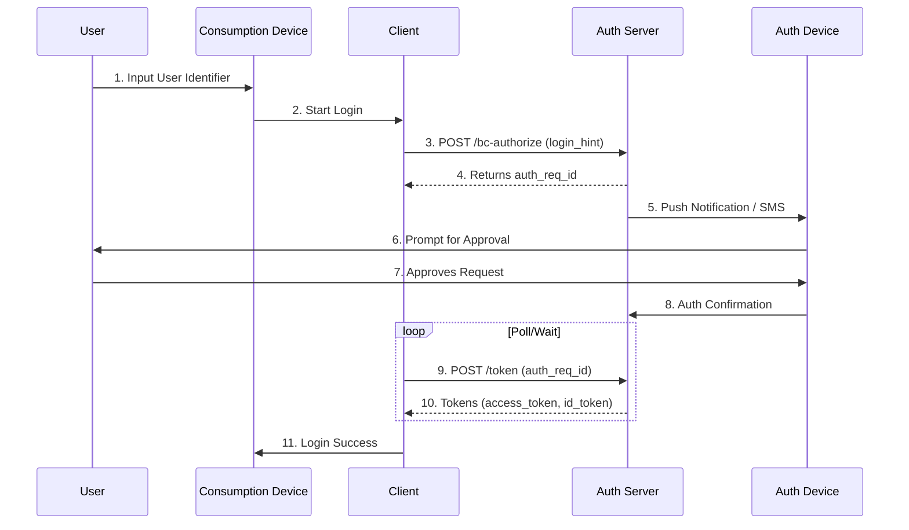

# Client-Initiated Backchannel Authentication (CIBA)

CIBA enables authentication flows where the client initiates authentication without browser redirects. 
    Perfect for call centers, point-of-sale, financial transactions, and IoT scenarios where the user 
    authenticates on a separate device.

:::note[Decoupled Authentication]
CIBA separates the device initiating authentication from the device where
the user authenticates. This enables scenarios like call center verification and IoT.
:::


## How CIBA Works

    
1. Client sends authentication request with a user hint (email, phone, etc.)
2. Server returns an `auth_req_id` immediately
3. User receives notification on their device and approves/denies
4. Client polls the token endpoint (or receives callback) for the result
5. Upon approval, tokens are issued

    


## Token Delivery Modes

| Mode | Description | Best For |
| --- | --- | --- |
| `poll` | Client polls the token endpoint until authentication completes | Simple integration, no callback infrastructure needed |
| `ping` | Server notifies client when ready, then client fetches tokens | Reduced polling, confirmed token delivery |
| `push` | Server pushes tokens directly to client's notification endpoint | Immediate delivery, no polling needed |

## Backchannel Authentication Endpoint

    
        **POST** 
        `/t/\{tenantSlug\}/api/v1/oauth/bc-authorize`
    

Initiate a backchannel authentication request. The client must be configured with CIBA enabled.

### Request Parameters

| Parameter | Required | Description |
| --- | --- | --- |
| `scope` | Yes | Space-separated scopes. `openid` is always included. |
| `login_hint` | One hint required | User's email address or username |
| `id_token_hint` | One hint required | Previously issued ID token for this user |
| `login_hint_token` | One hint required | JWT containing user identification |
| `binding_message` | No | Short message shown to user during authentication (e.g., "Transaction: $50.00") |
| `user_code` | No | Code the user must enter to prove presence (if supported) |
| `requested_expiry` | No | Preferred auth request lifetime in seconds (server may use shorter value) |
| `client_notification_token` | Ping/Push modes | Bearer token for server-to-client callbacks |

:::warning[Exactly One Hint Required]
Provide exactly one of `login_hint`, `login_hint_token`, or `id_token_hint`
to identify the user. Including more than one will result in an error.
:::


### Example Request

```bash
curl -X POST https://app.lumoauth.dev/t/acme-corp/api/v1/oauth/bc-authorize \
  -u "CLIENT_ID:CLIENT_SECRET" \
  -H "Content-Type: application/x-www-form-urlencoded" \
  -d "scope=openid%20profile%20email" \
  -d "login_hint=user@example.com" \
  -d "binding_message=Approve%20login%20from%20Call%20Center"
```

### Success Response

```json
{
  "auth_req_id": "1c266114-a1be-4252-8ad1-04986c5b9ac1",
  "expires_in": 120,
  "interval": 5
}
```

| Field | Description |
| --- | --- |
| `auth_req_id` | Unique identifier for this authentication request |
| `expires_in` | Seconds until this request expires |
| `interval` | Minimum seconds between poll requests (poll/ping modes) |

## Token Endpoint with CIBA Grant

    
        **POST** 
        `/t/\{tenantSlug\}/api/v1/oauth/token`
    

In poll mode, the client polls this endpoint using the `auth_req_id` received from 
    the backchannel authentication endpoint. Poll at least `interval` seconds apart.

### Request Parameters

| Parameter | Required | Description |
| --- | --- | --- |
| `grant_type` | Yes | `urn:openid:params:grant-type:ciba` |
| `auth_req_id` | Yes | The `auth_req_id` from the backchannel authentication response |

### Example Request

```bash
curl -X POST https://app.lumoauth.dev/t/acme-corp/api/v1/oauth/token \
  -u "CLIENT_ID:CLIENT_SECRET" \
  -H "Content-Type: application/x-www-form-urlencoded" \
  -d "grant_type=urn%3Aopenid%3Aparams%3Agrant-type%3Aciba" \
  -d "auth_req_id=1c266114-a1be-4252-8ad1-04986c5b9ac1"
```

### Pending Response (Keep Polling)

```json
{
  "error": "authorization_pending",
  "error_description": "The authorization request is still pending"
}
```

### Success Response (User Approved)

```json
{
  "access_token": "eyJhbGciOiJSUzI1NiIsInR5cCI6IkpXVCJ9...",
  "token_type": "Bearer",
  "expires_in": 3600,
  "refresh_token": "dGhpcyBpcyBhIHJlZnJlc2ggdG9rZW4...",
  "scope": "openid profile email",
  "id_token": "eyJhbGciOiJSUzI1NiIsInR5cCI6IkpXVCJ9..."
}
```

## Error Responses

CIBA defines specific error codes for different scenarios:

| Error | HTTP Status | Description |
| --- | --- | --- |
| `authorization_pending` | 400 | User hasn't approved/denied yet. Keep polling. |
| `slow_down` | 400 | Polling too fast. Increase your interval. |
| `expired_token` | 400 | The auth_req_id has expired. Start a new request. |
| `access_denied` | 403 | User denied the authentication request. |
| `unknown_user_id` | 400 | The user hint doesn't match any known user. |
| `unauthorized_client` | 400 | Client is not configured for CIBA. |
| `invalid_grant` | 400 | The auth_req_id is invalid or was issued to a different client. |

## Example: Poll Mode Integration

Here's a complete example of implementing CIBA poll mode in your application:

```python
import requests
import time

CLIENT_ID = "your_client_id"
CLIENT_SECRET = "your_client_secret"
BASE_URL = "https://app.lumoauth.dev/t/acme-corp/api/v1"

def authenticate_user(email):
    # Step 1: Initiate backchannel authentication
    auth_response = requests.post(
        f"{BASE_URL}/oauth/bc-authorize",
        auth=(CLIENT_ID, CLIENT_SECRET),
        data={
            "scope": "openid profile email",
            "login_hint": email,
            "binding_message": "Login requested from Support Portal"
        }
    )
    
    if not auth_response.ok:
        raise Exception(f"Auth failed: {auth_response.json()}")
    
    auth_data = auth_response.json()
    auth_req_id = auth_data["auth_req_id"]
    interval = auth_data.get("interval", 5)
    expires_in = auth_data["expires_in"]
    
    print(f"Waiting for user to approve... (expires in {expires_in}s)")
    
    # Step 2: Poll for tokens
    start_time = time.time()
    while time.time() - start_time < expires_in:
        time.sleep(interval)
        
        token_response = requests.post(
            f"{BASE_URL}/oauth/token",
            auth=(CLIENT_ID, CLIENT_SECRET),
            data={
                "grant_type": "urn:openid:params:grant-type:ciba",
                "auth_req_id": auth_req_id
            }
        )
        
        if token_response.ok:
            print("User approved! Tokens received.")
            return token_response.json()
        
        error = token_response.json().get("error")
        
        if error == "authorization_pending":
            print("Still waiting...")
            continue
        elif error == "slow_down":
            interval += 5  # Increase poll interval
            continue
        elif error == "access_denied":
            raise Exception("User denied the request")
        elif error == "expired_token":
            raise Exception("Request expired")
        else:
            raise Exception(f"Unexpected error: {token_response.json()}")
    
    raise Exception("Timeout waiting for user approval")

# Usage
tokens = authenticate_user("john.doe@example.com")
```

## Use Cases

:::tip[Call Center Authentication]
A customer service agent can initiate login verification on their terminal
while the customer approves on their mobile device.
:::


:::tip[Point-of-Sale]
A retail terminal initiates auth and the customer approves on their phone,
enabling secure payment authorization without exposing credentials.
:::


:::tip[Transaction Authorization]
High-value transactions can require out-of-band approval through
a separate authenticated device for enhanced security.
:::


## Discovery Metadata

CIBA endpoints and capabilities are advertised in the OpenID Connect Discovery document:

```bash
curl https://app.lumoauth.dev/t/acme-corp/api/v1/.well-known/openid-configuration | jq '{
  backchannel_authentication_endpoint,
  backchannel_token_delivery_modes_supported,
  backchannel_authentication_request_signing_alg_values_supported,
  backchannel_user_code_parameter_supported
}'
```

```json
{
  "backchannel_authentication_endpoint": "https://app.lumoauth.dev/t/acme-corp/api/v1/oauth/bc-authorize",
  "backchannel_token_delivery_modes_supported": ["poll", "ping", "push"],
  "backchannel_authentication_request_signing_alg_values_supported": ["RS256", "ES256", "PS256"],
  "backchannel_user_code_parameter_supported": true
}
```
