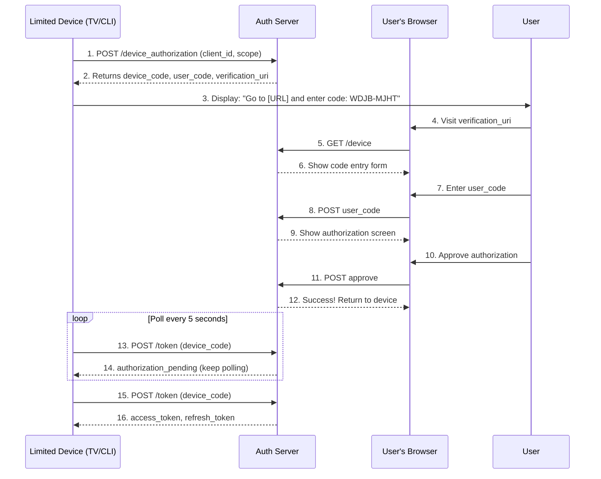

# Device Authorization Grant (RFC 8628)

The Device Authorization Grant enables OAuth on devices with limited input capabilities such as 
    smart TVs, gaming consoles, CLI tools, and IoT devices. Users authorize the device by entering a 
    short code on a separate device with a full browser.

:::note[Input-Constrained Devices]
The device authorization flow is designed for devices that lack a browser
or have limited input capabilities, such as smart TVs, printers, and CLI tools.
:::


## How Device Authorization Works

    
1. Device requests authorization, receives `device_code` and `user_code`
2. Device displays the `user_code` and verification URL to the user
3. User visits the URL and enters the code on their phone/computer
4. User authenticates and approves the authorization request
5. Device polls the token endpoint until authorization completes
6. Upon approval, tokens are issued to the device

    


## Use Cases

| Device Type | Example | Why Device Flow? |
| --- | --- | --- |
| **Smart TVs** | Netflix, YouTube, Disney+ | No keyboard, remote control only |
| **Gaming Consoles** | PlayStation, Xbox, Nintendo Switch | Controller input is cumbersome |
| **CLI Tools** | GitHub CLI, AWS CLI, Docker | No browser in terminal environment |
| **IoT Devices** | Printers, Smart Speakers | No screen or minimal display |
| **Kiosk Mode** | Digital Signage, Point-of-Sale | Locked-down browser, no URL bar |

## Device Authorization Endpoint

    
        **POST** 
        `/t/\{tenantSlug\}/api/v1/oauth/device_authorization`
    

The device initiates the authorization flow by requesting a device code and user code.

### Request Parameters

| Parameter | Required | Description |
| --- | --- | --- |
| `client_id` | Yes | The client identifier issued to your application |
| `scope` | No | Space-separated list of requested scopes (e.g., `openid profile email`) |

:::warning[Public Clients Only]
The device flow is intended for public clients that cannot securely store
a client secret. No `client_secret` is required.
:::


### Example Request

```bash
curl -X POST https://app.lumoauth.dev/t/acme-corp/api/v1/oauth/device_authorization \
  -H "Content-Type: application/x-www-form-urlencoded" \
  -d "client_id=my-tv-app" \
  -d "scope=openid%20profile"
```

### Success Response

```json
{
  "device_code": "GmRhmhcxhwAzkoEqiMEg_DnyEysNkuNhszIySk9eS",
  "user_code": "WDJB-MJHT",
  "verification_uri": "https://app.lumoauth.dev/t/acme-corp/api/v1/oauth/device",
  "verification_uri_complete": "https://app.lumoauth.dev/t/acme-corp/api/v1/oauth/device?user_code=WDJB-MJHT",
  "expires_in": 600,
  "interval": 5
}
```

| Field | Description |
| --- | --- |
| `device_code` | High-entropy verification code used for polling (keep secret) |
| `user_code` | Short, easy-to-type code for the user to enter |
| `verification_uri` | URL where the user should enter the code |
| `verification_uri_complete` | URL with user_code embedded (for QR codes) |
| `expires_in` | Seconds until the codes expire (default: 600 = 10 minutes) |
| `interval` | Minimum seconds between polling requests (default: 5) |

### User Code Format

:::note[Base-20 Character Set]
User codes use a base-20 character set (`BCDFGHJKLMNPQRSTVWXZ`) that avoids
ambiguous characters and vowels to prevent accidental word formation.
:::


## User Verification Page

    
        **GET** 
        `/t/\{tenantSlug\}/api/v1/oauth/device`
    

The verification page where users enter their code. Display this URL prominently on the device 
    along with the user code.

### What Users See

    
1. **Code Entry Screen:** User enters the 8-character code from their device
2. **Login (if needed):** User signs in if not already authenticated
3. **Authorization Screen:** Shows which app is requesting access and scopes
4. **Confirmation:** Success message telling user to return to their device

### QR Code Support

Use the `verification_uri_complete` to generate a QR code that users can scan with 
    their phone. This skips the manual code entry step for a smoother experience.

```javascript
// Generate QR code using the verification_uri_complete
const qr = new QRCode(document.getElementById("qr-container"), {
    text: response.verification_uri_complete,
    width: 200,
    height: 200
});

// Display instructions
console.log(`Scan the QR code or visit ${response.verification_uri}`);
console.log(`Enter code: ${response.user_code}`);
```

## Token Endpoint with Device Code Grant

    
        **POST** 
        `/t/\{tenantSlug\}/api/v1/oauth/token`
    

After displaying the code to the user, the device polls this endpoint until the user completes 
    authorization. Poll at least `interval` seconds apart.

### Request Parameters

| Parameter | Required | Description |
| --- | --- | --- |
| `grant_type` | Yes | `urn:ietf:params:oauth:grant-type:device_code` |
| `device_code` | Yes | The `device_code` from the device authorization response |
| `client_id` | Yes | The client identifier (for public clients) |

### Example Polling Request

```bash
curl -X POST https://app.lumoauth.dev/t/acme-corp/api/v1/oauth/token \
  -H "Content-Type: application/x-www-form-urlencoded" \
  -d "grant_type=urn%3Aietf%3Aparams%3Aoauth%3Agrant-type%3Adevice_code" \
  -d "device_code=GmRhmhcxhwAzkoEqiMEg_DnyEysNkuNhszIySk9eS" \
  -d "client_id=my-tv-app"
```

### Pending Response (Keep Polling)

```json
{
  "error": "authorization_pending",
  "error_description": "The authorization request is still pending."
}
```

### Slow Down Response (Increase Interval)

```json
{
  "error": "slow_down",
  "error_description": "Polling too frequently. Please wait 10 seconds between requests."
}
```

:::warning[Respect the Polling Interval]
Always wait at least the specified `interval` seconds between polling
requests. Polling too frequently will result in `slow_down` error responses.
:::


### Access Denied Response

```json
{
  "error": "access_denied",
  "error_description": "The user denied the authorization request"
}
```

### Expired Token Response

```json
{
  "error": "expired_token",
  "error_description": "The device code has expired"
}
```

### Success Response (User Approved)

```json
{
  "access_token": "eyJhbGciOiJSUzI1NiIsInR5cCI6IkpXVCJ9...",
  "token_type": "Bearer",
  "expires_in": 3600,
  "refresh_token": "8xLOxBtZp8",
  "scope": "openid profile"
}
```

## Error Codes Reference

| Error Code | HTTP Status | Description | Action |
| --- | --- | --- | --- |
| `authorization_pending` | 400 | User hasn't completed authorization yet | Keep polling |
| `slow_down` | 400 | Polling too frequently | Increase interval by 5 seconds |
| `access_denied` | 400 | User denied the request | Stop polling, show error |
| `expired_token` | 400 | Device code has expired | Stop polling, restart flow |
| `invalid_request` | 400 | Missing required parameter | Check request format |
| `invalid_client` | 401 | Unknown client_id | Verify client registration |
| `invalid_grant` | 400 | Invalid device_code | Restart the flow |

## Complete Implementation Example

```python
import requests
import time

AUTH_SERVER = "https://app.lumoauth.dev/t/acme-corp/api/v1"
CLIENT_ID = "my-tv-app"

def device_authorization_flow():
    # Step 1: Request device and user codes
    resp = requests.post(f"{AUTH_SERVER}/oauth/device_authorization", data={
        "client_id": CLIENT_ID,
        "scope": "openid profile email"
    })
    auth_data = resp.json()
    
    # Step 2: Display instructions to user
    print(f"\n{'='*50}")
    print(f"To sign in, visit: {auth_data['verification_uri']}")
    print(f"Enter this code: {auth_data['user_code']}")
    print(f"{'='*50}\n")
    print(f"(Code expires in {auth_data['expires_in']//60} minutes)")
    
    # Step 3: Poll for authorization
    device_code = auth_data['device_code']
    interval = auth_data['interval']
    
    while True:
        time.sleep(interval)
        
        token_resp = requests.post(f"{AUTH_SERVER}/oauth/token", data={
            "grant_type": "urn:ietf:params:oauth:grant-type:device_code",
            "device_code": device_code,
            "client_id": CLIENT_ID
        })
        
        if token_resp.status_code == 200:
            tokens = token_resp.json()
            print("✓ Authorization successful!")
            print(f"Access token: {tokens['access_token'][:50]}...")
            return tokens
        
        error_data = token_resp.json()
        error = error_data.get("error")
        
        if error == "authorization_pending":
            print("⏳ Waiting for user authorization...")
            continue
        elif error == "slow_down":
            interval += 5
            print(f"⚠ Slowing down, new interval: {interval}s")
            continue
        elif error == "access_denied":
            print("✗ User denied the authorization request")
            return None
        elif error == "expired_token":
            print("✗ Device code expired, please restart")
            return None
        else:
            print(f"✗ Error: {error}")
            return None

if __name__ == "__main__":
    device_authorization_flow()
```

## Security Considerations

:::warning[Security Best Practices]
Device codes expire after a short window. Always validate the `expires_in`
value and handle expiration gracefully by prompting for a new code.
:::


### User Code Entropy

User codes use a base-20 character set with 8 characters, providing approximately 34 bits of entropy 
    (20^8 ≈ 25 billion possible codes). Combined with rate limiting and short expiration, this provides 
    adequate security against brute force attacks per RFC 8628 Section 5.2.

## Discovery Metadata

The device authorization endpoint is advertised in the OpenID Connect Discovery document:

```json
{
  "device_authorization_endpoint": "https://app.lumoauth.dev/t/acme-corp/api/v1/oauth/device_authorization",
  "grant_types_supported": [
    "authorization_code",
    "refresh_token",
    "client_credentials",
    "urn:ietf:params:oauth:grant-type:device_code"
  ]
}
```
