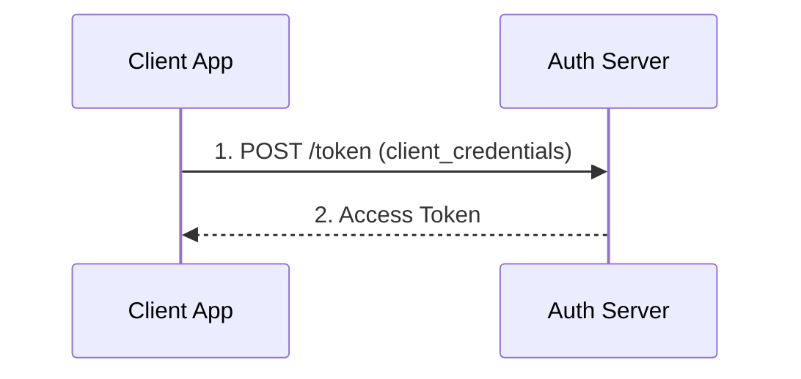
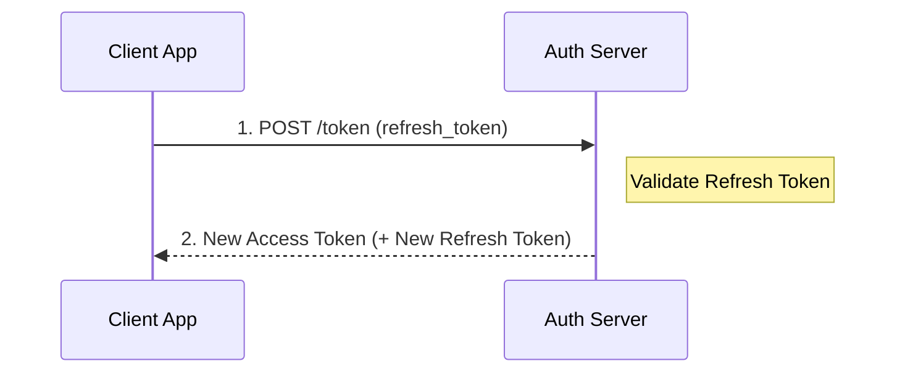

# Token Endpoint

The token endpoint is where your application exchanges credentials for access tokens. 
    It supports multiple grant types for different authentication scenarios.

    
        **POST** 
        `/t/\{tenantSlug\}/api/v1/oauth/token`
    

:::note[Server-to-Server]
For machine-to-machine communication, use the **Client Credentials** grant.
No user interaction is needed.
:::


## Authorization Code Grant

Exchange an authorization code (received from the authorize endpoint) for access and refresh tokens. 
    This is the most common flow for user authentication.

### Request Parameters

| Parameter | Required | Description |
| --- | --- | --- |
| `grant_type` | Yes | `authorization_code` |
| `code` | Yes | The authorization code from the callback |
| `redirect_uri` | Yes | Must match the URI used in the authorization request |
| `client_id` | Yes | Your application's client ID |
| `client_secret` | Confidential clients | Your application's client secret (not needed for public clients with PKCE) |
| `code_verifier` | If PKCE used | The original code_verifier that matches the code_challenge |

### Example Request

```bash
curl -X POST https://app.lumoauth.dev/t/acme-corp/api/v1/oauth/token \
  -H "Content-Type: application/x-www-form-urlencoded" \
  -d "grant_type=authorization_code" \
  -d "code=SplxlOBeZQQYbYS6WxSbIA" \
  -d "redirect_uri=https://myapp.com/callback" \
  -d "client_id=abc123def456" \
  -d "client_secret=YOUR_CLIENT_SECRET" \
  -d "code_verifier=dBjftJeZ4CVP-mB92K27uhbUJU1p1r_wW1gFWFOEjXk"
```

### Response

```json
{
  "access_token": "eyJhbGciOiJSUzI1NiIsInR5cCI6IkpXVCJ9...",
  "token_type": "Bearer",
  "expires_in": 3600,
  "refresh_token": "dGhpcyBpcyBhIHJlZnJlc2ggdG9rZW4...",
  "scope": "openid profile email",
  "id_token": "eyJhbGciOiJSUzI1NiIsInR5cCI6IkpXVCJ9..."
}
```

## Client Credentials Grant

Authenticate your application **as itself**, without a user. 
    Perfect for server-to-server communication, cron jobs, or background workers.

    


:::tip[Great for AI Agents]
Client Credentials is the simplest way to authenticate AI agents and background
services that don't act on behalf of a specific user.
:::


### Request Parameters

| Parameter | Required | Description |
| --- | --- | --- |
| `grant_type` | Yes | `client_credentials` |
| `client_id` | Yes | Your application's client ID |
| `client_secret` | Yes | Your application's client secret |
| `scope` | No | Space-separated scopes (defaults to client's registered scopes) |

### Example Request

```bash
curl -X POST https://app.lumoauth.dev/t/acme-corp/api/v1/oauth/token \
  -u "CLIENT_ID:CLIENT_SECRET" \
  -d "grant_type=client_credentials" \
  -d "scope=read:reports write:data"
```

### Response

```json
{
  "access_token": "eyJhbGciOiJSUzI1NiIsInR5cCI6IkpXVCJ9...",
  "token_type": "Bearer",
  "expires_in": 3600,
  "scope": "read:reports write:data"
}
```

## Refresh Token Grant

Get a new access token using a refresh token, without requiring the user to log in again.
    Refresh tokens typically last 30 days.

    


### Request Parameters

| Parameter | Required | Description |
| --- | --- | --- |
| `grant_type` | Yes | `refresh_token` |
| `refresh_token` | Yes | The refresh token from a previous token response |
| `client_id` | Yes | Your application's client ID |
| `client_secret` | Confidential clients | Your application's client secret |

### Example Request

```bash
curl -X POST https://app.lumoauth.dev/t/acme-corp/api/v1/oauth/token \
  -u "CLIENT_ID:CLIENT_SECRET" \
  -d "grant_type=refresh_token" \
  -d "refresh_token=dGhpcyBpcyBhIHJlZnJlc2ggdG9rZW4..."
```

:::warning[Refresh Token Rotation]
LumoAuth implements refresh token rotation for security. Each time you use a
refresh token, a new one is issued and the old one is invalidated.
:::


## Token Exchange Grant (RFC 8693)

Exchange one token for another. This enables advanced scenarios like:

- **Impersonation:** A service acts as a user
- **Delegation:** A service acts on behalf of a user, with audit trail
- **Workload Identity:** Exchange external tokens (AWS, K8s) for LumoAuth tokens

### Request Parameters

| Parameter | Required | Description |
| --- | --- | --- |
| `grant_type` | Yes | `urn:ietf:params:oauth:grant-type:token-exchange` |
| `subject_token` | Yes | The token representing the subject (user or service) |
| `subject_token_type` | Yes | `urn:ietf:params:oauth:token-type:access_token` or `urn:ietf:params:oauth:token-type:jwt` |
| `actor_token` | For delegation | Token of the service acting on behalf of the subject |
| `actor_token_type` | If actor_token | Type of the actor token |

### Delegation Example

Service B acts on behalf of User A. The resulting token has an `act` claim 
    showing the chain of identity.

```bash
curl -X POST https://app.lumoauth.dev/t/acme-corp/api/v1/oauth/token \
  -u "CLIENT_ID:CLIENT_SECRET" \
  -d "grant_type=urn:ietf:params:oauth:grant-type:token-exchange" \
  -d "subject_token=USER_A_ACCESS_TOKEN" \
  -d "subject_token_type=urn:ietf:params:oauth:token-type:access_token" \
  -d "actor_token=SERVICE_B_ACCESS_TOKEN" \
  -d "actor_token_type=urn:ietf:params:oauth:token-type:access_token"
```

### Resulting JWT Claims

```json
{
  "sub": "user_a",
  "act": {
    "sub": "service_b"
  },
  "iss": "https://app.lumoauth.dev",
  "exp": 1704067200
}
```

The `act` (actor) claim indicates that `service_b` is performing actions 
    on behalf of `user_a`. This creates a complete audit trail.

## Error Responses

Token endpoint errors follow the OAuth 2.0 specification:

```json
{
  "error": "invalid_grant",
  "error_description": "Authorization code is invalid, expired, or revoked"
}
```

| Error | Description |
| --- | --- |
| `invalid_request` | Missing or invalid parameters |
| `invalid_client` | Client authentication failed |
| `invalid_grant` | Authorization code or refresh token is invalid/expired |
| `invalid_scope` | Requested scope is not allowed for this client |
| `unsupported_grant_type` | The grant type is not supported |
