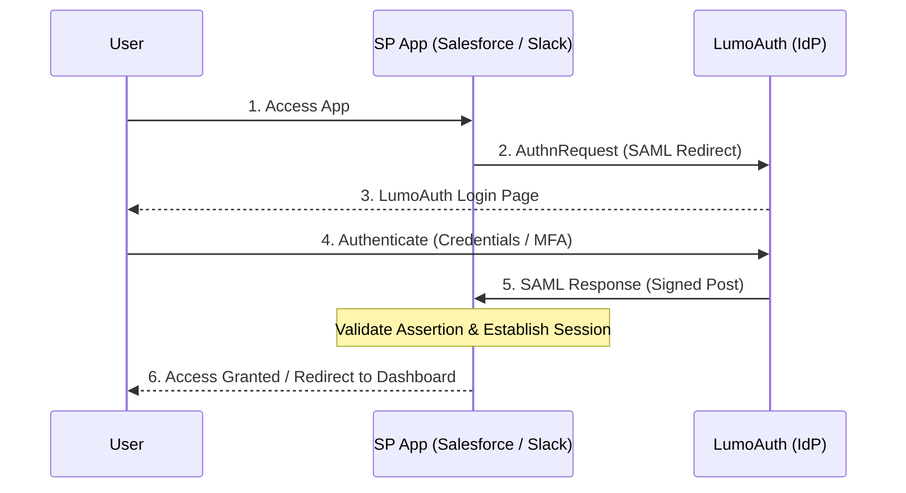

# Identity Provider (IdP) Mode

Configure LumoAuth as a SAML Identity Provider to issue signed assertions to SAML-enabled 
    Service Provider applications like Salesforce, Box, Slack, and custom enterprise apps.

:::note[When to Use IdP Mode]
Use LumoAuth as an IdP when you need to provide SSO access to external
applications like Salesforce, AWS Console, or custom enterprise apps.
:::


## SP-Initiated SSO Flow

In the most common flow, the user starts at the SP application which redirects to LumoAuth 
    for authentication:

    


## IdP Metadata Endpoint

    
        **GET** 
        `/t/\{tenantSlug\}/saml/idp/metadata`
    

Returns the SAML IdP metadata XML document. Provide this URL to SP applications 
    to configure SAML SSO automatically.

### Example Request

```bash
curl https://app.lumoauth.dev/t/acme-corp/saml/idp/metadata
```

### Response

```xml
MIICo...
                
            
        
        
        
            urn:oasis:names:tc:SAML:1.1:nameid-format:emailAddress
        
        
            urn:oasis:names:tc:SAML:2.0:nameid-format:persistent
```

## Single Sign-On Endpoint

    
        GET/POST
        `/t/\{tenantSlug\}/saml/idp/sso`
    

Receives SAML AuthnRequests from Service Providers. Supports both HTTP-Redirect 
    and HTTP-POST bindings.

### HTTP-Redirect Binding (GET)

| Parameter | Required | Description |
| --- | --- | --- |
| `SAMLRequest` | Yes | Base64 + DEFLATE encoded AuthnRequest |
| `RelayState` | No | Opaque state preserved through SSO |
| `SigAlg` | If signed | Signature algorithm |
| `Signature` | If signed | Request signature |

### HTTP-POST Binding (POST)

| Parameter | Required | Description |
| --- | --- | --- |
| `SAMLRequest` | Yes | Base64 encoded AuthnRequest |
| `RelayState` | No | Opaque state preserved through SSO |

### Processing Flow

1. Decode and parse the AuthnRequest
2. Validate the request (signature if required)
3. If user is logged in, generate SAML Response immediately
4. If user is not logged in, redirect to login page
5. After authentication, generate signed SAML Response
6. POST the Response to SP's ACS URL

## SAML Response Structure

LumoAuth generates signed SAML Responses containing user assertions:

```xml
https://app.lumoauth.dev/t/acme-corp/saml/idp/metadata
    
    ...
    
    
        
    
    
    
        https://app.lumoauth.dev/t/acme-corp/saml/idp/metadata
        
        
            
                user@example.com
            
            
                
            
        
        
        
            
                https://sp.example.com
            
        
        
        
            
                user@example.com
            
            
                John
            
            
                Doe
            
        
        
        
            
                
                    urn:oasis:names:tc:SAML:2.0:ac:classes:PasswordProtectedTransport
```

## Configuration Guide

### Step 1: Add the SP Application

1. Navigate to **SAML Apps** in your tenant portal
2. Click **New SAML App**
3. Enter the SP configuration:
        
- **Name:** Application display name
- **Entity ID:** SP's unique identifier
- **ACS URL:** Where to send SAML Responses
4. Configure NameID format and attributes
5. Save the configuration

### Step 2: Configure the SP Application

Provide your IdP metadata to the SP application. Most SPs accept a metadata URL:

```json
{
    "User.Email": "email",
    "User.FirstName": "givenName",
    "User.LastName": "sn",
    "User.Department": "department",
    "User.EmployeeNumber": "employeeNumber"
}
```

## Popular SP Configuration

### Salesforce

| **Entity ID** | `https://saml.salesforce.com` |
| --- | --- |
| **ACS URL** | `https://login.salesforce.com/...` |
| **NameID** | emailAddress (Federation ID) |

### Box

| **Entity ID** | `box.net` |
| --- | --- |
| **ACS URL** | `https://app.box.com/saml/...` |
| **NameID** | emailAddress |

### Slack

| **Entity ID** | `https://slack.com` |
| --- | --- |
| **ACS URL** | `https://your-workspace.slack.com/sso/saml` |
| **NameID** | emailAddress |

## Certificate Management

LumoAuth generates X.509 certificates automatically for each tenant:

- RSA 2048-bit keys with SHA-256 signatures
- Default validity: 3 years
- Automatic generation on first use
- Custom certificate import available

:::warning[Certificate Rotation]
Plan certificate rotation well in advance. LumoAuth supports publishing multiple
certificates simultaneously, allowing SP applications to transition smoothly.
:::

