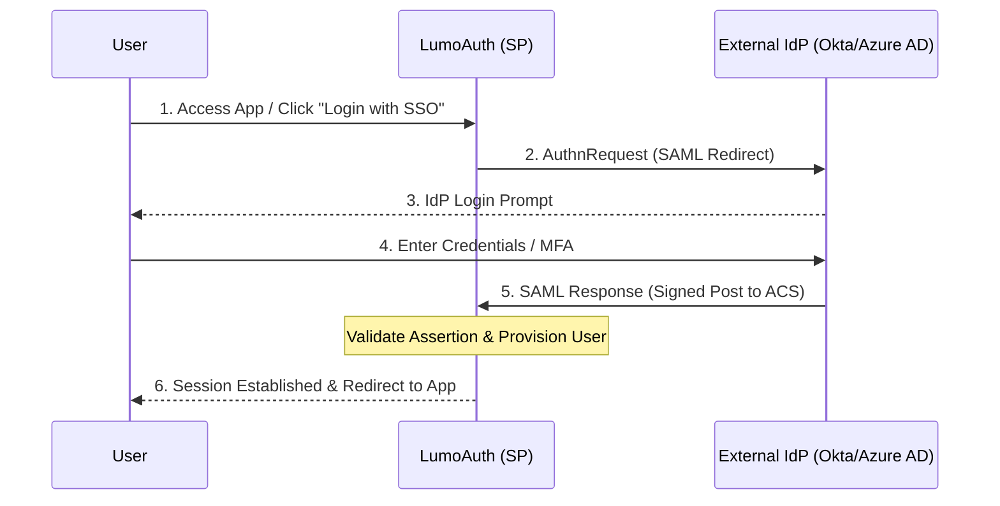

# Service Provider (SP) Mode

Configure LumoAuth as a SAML Service Provider to accept SSO logins from external Identity Providers 
    like Okta, Azure AD, OneLogin, PingIdentity, and ADFS.

:::note[When to Use SP Mode]
Use SP mode when you want users to authenticate via an external IdP like Okta,
Azure AD, or Google Workspace, and have their identity available in LumoAuth.
:::


## SP-Initiated SSO Flow

In the SP-initiated flow, the user begins at your application and is redirected to 
    the external IdP for authentication:

    


## SP Metadata Endpoint

    
        **GET** 
        `/t/\{tenantSlug\}/saml/sp/metadata`
    

Returns the SAML SP metadata XML document. Provide this URL to your external IdP 
    to automatically configure the SAML integration.

### Example Request

```bash
curl https://app.lumoauth.dev/t/acme-corp/saml/sp/metadata
```

### Response

```xml
MIICo...
                
            
        
        
        
        
        
            urn:oasis:names:tc:SAML:1.1:nameid-format:emailAddress
```

## SSO Login Endpoint

    
        **GET** 
        `/t/\{tenantSlug\}/saml/sp/login`
    

Initiates the SAML SSO flow by generating an AuthnRequest and redirecting the user 
    to the configured external IdP.

### Parameters

| Parameter | Required | Description |
| --- | --- | --- |
| `RelayState` | No | URL to redirect to after successful SSO |

### Example

    
        url
    
    
```
https://app.lumoauth.dev/t/acme-corp/saml/sp/login
    ?RelayState=https://app.example.com/dashboard
```

### Login with Specific IdP

    
        **GET** 
        `/t/\{tenantSlug\}/saml/sp/login/\{idpId\}`
    

When multiple IdPs are configured, use this endpoint to specify which IdP to use:

    
        url
    
    
```
https://app.lumoauth.dev/t/acme-corp/saml/sp/login/42
```

## Assertion Consumer Service (ACS)

    
        **POST** 
        `/t/\{tenantSlug\}/saml/sp/acs`
    

Receives and processes SAML Responses from the IdP. This endpoint:

- Validates the SAML Response signature
- Verifies the assertion audience and timestamps
- Extracts user attributes from the assertion
- Creates or updates the user (JIT provisioning)
- Establishes a session and redirects to RelayState

### Request Body (from IdP)

| Parameter | Description |
| --- | --- |
| `SAMLResponse` | Base64-encoded SAML Response XML |
| `RelayState` | Optional redirect URL preserved from AuthnRequest |

:::warning[Direct Calls Not Supported]
The ACS endpoint only accepts SAML responses from configured IdPs.
Do not call this endpoint directly — it's part of the SAML SSO flow.
:::


## Single Logout (SLO)

    
        GET/POST
        `/t/\{tenantSlug\}/saml/sp/slo`
    

Handles Single Logout requests and responses. Supports both IdP-initiated and SP-initiated logout.

## Configuration Guide

### Step 1: Get Your SP Metadata

Copy your SP metadata URL and provide it to your external IdP:

    
        Your SP Metadata
    
    
```
https://app.lumoauth.dev/t/{your-tenant}/saml/sp/metadata
```

### Step 2: Configure the External IdP

In your IdP's admin console, create a new SAML application with these settings:

| Setting | Value |
| --- | --- |
| **ACS URL** | `https://app.lumoauth.dev/t/\{tenant\}/saml/sp/acs` |
| **Entity ID** | `https://app.lumoauth.dev/t/\{tenant\}/saml/sp/metadata` |
| **NameID Format** | `emailAddress` |
| **SLO URL** | `https://app.lumoauth.dev/t/\{tenant\}/saml/sp/slo` |

### Step 3: Add the IdP to LumoAuth

1. Navigate to **SAML IdPs** in your tenant portal
2. Click **Add IdP**
3. Enter the IdP's metadata:
        
- **Entity ID:** IdP's unique identifier
- **SSO URL:** IdP's Single Sign-On endpoint
- **Certificate:** IdP's X.509 signing certificate
4. Configure security and provisioning options
5. Save and test

## Security Settings

| Setting | Default | Description |
| --- | --- | --- |
| `Require Signed Responses` | ✓ Enabled | Verify the SAML response is signed by the IdP |
| `Require Signed Assertions` | ✓ Enabled | Verify the assertion within the response is signed |
| `Sign AuthnRequests` | Disabled | Sign authentication requests sent to the IdP |
| `Clock Skew Tolerance` | 180 seconds | Allowable time difference for assertion validation |

## Just-In-Time (JIT) Provisioning

JIT provisioning automatically creates user accounts on their first SAML login:

| Setting | Description |
| --- | --- |
| `JIT Provisioning Enabled` | Create new users automatically on first login |
| `Update User on Login` | Sync user attributes from SAML on each login |
| `Default Roles` | Roles assigned to newly provisioned users |

### Attribute Mapping

SAML attributes are mapped to user fields automatically:

| SAML Attribute | User Field |
| --- | --- |
| `email`, `mail`, `emailAddress` | Email |
| `displayName`, `name`, `cn` | Display Name |
| `givenName`, `firstName` | First Name |
| `surname`, `lastName`, `sn` | Last Name |

## Popular IdP Configuration

### Okta

1. In Okta Admin, go to Applications → Create App Integration → SAML 2.0
2. Set Single sign on URL to your ACS URL
3. Set Audience URI to your SP Entity ID
4. Configure attribute statements (email, firstName, lastName)
5. Copy the IdP metadata URL from the Sign On tab

### Azure AD / Entra ID

1. In Azure Portal, go to Enterprise Applications → New application → Non-gallery
2. Set up single sign-on → SAML
3. Enter your SP Entity ID and Reply URL (ACS)
4. Download the Federation Metadata XML

### OneLogin

1. In OneLogin, go to Applications → Add App → SAML Custom Connector
2. Configure ACS URL and Audience
3. Download the IdP metadata

## Error Responses

| Error | Cause | Solution |
| --- | --- | --- |
| **Invalid Signature** | IdP certificate mismatch | Update the IdP certificate in your configuration |
| **Audience Mismatch** | SP Entity ID doesn't match | Verify the Audience in IdP matches your SP Entity ID |
| **Assertion Expired** | Clock skew between servers | Sync server clocks or increase clock skew tolerance |
| **No IdP Configured** | Missing IdP configuration | Add the IdP configuration in the tenant portal |
| **Missing NameID** | IdP not sending NameID | Configure NameID in the IdP application settings |
