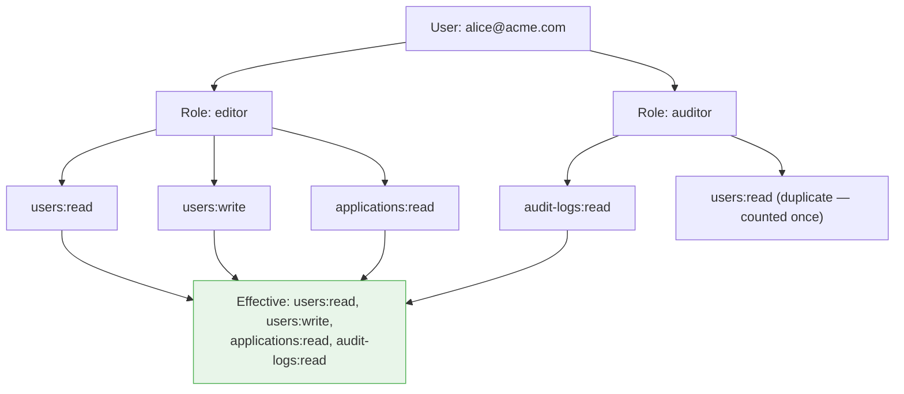

# Roles & Permissions (RBAC)

Role-Based Access Control (RBAC) is the foundation of LumoAuth's authorization system. Users are assigned roles, and roles contain permissions that determine what actions they can perform.

---

## Concepts

### Permissions

A **permission** represents a specific action on a resource:

| Example Permission | Description |
|-------------------|-------------|
| `users:read` | View user profiles |
| `users:write` | Create and edit users |
| `users:delete` | Delete users |
| `applications:manage` | Full control over OAuth applications |
| `audit-logs:read` | View audit log entries |
| `roles:assign` | Assign roles to users |

Permissions follow a `resource:action` naming convention.

### Roles

A **role** is a named collection of permissions:

| Role | Permissions |
|------|------------|
| `viewer` | `users:read`, `audit-logs:read` |
| `editor` | `users:read`, `users:write`, `applications:read` |
| `admin` | All permissions |
| `auditor` | `audit-logs:read`, `users:read` |

### Role Assignment

Users can be assigned one or more roles. Their effective permissions are the union of all permissions from all assigned roles.



---

## Managing Permissions

### Create a Permission

1. Go to `/t/{tenantSlug}/portal/access-management/permissions`
2. Click **Create Permission**
3. Enter the permission details:

| Field | Description | Example |
|-------|-------------|---------|
| **Name** | Human-readable name | `Read Users` |
| **Slug** | Machine-readable identifier | `users:read` |
| **Description** | What this permission grants | `View user profiles and details` |

### Via API

```bash
curl -X POST https://your-domain.com/t/{tenantSlug}/api/v1/permissions \
  -H "Authorization: Bearer {admin_token}" \
  -H "Content-Type: application/json" \
  -d '{
    "name": "Read Users",
    "slug": "users:read",
    "description": "View user profiles and details"
  }'
```

---

## Managing Roles

### Create a Role

1. Go to `/t/{tenantSlug}/portal/access-management/roles`
2. Click **Create Role**
3. Enter role details:

| Field | Description | Example |
|-------|-------------|---------|
| **Name** | Display name | `Editor` |
| **Slug** | Machine-readable identifier | `editor` |
| **Description** | Role purpose | `Can view and edit users and applications` |

4. Assign permissions to the role from the permissions list

### Via API

```bash
# Create a role
curl -X POST https://your-domain.com/t/{tenantSlug}/api/v1/roles \
  -H "Authorization: Bearer {admin_token}" \
  -H "Content-Type: application/json" \
  -d '{
    "name": "Editor",
    "slug": "editor",
    "description": "Can view and edit users and applications"
  }'

# Assign permissions to a role
curl -X POST https://your-domain.com/t/{tenantSlug}/api/v1/roles/{roleId}/permissions \
  -H "Authorization: Bearer {admin_token}" \
  -H "Content-Type: application/json" \
  -d '{
    "permissions": ["users:read", "users:write", "applications:read"]
  }'
```

---

## Assigning Roles to Users

### Via Portal

1. Go to `/t/{tenantSlug}/portal/access-management/users`
2. Select a user
3. Click the **Roles** tab
4. Add or remove roles

### Via API

```bash
# Assign a role to a user
curl -X POST https://your-domain.com/t/{tenantSlug}/api/v1/users/{userId}/roles \
  -H "Authorization: Bearer {admin_token}" \
  -H "Content-Type: application/json" \
  -d '{
    "roles": ["editor", "auditor"]
  }'

# List a user's roles
curl https://your-domain.com/t/{tenantSlug}/api/v1/users/{userId}/roles \
  -H "Authorization: Bearer {admin_token}"
```

---

## Roles in Tokens

When a user authenticates, their roles and permissions can be included in the access token as claims:

```json
{
  "sub": "user-uuid",
  "tenant": "acme-corp",
  "roles": ["editor", "auditor"],
  "permissions": ["users:read", "users:write", "applications:read", "audit-logs:read"],
  "iat": 1706400000,
  "exp": 1706403600
}
```

Your applications can inspect these claims to make authorization decisions without calling back to LumoAuth.

---

## Checking Permissions

### In Your Application

Check the `permissions` claim in the access token:

```javascript
// Node.js example
const token = jwt.verify(accessToken, publicKey);

if (token.permissions.includes('users:write')) {
  // Allow user edit
} else {
  // Deny access
}
```

### Via Permission Tester

Use the Permission Tester at `/t/{tenantSlug}/portal/access-management/permission-tester` to test access decisions interactively.

---

## Best Practices

| Practice | Description |
|----------|-------------|
| **Principle of least privilege** | Assign the minimum permissions needed |
| **Use roles, not direct permissions** | Assign permissions to roles, then roles to users |
| **Name permissions consistently** | Follow `resource:action` convention |
| **Avoid overly broad roles** | Create focused roles instead of catch-all admin roles |
| **Audit role assignments** | Regularly review who has what roles |

---

## Related Guides

- [Groups](groups.md) - Assign roles to groups for easier management
- [ABAC](abac.md) - Add attribute conditions to access decisions
- [Zanzibar](zanzibar.md) - Fine-grained relationship-based access
- [Access Control Overview](overview.md) - Compare all authorization models
