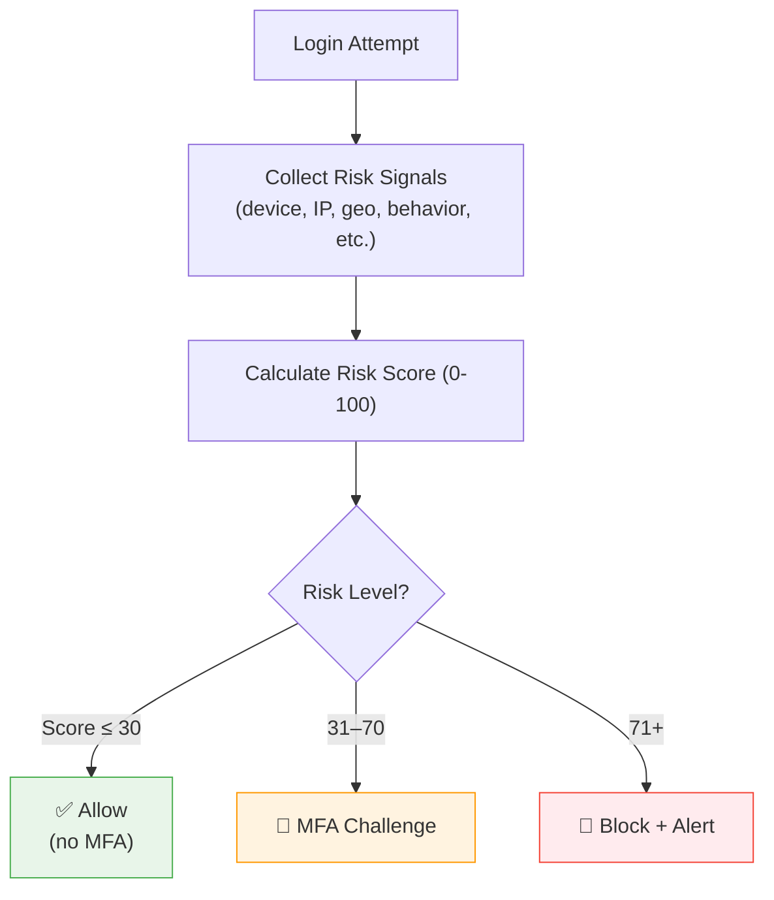

# Adaptive MFA

Adaptive MFA is an intelligent authentication system that evaluates risk signals in real-time and only triggers multi-factor authentication when the risk level warrants it. This balances security with user experience - trusted users log in seamlessly while suspicious activity triggers additional verification.

---

## How Adaptive MFA Works

### Risk Assessment Engine

Every login attempt is evaluated by LumoAuth's risk engine, which produces a **risk score from 0 to 100**:

| Risk Score | Level | Action |
|------------|-------|--------|
| **0–30** | Low | Login proceeds normally, no MFA |
| **31–70** | Medium | MFA challenge is triggered |
| **71–100** | High | Login is blocked and an alert is generated |

### Risk Signals

The risk engine analyzes multiple signals:

| Signal | What It Detects | Example |
|--------|----------------|---------|
| **New Device** | User is logging in from an unrecognized device | First login from a new laptop |
| **IP Reputation** | Known malicious, proxy, VPN, or tor exit node IPs | Login from a known VPN |
| **Geolocation** | Login from an unusual location | User normally logs in from New York, now logging in from Tokyo |
| **Geo-Velocity** | Impossible travel detection | Login from Paris 10 minutes after a login from Sydney |
| **Time Pattern** | Login at unusual hours | Login at 3 AM when user typically logs in during business hours |
| **Failed Attempts** | Recent failed login attempts | Multiple wrong passwords before a successful login |
| **Behavioral Analysis** | Deviation from normal user behavior | Unusual navigation patterns or access requests |
| **Device Fingerprint** | Browser, OS, screen resolution changes | Known device with different browser fingerprint |

### Decision Flow



---

## Configuration

### Enable Adaptive MFA

Navigate to **Configuration** → **Auth Settings** at:
```
/t/{tenantSlug}/portal/configuration/auth-settings
```

Or the dedicated adaptive auth configuration page:
```
/t/{tenantSlug}/portal/configuration/adaptive-auth
```

### Settings

| Setting | Description | Default |
|---------|-------------|---------|
| **Enable Adaptive Auth** | Turn on risk-based authentication | Off |
| **Low Risk Threshold** | Score below this → no MFA | 30 |
| **High Risk Threshold** | Score above this → block login | 70 |
| **Risk Signal Weights** | Customize importance of each signal | Equal weights |
| **Block Action** | What to do when risk is too high | Block + email alert |
| **Trusted IP Ranges** | IPs that are always low risk | None |
| **Trusted Devices** | Remember devices and reduce their risk score | Enabled |

### Customize Risk Signal Weights

You can adjust how much each signal contributes to the overall risk score:

```
New Device:        Weight 25 (out of 100)
IP Reputation:     Weight 20
Geolocation:       Weight 15
Geo-Velocity:      Weight 20
Failed Attempts:   Weight 10
Time Pattern:      Weight 5
Behavioral:        Weight 5
```

For example, if your users frequently travel, you might reduce the geolocation weight and increase the device fingerprint weight.

---

## Risk Events and Fraud Detection

### Event Types

LumoAuth generates security events for each adaptive authentication decision:

| Event | Description |
|-------|-------------|
| `adaptive_auth.low_risk` | Login allowed without MFA |
| `adaptive_auth.medium_risk` | MFA challenge triggered |
| `adaptive_auth.high_risk` | Login blocked |
| `adaptive_auth.impossible_travel` | Detected impossible travel pattern |
| `adaptive_auth.new_device` | Login from unrecognized device |
| `adaptive_auth.vpn_detected` | Login from VPN/proxy detected |
| `adaptive_auth.brute_force` | Multiple failed attempts detected |

### Viewing Risk Events

All adaptive auth events appear in the audit log:
```
/t/{tenantSlug}/portal/audit-logs
```

Filter by event type to see:
- Risk scores for recent logins
- Which signals triggered elevated risk
- Blocked login attempts
- MFA challenge outcomes

---

## User-Facing Behavior

### Low-Risk Login

The user experiences a normal login flow - they enter credentials and are immediately authenticated. No MFA prompt is shown.

### Medium-Risk Login (MFA Challenge)

After entering credentials, the user is redirected to the MFA challenge:

1. The MFA challenge page is displayed
2. User enters their second factor (TOTP, SMS, or email code)
3. On successful verification, login proceeds
4. The device may be remembered for future logins

### High-Risk Login (Blocked)

1. The login is immediately blocked
2. An error message is shown: "Login blocked due to suspicious activity"
3. An email alert is sent to the user and tenant admins
4. The event is logged in the audit trail
5. The user can try again from a different device or contact support

---

## Impossible Travel Detection

One of the most powerful adaptive auth features. LumoAuth detects when a user's login locations indicate physically impossible travel:

**Example**: User logs in from New York at 2:00 PM, then from London at 2:30 PM. Since it's impossible to travel 3,400 miles in 30 minutes, this triggers a high-risk alert.

### How It Works

1. Each login records the user's approximate geolocation (via IP)
2. The system calculates the distance between consecutive logins
3. Given the time difference, it determines if the travel speed is realistic
4. If the implied speed exceeds a threshold (e.g., 500 mph), it's flagged as impossible travel

### Configuration

- **Travel Speed Threshold** - Maximum realistic travel speed (default: 500 mph / 800 km/h)
- **Minimum Time Window** - Only check if logins are within a configurable window (default: 24 hours)

---

## Trusted IP Ranges

You can define IP ranges that are always considered low-risk:

This is useful for:
- Office IP ranges
- VPN exit nodes used by your organization
- Known customer network ranges

Logins from trusted IPs bypass adaptive risk scoring (though other security measures like rate limiting still apply).

---

## Integration with Webhooks

Adaptive auth events can be sent to external systems via webhooks:

```json
{
  "event": "adaptive_auth.high_risk",
  "timestamp": "2026-03-18T10:30:00Z",
  "user_id": "usr_abc123",
  "risk_score": 85,
  "signals": {
    "new_device": true,
    "impossible_travel": true,
    "ip_reputation": "suspicious"
  },
  "action_taken": "blocked",
  "ip_address": "203.0.113.42",
  "location": {
    "country": "Unknown",
    "city": "Unknown"
  }
}
```

Configure webhooks at:
```
/t/{tenantSlug}/portal/configuration/webhooks
```

---

## Best Practices

1. **Start with medium thresholds** and adjust based on your user base
2. **Enable trusted devices** to reduce false positives for returning users
3. **Monitor audit logs** regularly to tune risk weights
4. **Set up webhook alerts** for high-risk events
5. **Combine with standard MFA** - use adaptive as the policy, with TOTP as the challenge method
6. **Test with real users** before enforcing - run in monitor-only mode first
7. **Whitelist office IPs** if your users have stable network environments

---

## Adaptive MFA vs. Always-On MFA

| Aspect | Always-On MFA | Adaptive MFA |
|--------|---------------|-------------|
| **User Experience** | MFA every login | MFA only when risk is elevated |
| **Security** | Consistent protection | Dynamic, context-aware protection |
| **Friction** | High - users may get frustrated | Low - seamless for normal logins |
| **Coverage** | Same for all logins | Stronger for suspicious logins |
| **Best For** | High-security environments | Consumer apps, B2B SaaS |

---

## Related Guides

- [Multi-Factor Authentication](mfa.md) - MFA methods and enrollment
- [Audit Logs](../compliance/audit-logs.md) - View adaptive auth events
- [Webhooks](../integrations/webhooks.md) - Get notified about risk events
- [Security Overview](../security/overview.md) - Overall security architecture
