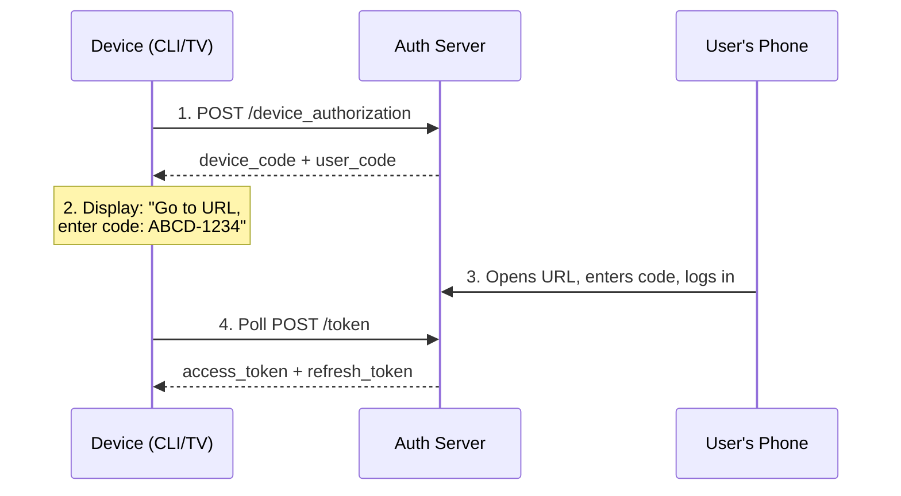

# Device Authorization Flow

The Device Authorization Flow (RFC 8628) enables authentication on input-constrained devices like CLI tools, IoT devices, and smart TVs - devices that lack a browser or keyboard for entering credentials.

---

## How It Works

1. **Device requests authorization** - The device calls the device authorization endpoint
2. **User code displayed** - The device shows a code and a URL to the user
3. **User opens URL on another device** - e.g., their phone or laptop
4. **User enters the code and authenticates** - Standard login flow on the second device
5. **Device polls for tokens** - The device periodically checks if the user has completed authentication
6. **Tokens issued** - Once the user authorizes, the device receives access and refresh tokens



---

## Endpoints

All device flow endpoints are tenant-specific:

| Endpoint | URL | Purpose |
|----------|-----|---------|
| **Device Authorization** | `/t/{tenantSlug}/api/v1/oauth/device_authorization` | Request device + user codes |
| **Device Verification** | `/t/{tenantSlug}/device` | User-facing page to enter the code |
| **Token** | `/t/{tenantSlug}/api/v1/oauth/token` | Poll for tokens (grant_type=device_code) |

---

## Step-by-Step Guide

### 1. Request Device Authorization

The device calls the authorization endpoint:

```bash
curl -X POST https://your-domain.com/t/{tenantSlug}/api/v1/oauth/device_authorization \
  -d client_id=YOUR_CLIENT_ID \
  -d scope="openid profile email"
```

Response:

```json
{
  "device_code": "GmRh...device_code",
  "user_code": "ABCD-1234",
  "verification_uri": "https://your-domain.com/t/{tenantSlug}/device",
  "verification_uri_complete": "https://your-domain.com/t/{tenantSlug}/device?user_code=ABCD-1234",
  "expires_in": 1800,
  "interval": 5
}
```

### 2. Display the Code to the User

The device displays:

```
To sign in, visit: https://your-domain.com/t/acme-corp/device
Enter code: ABCD-1234
```

Or display a QR code pointing to `verification_uri_complete` for a seamless mobile experience.

### 3. User Authenticates on Their Device

The user:
1. Opens the verification URL
2. Enters the user code (if not in the URL)
3. Logs in with their credentials (or social login)
4. Approves the device

### 4. Device Polls for Tokens

The device polls the token endpoint at the specified interval:

```bash
curl -X POST https://your-domain.com/t/{tenantSlug}/api/v1/oauth/token \
  -d grant_type=urn:ietf:params:oauth:grant-type:device_code \
  -d device_code=GmRh...device_code \
  -d client_id=YOUR_CLIENT_ID
```

**While waiting:**
```json
{
  "error": "authorization_pending",
  "error_description": "The user has not yet completed authorization"
}
```

**After user authorizes:**
```json
{
  "access_token": "eyJ...",
  "token_type": "Bearer",
  "expires_in": 3600,
  "refresh_token": "def...",
  "id_token": "eyJ..."
}
```

---

## Use Cases

| Device | Example |
|--------|---------|
| **CLI Tools** | `lumo login` command that displays a code |
| **Smart TVs** | Streaming apps that display a code on screen |
| **IoT Devices** | Connected devices without a full browser |
| **Kiosks** | Public terminals with limited input capabilities |
| **Game Consoles** | Authenticate with a code shown on the TV |

---

## Configuration

### Create a Device Flow Application

1. Go to `/t/{tenantSlug}/portal/applications`
2. Create a new application with grant type: **Device Authorization**
3. Set the client as a **public client** (no client secret for devices)
4. Configure allowed scopes

### Device Code Settings

| Setting | Description | Default |
|---------|-------------|---------|
| **Code Expiration** | How long the user code is valid | 30 minutes |
| **Polling Interval** | Minimum seconds between token polls | 5 seconds |
| **User Code Format** | Format of the code shown to users | `XXXX-XXXX` |

---

## Related Guides

- [Authentication Overview](overview.md) - All authentication methods
- [OAuth 2.0 & OIDC](../applications/oauth2-oidc.md) - Token management and OAuth flows
