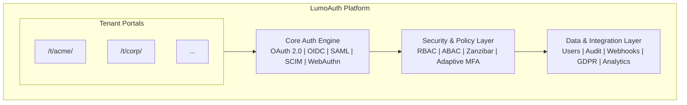

# What is LumoAuth?

LumoAuth is an enterprise-grade, multi-tenant identity and access management (IAM) platform. It provides everything you need to authenticate users, authorize access, and manage identities - all from a single cloud service.

LumoAuth gives you the power of Auth0, Okta, or Keycloak - with built-in support for modern standards like OAuth 2.0, OpenID Connect, SAML 2.0, SCIM 2.0, and advanced features like adaptive MFA, fine-grained authorization (Zanzibar), and AI-powered policy authoring.

---

## Who is LumoAuth For?

| Use Case | Description |
|----------|-------------|
| **B2B SaaS** | Build multi-tenant applications where each customer gets isolated authentication, branding, and user management |
| **B2C Applications** | Offer social login, passwordless, and MFA to consumer-facing apps |
| **Enterprise** | Integrate with Active Directory, SAML IdPs, and enforce compliance policies |
| **Internal Tools** | Secure internal APIs and dashboards with RBAC and audit logging |
| **AI & Automation** | Authenticate AI agents and autonomous workloads with workload identity |

---

## Key Features at a Glance

### Authentication
- **Email & Password** - Standard credential-based login with email verification
- **Social Login** - Google, GitHub, Microsoft, Facebook, Apple, LinkedIn, and custom OIDC providers
- **Multi-Factor Authentication (MFA)** - TOTP, SMS, email codes, and backup codes
- **Adaptive MFA** - AI-driven risk scoring that triggers MFA only when needed
- **Passkeys / WebAuthn** - FIDO2 passwordless authentication
- **Enterprise SSO** - SAML 2.0 (as IdP and SP), OIDC federation, LDAP/Active Directory
- **Device Flow** - RFC 8628 authentication for CLI tools and IoT devices

### Multi-Tenancy
- **Complete Data Isolation** - Each tenant has its own users, roles, permissions, and OAuth clients
- **Tenant Portal** - Self-service admin dashboard for each tenant at `/t/{tenantSlug}/portal/`
- **Custom Domains** - Branded login pages with your own domain
- **Per-Tenant Configuration** - Independent auth settings, social providers, email templates, and more

### Authorization & Access Control
- **Role-Based Access Control (RBAC)** - Define roles with granular permissions
- **Groups** - Organize users into groups with inherited roles
- **Attribute-Based Access Control (ABAC)** - Context-aware authorization policies
- **Fine-Grained Authorization (Zanzibar)** - Google Zanzibar-style relational access control
- **AI Policy Authoring** - Describe policies in natural language, get enforceable rules
- **Permission Tester** - Validate authorization decisions in real-time

### Standards & Protocols
- **OAuth 2.0** - Authorization Code, Client Credentials, Device Code, Refresh Token, CIBA
- **OpenID Connect** - Full OIDC compliance with discovery, dynamic registration, and custom claims
- **SAML 2.0** - Act as both Identity Provider (IdP) and Service Provider (SP)
- **SCIM 2.0** - Automated user and group provisioning (RFC 7643/7644)
- **DPoP** - Demonstration of Proof-of-Possession (RFC 9449)
- **PAR** - Pushed Authorization Requests (RFC 9126)
- **RAR** - Rich Authorization Requests (RFC 9396)

### Compliance & Security
- **GDPR** - Data subject requests, consent tracking, data export, breach incident reporting
- **Audit Logs** - Immutable audit trail for every operation
- **Rate Limiting** - Per-endpoint protection against brute-force attacks
- **Signing Key Management** - JWT key rotation, JWKS endpoints, multiple active keys

### Integrations
- **Webhooks** - Real-time event notifications for user lifecycle events
- **Observability** - Datadog and Axiom integration for logs and tracing
- **Email Templates** - Customizable transactional emails (welcome, verification, password reset, MFA)
- **SDKs** - Javascript/Typescript, React/NextJS integration, Enable security for popular AI agent frameworks

### AI & Automation
- **Workload Identity** - Register and authenticate autonomous AI agents
- **Model Context Protocol (MCP)** - Authorize LLM tool calls and agent actions
- **JIT Provisioning** - Automatically create user accounts from external IdPs

---

## Architecture Overview

---

## Next Steps

- [Quick Start Guide](quick-start.md) - Sign up and get started in minutes
- [Core Concepts](concepts.md) - Understand tenants, users, roles, and OAuth clients
- [Configure Your Tenant](first-tenant.md) - Set up authentication and register your first application
