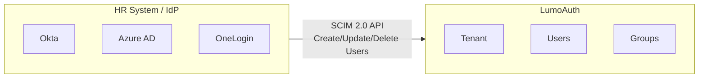

# SCIM 2.0 Provisioning

LumoAuth supports SCIM 2.0 (System for Cross-domain Identity Management) for automated user and group provisioning from external identity providers and HR systems.

---

## What is SCIM?

SCIM enables automatic user lifecycle management:

- **Provisioning** - Automatically create users when they're added in your IdP (Okta, Azure AD, etc.)
- **Deprovisioning** - Automatically disable or delete users when they're removed
- **Sync** - Keep user attributes in sync between your IdP and LumoAuth
- **Group sync** - Synchronize group memberships



---

## SCIM Endpoints

LumoAuth exposes SCIM 2.0 endpoints per tenant:

| Endpoint | Method | Purpose |
|----------|--------|---------|
| `/t/{tenantSlug}/api/v1/scim/v2/Users` | GET | List users |
| `/t/{tenantSlug}/api/v1/scim/v2/Users` | POST | Create a user |
| `/t/{tenantSlug}/api/v1/scim/v2/Users/{id}` | GET | Get a user |
| `/t/{tenantSlug}/api/v1/scim/v2/Users/{id}` | PUT | Replace a user |
| `/t/{tenantSlug}/api/v1/scim/v2/Users/{id}` | PATCH | Update a user |
| `/t/{tenantSlug}/api/v1/scim/v2/Users/{id}` | DELETE | Delete a user |
| `/t/{tenantSlug}/api/v1/scim/v2/Groups` | GET | List groups |
| `/t/{tenantSlug}/api/v1/scim/v2/Groups` | POST | Create a group |
| `/t/{tenantSlug}/api/v1/scim/v2/Groups/{id}` | GET | Get a group |
| `/t/{tenantSlug}/api/v1/scim/v2/Groups/{id}` | PATCH | Update group membership |
| `/t/{tenantSlug}/api/v1/scim/v2/Groups/{id}` | DELETE | Delete a group |
| `/t/{tenantSlug}/api/v1/scim/v2/ServiceProviderConfig` | GET | SCIM capabilities |
| `/t/{tenantSlug}/api/v1/scim/v2/Schemas` | GET | Supported schemas |

---

## Setting Up SCIM

### 1. Generate a SCIM Token

1. Go to `/t/{tenantSlug}/portal/applications`
2. Create a machine-to-machine application for SCIM
3. Generate a bearer token for SCIM authentication

### 2. Configure Your IdP

Provide your IdP with:

| Setting | Value |
|---------|-------|
| **SCIM Base URL** | `https://your-domain.com/t/{tenantSlug}/api/v1/scim/v2` |
| **Authentication** | `Bearer {scim_token}` |
| **Unique Identifier** | `userName` (email) |

### Okta SCIM Setup

1. In Okta, open your LumoAuth application → **Provisioning**
2. Click **Configure API Integration**
3. Enter the SCIM Base URL and token
4. Enable: Create Users, Update User Attributes, Deactivate Users

### Azure AD SCIM Setup

1. In Azure AD → Enterprise Applications → Your App → **Provisioning**
2. Set **Provisioning Mode** to Automatic
3. Enter the Tenant URL (SCIM base URL) and Secret Token
4. Test connection and start provisioning

---

## User Schema

SCIM user resources map to LumoAuth users:

| SCIM Attribute | LumoAuth Field |
|---------------|----------------|
| `userName` | Email |
| `name.givenName` | First name |
| `name.familyName` | Last name |
| `emails[0].value` | Email |
| `phoneNumbers[0].value` | Phone |
| `active` | Account active status |
| `externalId` | External IdP identifier |

### Create User Request

```json
POST /t/{tenantSlug}/api/v1/scim/v2/Users

{
  "schemas": ["urn:ietf:params:scim:schemas:core:2.0:User"],
  "userName": "alice@acme.com",
  "name": {
    "givenName": "Alice",
    "familyName": "Smith"
  },
  "emails": [
    {
      "value": "alice@acme.com",
      "primary": true
    }
  ],
  "active": true,
  "externalId": "okta-user-id-123"
}
```

---

## Group Provisioning

SCIM groups map to LumoAuth groups:

```json
POST /t/{tenantSlug}/api/v1/scim/v2/Groups

{
  "schemas": ["urn:ietf:params:scim:schemas:core:2.0:Group"],
  "displayName": "Engineering",
  "members": [
    {"value": "user-uuid-1"},
    {"value": "user-uuid-2"}
  ]
}
```

---

## Supported RFCs

| RFC | Description |
|-----|-------------|
| RFC 7643 | SCIM Core Schema |
| RFC 7644 | SCIM Protocol |
| RFC 7642 | SCIM Definitions, Overview, Concepts |

---

## Related Guides

- [User Management](../user-management/overview.md) - Manual user management
- [Groups](../access-control/groups.md) - Group-based access control
- [Enterprise SSO](../authentication/enterprise-sso.md) - SAML/OIDC federation
