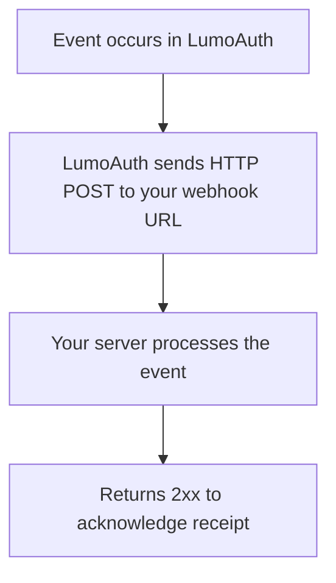

# Webhooks

Webhooks allow LumoAuth to notify your applications in real-time when events occur - authentication events, user changes, security alerts, and more.

---

## How Webhooks Work



LumoAuth sends a JSON payload to your configured endpoint for each subscribed event.

---

## Setting Up Webhooks

### Via Portal

1. Go to `/t/{tenantSlug}/portal/configuration/webhooks`
2. Click **Create Webhook**
3. Configure:

| Field | Description |
|-------|-------------|
| **URL** | Your HTTPS endpoint for receiving events |
| **Events** | Which events to subscribe to |
| **Secret** | Shared secret for signature verification |
| **Active** | Enable/disable the webhook |

### Via API

```bash
curl -X POST https://your-domain.com/t/{tenantSlug}/api/v1/webhooks \
  -H "Authorization: Bearer {admin_token}" \
  -H "Content-Type: application/json" \
  -d '{
    "url": "https://your-app.com/webhooks/lumoauth",
    "events": ["auth.login.success", "auth.login.failure", "user.created"],
    "secret": "your-webhook-secret",
    "active": true
  }'
```

---

## Available Events

### Authentication Events
- `auth.login.success` - User login succeeded
- `auth.login.failure` - Login attempt failed
- `auth.logout` - User logged out
- `auth.mfa.challenge` - MFA challenge triggered
- `auth.mfa.success` - MFA verified
- `auth.mfa.failure` - MFA failed
- `auth.password_reset` - Password reset completed

### User Events
- `user.created` - New user registered
- `user.updated` - User profile changed
- `user.deleted` - User removed
- `user.suspended` - User suspended
- `user.role.changed` - Role assignment changed

### Application Events
- `app.created` - Application registered
- `app.deleted` - Application removed
- `token.issued` - Token generated
- `token.revoked` - Token revoked

### Security Events
- `security.brute_force` - Brute force detected
- `security.impossible_travel` - Impossible travel detected
- `security.high_risk` - High risk score triggered
- `security.account_lockout` - Account locked

---

## Webhook Payload

```json
{
  "id": "evt_abc123",
  "type": "auth.login.success",
  "timestamp": "2025-02-01T14:30:00Z",
  "tenant": "acme-corp",
  "data": {
    "user_id": "user-uuid",
    "email": "alice@acme.com",
    "ip_address": "192.168.1.100",
    "user_agent": "Mozilla/5.0...",
    "method": "password",
    "session_id": "sess-uuid"
  }
}
```

---

## Signature Verification

Every webhook request includes a signature header for verification:

```
X-LumoAuth-Signature: sha256=abc123...
```

Verify the signature to ensure the request came from LumoAuth:

```javascript
const crypto = require('crypto');

function verifyWebhook(payload, signature, secret) {
  const expected = 'sha256=' + crypto
    .createHmac('sha256', secret)
    .update(payload)
    .digest('hex');

  return crypto.timingSafeEqual(
    Buffer.from(signature),
    Buffer.from(expected)
  );
}
```

---

## Retry Policy

| Scenario | Behavior |
|----------|----------|
| **2xx response** | Success, no retry |
| **Non-2xx response** | Retry with exponential backoff |
| **Timeout (30s)** | Retry |
| **Max retries** | 5 attempts over ~1 hour |
| **Consecutive failures** | Webhook disabled after threshold, admin notified |

---

## Related Guides

- [Audit Logs](../compliance/audit-logs.md) - Historical event records
- [Adaptive MFA](../authentication/adaptive-mfa.md) - Security event triggers
- [Observability](observability.md) - Monitoring and metrics
