# Tenant Admin Portal

The tenant admin portal is the primary interface for managing a tenant's identity configuration, users, applications, and security settings.

**URL:** `/t/{tenantSlug}/portal/`

---

## Portal Dashboard

The dashboard at `/t/{tenantSlug}/portal/dashboard` provides an at-a-glance view of:

- Total users and recent registrations
- Active applications
- Authentication activity
- Recent audit events
- Security alerts

---

## Portal Sections

### Applications

**URL:** `/t/{tenantSlug}/portal/applications`

Manage OAuth 2.0 / OIDC applications registered for this tenant:

- Create, edit, and delete applications
- Configure redirect URIs, allowed scopes, and grant types
- View client credentials (client ID, client secret)
- Manage application-specific settings (token lifetimes, allowed origins)

See [Applications](../applications/overview.md) for details.

---

### Access Management

All access management features are under `/t/{tenantSlug}/portal/access-management/`:

| Section | URL | Description |
|---------|-----|-------------|
| **Users** | `.../access-management/users` | Manage users, view profiles, assign roles |
| **Roles** | `.../access-management/roles` | Create and manage RBAC roles |
| **Groups** | `.../access-management/groups` | Organize users into groups |
| **Permissions** | `.../access-management/permissions` | Define granular permissions |
| **Zanzibar** | `.../access-management/zanzibar` | Fine-grained relationship-based access |
| **ABAC** | `.../access-management/abac` | Attribute-based access control policies |
| **Policy Author** | `.../access-management/policy-author` | AI-assisted access policy creation |
| **Permission Tester** | `.../access-management/permission-tester` | Test access decisions in real-time |

See [Access Control](../access-control/overview.md) for details.

---

### Configuration

All configuration options are under `/t/{tenantSlug}/portal/configuration/`:

| Section | URL | Description |
|---------|-----|-------------|
| **Auth Settings** | `.../configuration/auth-settings` | Password policy, session config, MFA, registration |
| **Social Login** | `.../configuration/social-login` | Configure Google, GitHub, Microsoft, etc. |
| **SAML IdP** | `.../configuration/saml-idp` | SAML 2.0 identity provider federation |
| **OIDC IdP** | `.../configuration/oidc-idp` | OIDC identity provider federation |
| **LDAP** | `.../configuration/ldap` | LDAP / Active Directory integration |
| **Email Templates** | `.../configuration/email-templates` | Customize verification, reset, invite emails |
| **Webhooks** | `.../configuration/webhooks` | Event-driven webhook notifications |
| **Adaptive Auth** | `.../configuration/adaptive-auth` | Risk-based authentication settings |

---

### Security & Compliance

| Section | URL | Description |
|---------|-----|-------------|
| **Signing Keys** | `/t/{tenantSlug}/portal/signing-keys` | Manage JWT signing keys (RSA/EC) |
| **Custom Domains** | `/t/{tenantSlug}/portal/custom-domains` | Map your domain to this tenant |
| **Audit Logs** | `/t/{tenantSlug}/portal/audit-logs` | View all authentication and admin events |
| **GDPR** | `/t/{tenantSlug}/portal/gdpr` | Data subject access and deletion requests |

---

### Observability

**URL:** `/t/{tenantSlug}/portal/observability`

Monitor tenant health and activity:

- Authentication success/failure metrics
- Active sessions count
- Token issuance statistics
- Error rates and trends

---

### AI Agents

**URL:** `/t/{tenantSlug}/portal/agents`

Manage AI agent identities and MCP (Model Context Protocol) server configurations:

- Register AI agents as authenticated entities
- Configure MCP server connections
- Manage agent-specific permissions and scopes

See [AI Agents](../ai-agents/overview.md) for details.

---

## Portal Navigation

The portal sidebar organizes all sections:

```mermaid
graph TD
    Dashboard["📊 Dashboard"]
    Apps["📱 Applications"]
    Access["👥 Access Management"]
    Access --> Users["Users"]
    Access --> Roles["Roles"]
    Access --> Groups["Groups"]
    Access --> Permissions["Permissions"]
    Access --> Zanzibar["Zanzibar"]
    Access --> ABAC["ABAC"]
    Access --> PolicyAuthor["Policy Author"]
    Access --> PermTester["Permission Tester"]
    Config["⚙️ Configuration"]
    Config --> AuthSettings["Auth Settings"]
    Config --> SocialLogin["Social Login"]
    Config --> SAMLIdP["SAML IdP"]
    Config --> OIDCIdP["OIDC IdP"]
    Config --> LDAP["LDAP"]
    Config --> EmailTemplates["Email Templates"]
    Config --> Webhooks["Webhooks"]
    Config --> AdaptiveAuth["Adaptive Auth"]
    SigningKeys["🔐 Signing Keys"]
    CustomDomains["🌐 Custom Domains"]
    AuditLogs["📋 Audit Logs"]
    GDPR["🛡️ GDPR"]
    Observability["📈 Observability"]
    AIAgents["🤖 AI Agents"]
```

---

## Portal Access

### Who Can Access the Portal?

Users with the **Tenant Admin** role can access the full portal. Other roles may have limited access based on their permissions.

### Logging In

Tenant admins log in through the standard login page at `/t/{tenantSlug}/login` and are redirected to the portal after authentication.

---

## Related Guides

- [Tenant Setup](tenant-setup.md) - Create and configure tenants
- [Custom Domains](custom-domains.md) - Use your own domain
- [Access Control Overview](../access-control/overview.md) - Manage roles and permissions
