# Tenant Setup

This guide covers configuring and managing your tenant in LumoAuth.

---

## Getting Your Tenant

When you sign up for LumoAuth, you create a tenant during onboarding. Your tenant is immediately available at:

```
https://app.lumoauth.dev/t/{your-tenant-slug}/portal/
```

Your tenant slug is a URL-safe identifier (e.g., `acme-corp`) that you chose during signup.

---

## Tenant Configuration

Configure your tenant settings through the tenant portal at `/t/{tenantSlug}/portal/`.

### Authentication Settings

Navigate to `/t/{tenantSlug}/portal/configuration/auth-settings` to configure:

| Setting | Description |
|---------|-------------|
| **Password Policy** | Minimum length, complexity requirements, breach detection |
| **Session Lifetime** | How long user sessions remain active |
| **MFA Policy** | Required, optional, or adaptive MFA |
| **Account Lockout** | Failed attempt threshold and lockout duration |
| **Registration** | Allow self-registration or invitation-only |
| **Email Verification** | Require email verification for new accounts |

### Identity Providers

Configure external identity providers for your tenant:

| Provider Type | Configuration Path |
|--------------|-------------------|
| [Social Login](../authentication/social-login.md) | `/t/{tenantSlug}/portal/configuration/social-login` |
| [SAML 2.0 IdP](../authentication/enterprise-sso.md) | `/t/{tenantSlug}/portal/configuration/saml-idp` |
| [OIDC Federation](../authentication/enterprise-sso.md) | `/t/{tenantSlug}/portal/configuration/oidc-idp` |
| [LDAP / Active Directory](../authentication/enterprise-sso.md) | `/t/{tenantSlug}/portal/configuration/ldap` |

### Adaptive Authentication

Configure risk-based authentication at `/t/{tenantSlug}/portal/configuration/adaptive-auth`:

- Risk score thresholds
- Trusted IP ranges
- Impossible travel detection
- Fraud event webhooks

See [Adaptive MFA](../authentication/adaptive-mfa.md) for details.

---

## Tenant Roles

LumoAuth supports different roles within a tenant:

| Role | Description | Typical Permissions |
|------|-------------|-------------------|
| **Tenant Admin** | Full control over the tenant | All tenant operations |
| **User Manager** | Manage users and assignments | Create/edit/delete users, assign roles |
| **App Manager** | Manage OAuth applications | Create/edit/delete applications |
| **Auditor** | Read-only access to logs | View audit logs, view users |

### Assigning Tenant Admins

1. Go to `/t/{tenantSlug}/portal/access-management/users`
2. Select a user
3. Assign the **Tenant Admin** role from the roles tab

---

## Tenant Settings via API

You can also manage tenant settings programmatically using the Admin API:

```bash
# Update tenant authentication settings
curl -X PATCH https://app.lumoauth.dev/t/acme-corp/api/v1/admin/settings \
  -H "Authorization: Bearer {access_token}" \
  -H "Content-Type: application/json" \
  -d '{
    "registration_enabled": true,
    "email_verification_required": true,
    "mfa_policy": "optional"
  }'
```

See the [Admin API](/admin) documentation for the full list of available endpoints.

---

## Tenant Data Model

Each tenant owns the following resources:

```mermaid
graph TD
    Tenant
    Tenant --> Users
    Users --> Profiles
    Users --> MFA["MFA Methods"]
    Users --> Passkeys["Passkey Credentials"]
    Users --> Social["Social Accounts"]
    Tenant --> Apps["Applications (OAuth Clients)"]
    Apps --> AT["Access Tokens"]
    Apps --> RT["Refresh Tokens"]
    Apps --> AC["Authorization Codes"]
    Tenant --> AC2["Access Control"]
    AC2 --> Roles
    AC2 --> Permissions
    AC2 --> Groups
    AC2 --> ABAC["ABAC Policies"]
    AC2 --> Zanzibar["Zanzibar Relations"]
    Tenant --> IdP["Identity Providers"]
    IdP --> Social2["Social Login Providers"]
    IdP --> SAML["SAML IdP Configs"]
    IdP --> OIDC["OIDC IdP Configs"]
    IdP --> LDAP["LDAP Configs"]
    Tenant --> Config["Configuration"]
    Config --> AuthSettings["Auth Settings"]
    Config --> EmailTemplates["Email Templates"]
    Config --> SigningKeys["Signing Keys"]
    Config --> Domains["Custom Domains"]
    Config --> Webhooks
    Tenant --> Compliance
    Compliance --> AuditLogs["Audit Logs"]
    Compliance --> GDPR["GDPR Requests"]
```



---

## Related Guides

- [Tenant Portal](tenant-portal.md) - Navigate the admin portal
- [Custom Domains](custom-domains.md) - Map your domain to a tenant
- [Configure Your Tenant](../getting-started/first-tenant.md) - Step-by-step tenant configuration walkthrough
